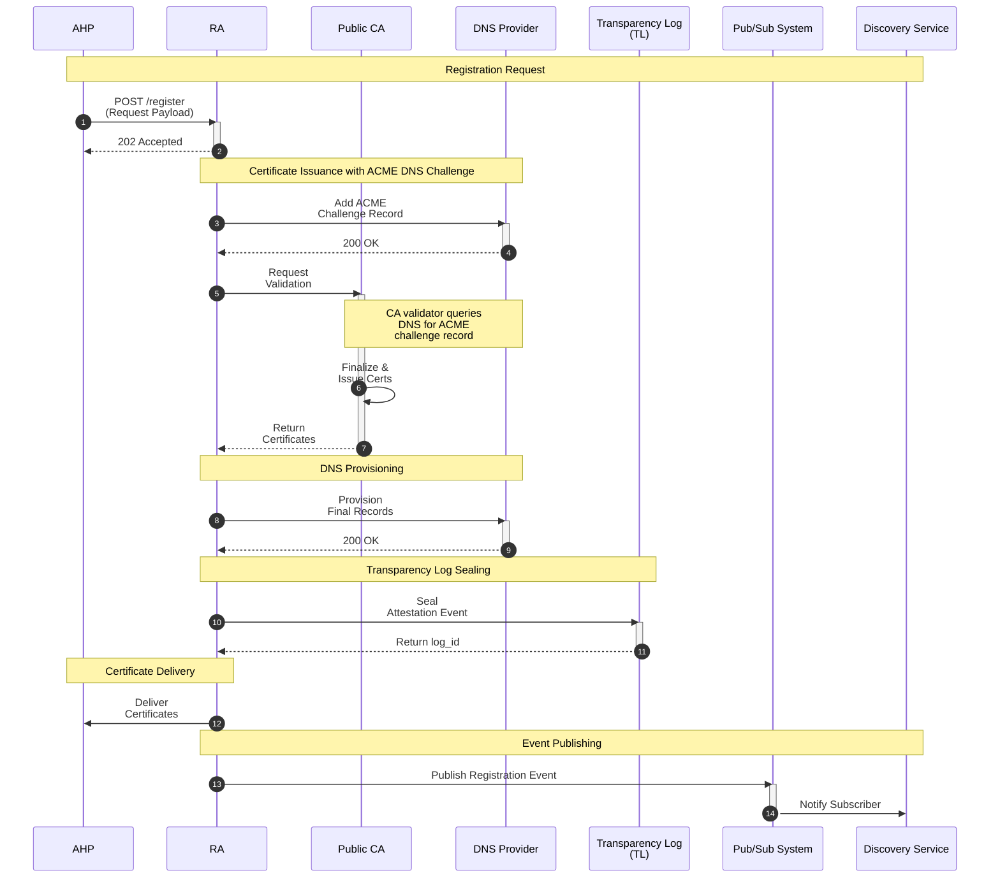
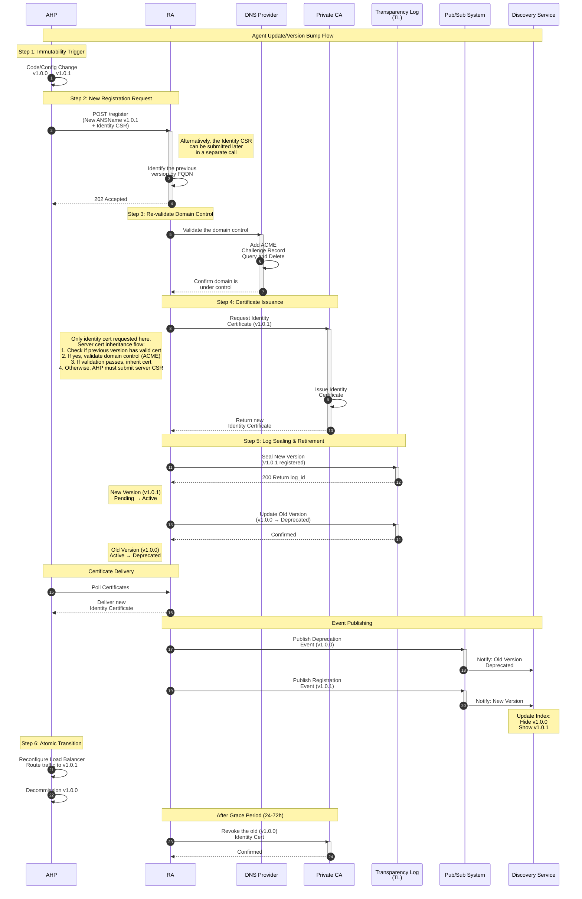

# Enhanced ANS/RA Software Architecture Document

## 1.0 Introduction and goals

### 1.1 Purpose
This document describes the Agent Name Service (ANS) Registry system architecture. It shows different architectural views for communication between software architects, developers, and stakeholders.

### 1.2 Context and background
This architecture implements the principles from initial industry drafts. It creates immutable, version-bound agent identities that coexist with traditional time-based public TLS certificates.

### 1.3 Foundational principles and departures from prior art

This architecture builds on concepts from "Agent Name Service for Secure AI Agent Discovery" by Narajala, Huang, Habler, and Sheriff (OWASP). The Enhanced ANS/RA evolves these concepts for production with departures for operational robustness, verifiability, and internet-scale deployment.

**1. Foundational principle: Identity is anchored to a stable FQDN**

Every agent identity must anchor to a unique, globally resolvable Fully Qualified Domain Name (FQDN).

The `ANSName` structure ties to a verifiable DNS asset rather than a logical construct. The `ANSName` components construct the agent's FQDN using: `agentName + . + extension`.

This domain name becomes the agent's permanent, discoverable address. It remains consistent for Agent Hosting Platforms and discovery services while the versioned `ANSName` changes with software updates. Trust artifacts bind cryptographically to the AHP's verified domain control, making the domain the trust chain root.

**2. Other key architectural enhancements**

Building on this FQDN foundation, the architecture introduces:

* **Trust bootstrapping via domain control validation:** The Registration Authority (RA) uses ACME DNS-01 challenge to verify ownership. The RA attests to agent identity only after the owner proves domain control.

* **Decentralized discovery model:** A publish-subscribe model enables decentralized discovery. The RA publishes signed attestation events, creating a competitive market of third-party discovery services rather than centralized queries.

* **Version-centric lifecycle:** Any change to agent software or capabilities requires a new versioned `ANSName` and registration. This event-driven lifecycle creates a granular audit trail compared to time-based models.

* **Dual-certificate identity model:** Two certificates resolve the conflict between public web trust and software versioning. A Public Server Certificate grants universal trust for the stable FQDN. A Private Identity Certificate enables fast, automated attestation for the version-bound `ANSName`.

* **Explicit discoverable schemas:** The Agent Card requires each protocol to link to a canonical JSON Schema URL. This makes schemas first-class, discoverable artifacts for developers, unlike prior models where schema logic remains internal to server-side protocol adapters.

### 1.4 Definitions, Acronyms, and Abbreviations

| Term | Definition |
| :--- | :--- |
| **A2A** | Agent-to-Agent protocol: A protocol for agent collaboration, notably used by Google. |
| **ACP** | Agent Communication Protocol: An open standard for interoperability between AI agents, built on a REST-based architecture. |
| **AHP** | Agent Hosting Platform: The client system that hosts agent code and initiates all lifecycle requests on behalf of its customer. |
| **ANS** | Agent Name Service: A universal directory service for secure AI agent discovery and interoperability. |
| **CA** | Certificate Authority: An entity that issues digital certificates. Public APIs (OCSP) and distribution points (CRLs) are hosted by a CA to check the real-time revocation status of a certificate. |
| **CSR** | Certificate Signing Request: A message sent from an applicant to a CA in order to apply for a digital identity certificate. |
| **DNS** | Domain Name System: The decentralized, hierarchical naming system for computers, services, or other resources connected to the Internet. |
| **FQDN** | Fully Qualified Domain Name: The complete, unambiguous domain name that specifies a specific host's absolute location in the DNS hierarchy. It is composed of the hostname and all parent domains. |
| **KMS** | Key Management System: The centralized system that manages and protects the cryptographic root of trust for the registry. |
| **MCP** | Model Context Protocol: A protocol that focuses on an agent's communication with its tools. |
| **PKI** | Public Key Infrastructure: A set of roles, policies, and procedures needed to create, manage, and revoke digital certificates. |
| **RA** | Registration Authority: The central orchestrator that automates the agent registration, validation, and attestation process. |
| **SAD** | Software Architecture Document: This document. |
| **TL** | Transparency Log: The immutable, cryptographically verifiable ledger that contains a record of all registered agent identities. |

### 1.5 Project goals

The project creates a single immutable Transparency Log to record all agent identity events. Server Certificates separate from Identity Certificates due to different lifecycles: Server Certificates track web server uptime while Identity Certificates track software versions. Every code change requires a new identity registration.

The `ra_id` field identifies which Registration Authority instance processed each request for forensic investigation. Agent Hosting Platforms manage public key infrastructure and DNS operations, removing these burdens from agent developers.

### 1.6 Business goals and use cases

The ANS Registry enables autonomous AI agents to find and trust each other across organizational boundaries. Without this trust layer, every agent provider needs bilateral agreements with every potential partner, creating an O(n²) scaling problem.

The registry automates certificate lifecycle management, DNS record provisioning, and cryptographic identity binding. SMBs can integrate their customer support chatbots with third-party payment processors and CRM systems without manual configuration. The verifiable identity model enables business models where agents charge per API call or require subscriptions with cryptographic proof of service delivery.

## 2.0 Architectural views

### 2.1 Logical view (static component relationships)

The system has three security domains interconnected by the Registration Authority.

The Agent Platform Domain contains the Agent Hosting Platform and the public-facing DNS Provider. The Trust Authority Domain includes the Centralized Key Management System, the Transparency Log, and the Provider Registry as core trust infrastructure. The Certificate Domain contains both the Public and Private Certificate Authorities.


*Figure 1: High-Level Component Diagram of the ANS Registry Ecosystem*

### 2.2 Process view (dynamic interaction and flow)

The Agent Registration Flow dominates system behavior. The RA receives a request, proxies validation and provisioning, aggregates the final state, seals a non-repudiable entry into the Transparency Log upon success, then delivers artifacts to the AHP.

A continuous, post-registration Integrity Verification Flow runs in the background via the ANS Integrity Monitor (AIM). The AIM queries provisioned DNS records for active agents, compares them to expected states from registration, and triggers remediation when detecting unauthorized changes or discrepancies.

## 3.0 Component model

The ANS Registry ecosystem contains major systems and components. The architecture connects a central Registration Authority System with the Agent Hosting Platform (AHP) System and Internet Infrastructure Dependencies.

### 3.1 The Registration Authority system

The RA serves as the trusted third party at the center of the ANS ecosystem. It validates agent identities, orchestrates certificate issuance, and seals immutable records into the Transparency Log.

**3.1.1 Registration Authority:** The stateful orchestration engine processes registration requests, coordinates with external services, and manages the agent lifecycle from registration through revocation.

**3.1.2 Centralized Key Management System (KMS):** AWS KMS (or similar) holds the private key that signs the Transparency Log's Merkle Tree Root. This key provides the cryptographic root of trust for the system.

**3.1.3 Provider Registry:** Maps immutable ProviderIDs (`PID-1234`) to current legal entity names. When "AcmeCorp" becomes "MegaCorp", one record updates instead of re-registering thousands of agents.

**3.1.4 ANS Integrity Monitor:** The AIM is now defined as an external, third-party ecosystem role (see Section 3.4.2). The RA system itself may run its own AIM instance as a reference implementation and for its own operational awareness, but the architecture treats monitoring as a decentralized function. The RA's internal AIM instance validates the attestation chain continuously. Verifies DNS records, Agent Card cryptographic integrity, and linked capability schemas against registration hashes. Triggers remediation when discrepancies occur.

**3.1.4 ANS Integrity Monitor:** The AIM is defined as an external, third-party ecosystem role (see Section 3.4.2). The RA may run its own AIM instance as a reference implementation and for operational awareness. The architecture treats monitoring as a decentralized function.

The RA's internal AIM instance validates the attestation chain continuously. It verifies DNS records, Agent Card cryptographic integrity, and linked capability schemas against registration hashes. It triggers remediation when discrepancies occur.

**3.1.5 Interfaces Hosted by the RA System:**
* **Dynamic Badge Lander:** Shows real-time trust status for agents - green checkmark if valid, red X if compromised
* **Dynamic Badge Lander:** Serves the agent's real-time trust status. This interface MUST support a dual-format deployment: 1) The official forensic verification portal via the standalone HTML page, and 2) an embeddable, real-time JavaScript snippet for display on the AHP's landing pages. The RA advises customers that the JS snippet is a visual trust symbol for human users and is not the cryptographic security mechanism.
* **Audit Log Viewer:** Forensic history of state changes with cryptographic proofs
* **Lifecycle Management APIs:** Private API endpoints where AHPs submit registrations, renewals, and revocations

### 3.2 The Agent Hosting Platform system

The AHP client system hosts the agent's code and business logic. It initiates lifecycle requests to the RA System on behalf of the agent's owner.

The AHP maintains public-facing resources associated with the agent's FQDN: the Agent Functional Endpoints, the Agent Card metadata file, and JSON Schema files linked from the Agent Card for each supported protocol.

**3.2.1 Agent Hosting Platform:** The core client platform integrates with the RA's APIs.

**3.2.2 Interfaces Hosted by the AHP System:**
* **Agent Functional Endpoint (API):** Live service with the agent's core functionality
* **Agent Card (Data):** Machine-readable JSON file at a canonical URL containing agent capability metadata, with URLs pointing to each protocol's JSON Schema definition

### 3.3 Foundational infrastructure & dependencies

Core third-party systems support the ANS/RA architecture.

**3.3.1 Transparency Log (TL):**

The immutable, cryptographically verifiable ledger contains permanent records of agent identity lifecycle events. The TL uses a global Merkle tree architecture.

Events process in batches every 5 seconds or after 1000 events. Each event receives a globally unique, monotonically increasing sequence number for append-only semantics.

The system uses SHA-256 binary Merkle trees for cryptographic integrity. Leaf nodes contain deterministic hashes of canonicalized event data. The Key Management System signs each new Merkle root after batch completion, creating a verifiable checkpoint.

The TL generates cryptographic proofs for event existence at specific positions. The architecture supports O(log n) append operations by caching intermediate node hashes.

**3.3.1.1 Public verification interface:**

The Transparency Log exposes a REST API for external verifiers. The API provides:
- Current and historical Signed Tree Heads (STH)
- Merkle inclusion proofs for specific events
- Consistency proofs between tree states
- Public signing keys for verification
- Event queries by ANS name or batch identifier

**3.3.1.2 Key distribution mechanism:**

The Transparency Log implements multi-channel key distribution:
- Primary: HTTPS endpoints at `/v1/keys/*` for current and historical public keys
- Secondary: DNS TXT records for key fingerprint verification

Each key associates with a `tree_version` that increments on rotation. Public keys support caching with ETags and cache-control headers.

**3.3.1.3 Producer Signature Validation:**

Producer signatures validate internally upon event receipt and include in sealed log entries:
- Internal validation confirms event authenticity from authorized RA instances
- Producer signatures become part of the immutable record
- Producer public keys remain private, disclosed only for authorized forensic investigations
- External verifiers trust the TL's validation as part of the trust model

**3.3.2 Pub/Sub system:**

The asynchronous messaging bus receives lifecycle events from the RA for Discovery Service consumption. Each event payload includes a digital signature from the RA for authenticity and integrity verification.

**3.3.3 Producer authentication and event submission**

The Transparency Log uses two-phase trust establishment for event producers (RA instances).

**Phase 1 - Key registration:**
Registration Authority instances register public keys with the Transparency Log before submitting events. Registration establishes cryptographic identity through an internal API. Keys register with instance identifier (`ra_id`), signing algorithm, and validity period.

Authentication uses JWT tokens from the IAM system. The `ra_id` in token claims must match the registered public key identifier. Key rotation supports configurable overlap periods. Keys can pre-register with future `valid_from` dates.

**Phase 2 - Event submission:**
Producers submit events signed with registered private keys. Each event includes a detached JWS signature and `producer_key_id`. The Transparency Log validates signatures using registered public keys before accepting events.

Validated events receive globally unique sequence numbers and enter the batch processing queue. The `log_id` provides unique identification for idempotency checking.

**Internal validation flow:**
Producers submit events with signatures to `/internal/v1/events`. The TL retrieves producer public keys, validates signatures and event structure. Valid events receive sequence numbers and queue for batch processing. Producers receive acknowledgments with sequence numbers. Events seal into the Merkle tree during batch processing.

**3.3.4 DNS provider:**

Manages public DNS zone files for agent FQDNs. The RA interacts via API (e.g., Domain Connect) to provision records.

### 3.3.5 Certificate Authorities (CAs)

The architecture uses two distinct Certificate Authority types:

* **Public Certificate Authority (Public CA):** Standard, universally trusted CA (e.g., Let's Encrypt, DigiCert) issues the Public Server Certificate (`PubSC`) securing the agent's stable FQDN. Public revocation services (OCSP/CRL) serve any internet client.

* **Private Certificate Authority (Private CA):** Dedicated CA operated by the Registration Authority issues event-driven Private Identity Certificates (`PriCC`) attesting to version-bound `ANSName`. Revocation services remain private to the ANS ecosystem.

This separation allows the `PubSC` to follow slow, time-based public WebPKI rules for universal compatibility while the `PriCC` maintains the fast, event-driven lifecycle needed for agent identities.

### 3.4 The holistic trust framework: a 3-layer model

The ANS' RA architecture is scoped to be the first layer, the foundational identity, of a required 3-layer trust model. In this, the RA answers "who are you?" It is limited to verifying and sealing the agent's identity via the PriCC and public commitment via the Agent Card hash into the TL.

Having a layer 1 foundation enables a competitive ecosystem of external services to provide the higher-level trust guarantees necessary for high-stakes transactions:

Layer 2 provides batch-updated or certification-updated operational maturity about the agent's credentials (its attested claims). These third-party services attest to how an agent is governed, such as SOC 2 compliance or HIPAA validation. The RA provides hooks for these claims in the Agent Card.

Layer 3 provides up-to-the-second reputation about how the agent is currently behaving. It is expected that external services will continuously score the agent's real-time behavior, including transaction success and community flags, to detect exploits or non-compliance.

Thus, the RA provides the immutable anchor of identity; the ecosystem (layers 2 and 3) builds the trust and reputation scores upon it.


*Figure 2: Holistic Trust Framework for Agents*

**3.4.1 Discovery service:**

Third-party applications at layer 3 consume the RA's Pub/Sub feed to build searchable agent indexes accessible through their own UI and API.

**3.4.2 ANS Monitoring Service:**

Third-party ANS monitoring services provide layer 2 and layer 3 functions. For instance, the ANS Integrity Monitor operates at layer 2 and provides continuous integrity verification for registered agents; its findings contribute to behavioral scoring at layer 3.

A competitive marketplace of monitoring services can emerge, offering different service levels: verification frequency, geographic distribution of workers, and alerting features. The RA is the source of truth for registration. ANS Monitors audit the live state of the internet against that truth.

## 4.0 Data model & integrity

### 4.1 The canonical ANSName structure

The immutable, six-part identifier for a registered agent acts as its primary, version-bound identity. Canonical Example (post-ADR 005): `mcp://sentimentAnalyzer.textAnalysis.PID-1234.v1.0.0.example.com`

| Component | Description | Example |
| :--- | :--- | :--- |
| **Protocol** | The mandatory scheme that specifies the agent's communication protocol. | `mcp` |
| **agentName** | The unique, provider-assigned name for the agent service. Also the subdomain for constructing the agent's FQDN (e.g., `agentName.extension`). | `sentimentAnalyzer`|
| **capability** | The high-level function the agent exposes. | `textAnalysis` |
| **ProviderID**| A non-semantic, unique, and immutable identifier for the owning entity (per ADR 005). | `PID-1234` |
| **version** | A semantic version (`major.minor.patch`) that is strictly bound to the agent's code. | `v1.0.0` |
| **extension** | A fully-qualified domain name acting as the trust anchor. | `example.com` |

### 4.2 Cryptographic and operational identifiers

#### 4.2.1 Operational Instance ID (ra_id)

The `ra_id` uniquely identifies the specific runtime instance of the RA that processed a request - for example `RA-USEAST1-PROD-03` for the third production instance in AWS us-east-1. It supplies granular data for forensic auditing and traceability. The specific format and generation method for the `ra_id` are detailed in `IMPLEMENTATION_GUIDE.md`.

#### 4.2.2 Cryptographic Root ID (kms_key_id)
Identifies the unique key within the KMS used to sign the Merkle Tree Root (e.g., `arn:aws:kms:us-west-2:key/RootKey-A`).

### 4.3 Certificate integrity

**Server Certificate:** Issued by a Public CA, contains the FQDN in the SAN for standard TLS.

**Identity Certificate:** Issued by a Private CA, contains the full `ANSName` as a `uniformResourceIdentifier` within the SAN for an unbreakable cryptographic binding.

### 4.4 Agent state lifecycle

The `agent_state` field follows a defined lifecycle and transitions between states based on specific events recorded in the Transparency Log. The diagram below illustrates all possible states and their triggering events.


*Figure 3: State Machine Diagram of the Agent Registration Lifecycle*

### 4.5 Cryptographic data integrity standards

The ANS Registry components require these cryptographic standards for consistent and verifiable data integrity:

#### 4.5.1 JSON Canonicalization Scheme (JCS)

All JSON data requiring cryptographic signing or hashing must use JSON Canonicalization Scheme (RFC 8785) before cryptographic operations.

JCS ensures the same logical JSON object produces the same byte sequence through deterministic serialization. Different implementations produce identical hashes for the same data, maintaining cross-platform consistency. Leaf hashes in the Transparency Log remain stable and verifiable.

#### 4.5.2 JSON Web Signature (JWS) format

All digital signatures in the ANS ecosystem MUST use JWS Detached Signature format.

**Detached Signature Requirement:**

Signatures MUST be stored separately from their payloads at all levels of the system. The payload MUST NOT be embedded within the JWS structure (no Base64URL-encoded payload in the JWS).

**Preventing Circular Dependencies:**

When a signature resides in the same JSON object as the data it signs, the signature fields must be excluded from the signed payload. The signature scope must be explicitly defined (e.g., "all fields except signature and signature_kms_key_id"). During verification, implementations must extract only the signed fields before canonicalization and verification. Without exclusion, a signature would need to include itself, creating an impossible scenario.

**Benefits:**

The detached approach enables:
- Independent storage and transmission of data and signatures
- Processing without Base64 encoding/decoding overhead
- Separation of data and attestation concerns
- Adding or verifying signatures without modifying original data
- JSON structures without circular dependency issues

**Technical Requirements:**

The default algorithm is ES256 (ECDSA with P-256 and SHA-256), with provisions for algorithm agility.

Protected headers must include:
- `alg`: signing algorithm
- `kid`: key identifier for the signing key
- `typ`: type indicator (e.g., "JWT" for attestations)
- `tsp`: Unix timestamp of signature creation
- `raid`: RA instance identifier that created the signature

The payload consists of the JCS-canonicalized JSON object being signed (stored separately). The signature format follows `<protected_header>..signature` (note the two dots with empty payload section).

Use cases include Transparency Log batch signatures (Signed Tree Heads), RA attestation badges, Pub/Sub event payloads, and critical lifecycle requests such as revocations.

**JSON Structure and Signature Scope:**
To prevent circular dependencies when signatures are stored within JSON objects:

1. **Explicit Field Exclusion Pattern:**
   ```json
   {
     "data_field_1": "value1",
     "data_field_2": "value2",
     "signature": "..."         // This field is NOT included in the signed payload
   }
   ```
   Signature covers: `{"data_field_1": "value1", "data_field_2": "value2"}`

2. **Nested Structure Pattern (Recommended):**
   ```json
   {
     "data": {
       "field_1": "value1",
       "field_2": "value2"
     },
     "signature": "..."         // Signs only the "data" object
   }
   ```
   Signature covers: The entire `data` object

3. **Multi-Level Signature Pattern:**
   ```json
   {
     "event": {
       "type": "registered",
       "ans_name": "...",
       "producer_signature": "..."  // Signs the event minus this field
     },
     "batch_signature": "..."       // Signs the entire event object
   }
   ```
   - `producer_signature` covers: event object excluding itself
   - `batch_signature` covers: entire event object (including producer_signature)

## 5.0 Trust, security, & attestation

Core security boundaries and trust mechanisms define the ANS Registry ecosystem.

### 5.1 Principle of layered trust

A three-layer hierarchy anchors trust. The Identity Layer uses the strictly defined, version-bound `ANSName`. The Cryptographic Layer signs the Merkle Tree Root of the Transparency Log with a key controlled by the Centralized KMS. The Operational Layer uniquely identifies the specific RA instance that performed validation through the `ra_id` for forensic accountability.

#### 5.1.1 Tiers of Trust: Layering DANE on the PKI Foundation

The ANS Registry uses DANE (DNS-Based Authentication of Named Entities) to strengthen the PKI trust model. DANE binds X.509 certificates to DNS names through TLSA records, creating cryptographic proof that a certificate belongs to a specific domain. Different tiers of trust require more robust use of DANE.  

**Bronze Tier: Standard PKI**. Basic TLS using certificates from public CAs. Agents accept any valid certificate signed by a trusted CA. This provides encryption and basic authentication but remains vulnerable to CA compromise or mistaken issuance.

**Silver Tier: DANE-Enhanced PKI**. Adds TLSA record validation to Bronze tier checks. The agent's certificate fingerprint is published in DNS via a TLSA record at _443._tcp.agent.example.com. Clients verify both the certificate chain and the TLSA record match. If either check fails, the connection is rejected.

This requires:
  - Valid certificate from trusted CA
  - Matching TLSA record in DNS
  - DNSSEC signatures on the DNS zone

**Gold Tier: DANE with Trust-on-First-Use**. Extends Silver tier with persistent trust storage. On first connection, clients store the validated certificate fingerprint locally. Future connections require the same certificate, preventing undetected substitution even if both a CA and DNS are compromised simultaneously.

**Implementation in ANS Registry**. The RA provisions TLSA records during agent registration: `_443._tcp.agent.example.com IN TLSA 3 1 1 [sha256_hash]`

Where:
- 3 = Domain-issued certificate
- 1 = Match full certificate
- 1 = SHA-256 hash

Clients implementing Silver tier validation:
1. Resolve TLSA record for the agent's domain
2. Validate DNSSEC signatures
3. Connect via TLS and obtain certificate
4. Verify certificate hash matches TLSA record
5. Proceed only if all checks pass

This approach prevents certificate substitution attacks that standard PKI cannot detect, while remaining compatible with clients that only support Bronze tier validation.

### 5.2 Attestation process and verifiability
Attestation proves that an agent's identity was successfully validated. A multi-layered system anchored in DNS and the Transparency Log makes this verifiable.

#### 5.2.1 DNS trust anchor
The RA provisions a `_ra-badge` TXT record containing the URL to the agent's unique Dynamic Badge Lander. This record establishes the initial discovery point for verification.

#### 5.2.2 Immediate status check (Dynamic Badge Lander)
The RA-hosted page answers "Is this agent trustworthy right now?" by displaying the current agent state from the latest Transparency Log entry, the Merkle inclusion proof for the registration event, and the signed attestation badge with verifiable JWS signature.

#### 5.2.3 Cryptographic verification path
High-assurance verification requires validating this chain:
1. **DNS Record Integrity:** Verify the `_ra-badge` TXT record via DNSSEC
2. **Badge Signature:** Validate the JWS signature on the attestation badge using the RA's public key
3. **Merkle Inclusion:** Verify the inclusion proof showing the event exists in the Transparency Log
4. **Root Signature:** Validate the Signed Tree Head (STH) using the KMS key identifier
5. **State Consistency:** Check that the agent's current state matches the latest log entry

#### 5.2.4 Deep forensic history (Audit Log Viewer)
The Badge Lander links to the Audit Log Viewer, which contains complete chronological history of all state transitions, Merkle inclusion proofs for each historical event, the ability to verify the entire chain of custody, and cross-references to related events (registrations, renewals, revocations).

### 5.3 Operational and forensic integrity
Any version change to the `ANSName` mandates revocation and re-registration of the Identity Certificate to enforce immutability. The `ra_id` in the Transparency Log allows auditors to isolate all log entries processed by a single compromised operational instance. Using separate Server and Identity Certificates prevents a compromise or expiration of one from affecting the other.

### 5.4 Key management and storage
The RA never generates, handles, or has access to an agent's private keys. The AHP remains solely responsible for the entire lifecycle of the private key. The RA uses separate, unique authentication credentials for each external service integration. These credentials are rotated on a regular schedule and stored in a dedicated secret management system.

### 5.5 Agent discovery model
Agent discovery is intentionally decoupled from the core RA. The architecture creates a competitive ecosystem of third-party Discovery Service Providers by broadcasting all public lifecycle events via the Pub/Sub System.

The discovery process works in two stages. First, real-time indexing occurs when a Discovery Service subscribes to the Pub/Sub feed. It must cryptographically verify the signature on each event payload to confirm it originated from a trusted RA. Upon receiving a verified event payload, it immediately indexes the essential metadata contained within the message's `meta` object, using the stable `FQDN` as the primary key. New agents become discoverable for basic queries within seconds.

Second, asynchronous augmentation happens when the Discovery Service's crawler uses the `agent_card_url` from the event payload to optionally fetch the full, provider-hosted Agent Card. It then parses this file to augment its index with advanced metadata including detailed capability descriptions and parameter schemas.

### 5.6 Coexistence with other trust models
The ANS Registry architecture serves as a foundational identity layer without replacing existing authentication schemes. An agent hosted at a stable FQDN supports multiple authentication protocols simultaneously.

A client using a token-based protocol like OpenAI's ACP connects to the agent's stable FQDN, secured by the standard,
time-based Public Server Certificate. An ANS-aware agent connects to the same FQDN but initiates mTLS,
presenting its event-driven Private Identity Certificate to prove its specific, version-bound `ANSName`.

This coexistence model addresses two scenarios. Simple agents or legacy clients may fall back to token-based
authentication over standard TLS, which is a lower-assurance interaction pattern. High-assurance, ANS-to-ANS 
communication between agents registered with different RAs requires a different solution to bridge the private trust 
domains. ADR 009 (Solving the Trust Bootstrap Problem via a Client-Side Trust Provisioner) details the architectural 
solution and its evolution in a multi-provider ecosystem.

### 5.7 Channel vs. message-level security
The architecture uses two layers of security: channel security and message-level security.

All point-to-point API calls (e.g., AHP-to-RA, RA-to-CA) are secured using TLS for channel security. TLS protects authentication, confidentiality, and integrity for the communication session. For most transient, synchronous commands between trusted parties, channel security suffices.

Payloads receive digital signatures when they represent durable, non-repudiable artifacts intended for third-party or asynchronous verification. Digital signatures prove origin and integrity that persists long after the communication session ends. The RA Attestation Badge JSON carries the RA's public attestation. The Pub/Sub Event Payload allows subscribers to verify event authenticity. Critical AHP requests like Agent Revocation Requests require signatures for non-repudiation.

The signature verification hierarchy operates at three levels. Level 1 makes TL root signatures publicly verifiable using keys from `/v1/keys/*`. Level 2 makes RA attestation badges publicly verifiable using the RA's published public key. Level 3 includes producer signatures in log entries but verifies them only internally. Their presence demonstrates the complete chain of custody without requiring external verification infrastructure.

The multi-level signature pattern looks like this:
```json
{
  "event": {
    "type": "registered",
    "ans_name": "...",
    "producer_signature": "...",  // Included but not publicly verifiable
    "producer_key_id": "..."      // For forensic reference
  },
  "tree_head": {
    "root_hash": "...",
    "tree_signature": "..."       // Publicly verifiable via /v1/keys/*
  }
}
```

Producer signatures form part of the immutable record. Tree signatures can be verified publicly via `/v1/keys/*` endpoints. Producer signatures maintain the complete audit trail.

For internal verification, the TL validates producer signatures using registered keys from an internal registry. For public verification, anyone can verify tree signatures using publicly distributed TL keys. Producer signatures are included in responses to maintain record completeness. The separation reduces complexity for external verifiers while preserving forensic capabilities.

### 5.8 Private vs. public audit trails
The ANS Registry maintains two distinct types of logs for different purposes: a private operational log and the public Transparency Log.

The Private Operational Log resides in the RA's internal database for detailed, fine-grained forensic analysis and debugging of the RA's internal workflows. The RA's operators and developers use it to track all internal milestone events like `domain_validation_complete` and `certificate_issued`.

The Public Transparency Log (TL) acts as the immutable, cryptographically verifiable ledger for public consumption. It attests to finalized state changes in a non-repudiable way. The TL contains only final, meaningful public events like `ra_badge_created`, `agent_revoked`, and `agent_renewed`.

### 5.9 Producer key management

The TL maintains a private registry of producer (RA instance) public keys for internal signature validation.

Each RA instance must register at least one active public key before submitting events. Keys must specify the signing algorithm (ES256, RS256, etc.) and should include an expiration date to enforce rotation practices. The `ra_id` in the key registration must match the `ra_id` in the IAM JWT token claims.

The key rotation protocol allows new keys to be registered with future `valid_from` dates. During rotation, both old and new keys remain active for an overlap period (default 24 hours). Zero-downtime rotation handles in-flight events gracefully. Old keys are automatically marked as expired after the overlap period.

Producer private keys never leave the RA instance. Public keys are only accessible via the internal API with proper authentication. Compromised keys can be immediately revoked via the `/internal/v1/producer-keys/{key_id}` DELETE endpoint. Historical signatures remain valid even after key expiration but not after revocation.

All producer keys are retained indefinitely for forensic analysis. Key usage statistics track total signatures and last used timestamps. During security incidents, specific producer keys can be queried to identify affected events.

### 5.10 Ecosystem security considerations
Query privacy is out of scope for the RA since it does not handle discovery queries. However, third-party Discovery Services built on the ANS platform need critical security and privacy protections. Discovery Services should implement privacy-preserving techniques mentioned in the OWASP paper: Private Information Retrieval and Anonymized Query Relays.

### 5.11 Ecosystem Integrity and Remediation ###

To support the externalization of the ANS Integrity Monitor (AIM) role, the RA requires a secure mechanism to receive and act upon integrity failure reports without creating an attack vector. A malicious monitoring service could attempt to disable valid agents by flooding the RA with false reports.

The remediation process must follow these principles:

1. Monitors report, the RA adjudicates: External ANS Monitoring Services cannot command the RA to change an agent's state. They publish findings. The RA remains the sole authority for state changes.

2. Public, signed reports: Monitors should publish findings (successes and failures) to their own public, cryptographically signed feeds. This creates transparency and a verifiable reputation for the monitor. Monitors that frequently report false positives lose credibility.

3. Adjudication by quorum: The RA's internal Remediation Service must not take automated action (e.g., SUSPENDED state) based on a single report from one monitor. It must require corroborating reports from multiple, independent, reputable monitoring services before triggering automated state changes.

4. Verifiable evidence required: Any integrity failure report submitted to the RA must contain verifiable, cryptographic proof of the detected discrepancy. The RA's remediation service must independently re-verify this evidence before accepting the report as valid.

## 6.0 Operational flow

The complete lifecycle of an agent's identity within the ANS ecosystem differs from simpler models. Unlike simpler, time-based directory models where a single registration has a Time-to-Live (TTL), the ANS architecture employs a more granular, event-driven lifecycle. Each unique software version of an agent (including metadata such as Agent Card) is registered with its own immutable `ANSName`. The validity of this identity is not tied to a registration TTL, but to the validity period of its underlying, cryptographically-bound Identity Certificate. This version-centric approach, governed by the principle of "Strict Immutability," provides a much more precise and auditable trust model.

### 6.1 Initial registration flow (full orchestration)
The end-to-end process for new agent registration follows a multi-stage approach. An `ANSName` can be reserved in a `pending` state before all technical validations are complete, then transition to an `active` state.


*Figure 4: Sequence Diagram of the Initial Agent Registration Flow*

#### 6.1.1 Stage 1: Pending registration
The AHP initiates the registration process.

* **Submission:** The AHP submits a `Registration Request` via a secure `POST` to the RA's Lifecycle Management API. This JSON payload must contain:
  * Transactional Intent (e.g., `request_type: "new_registration"`).
  * Identity Components (the agent's stable FQDN and the `ANSName` components).
  * Cryptographic Materials (CSRs for both Server and Identity certificates).
  * Full Agent Card (the complete JSON object, embedded as `agent_card_payload`).
* **Initial Validation & State Change:** The RA validates the payload schema. If valid, the RA creates an internal record for the `ANSName` and sets its status to `pending`. In this state, no public actions are taken.

#### 6.1.2 Stage 2: Activation
Once the RA has a complete and valid `pending` registration, activation begins.

* **Asynchronous Validation:** The RA orchestrates the required external validations. These checks MUST all pass before activation can proceed and include:
  * **Organization Identity Verification:** Verifying the legal entity of the provider for OV-level attestations.
  * **Domain Control Validation:** The Registration Authority generates the ACME DNS-01 challenge string and returns it to the AHP. The AHP MUST execute the DNS write to provision the TXT record, allowing the RA to verify the public record. This prevents the security risk of OAuth token delegation.
  * **Schema Integrity Validation:** For each protocol in the Agent Card's `protocolExtensions` block, the RA fetches the schema content from the provided URL. It then calculates the hash and verifies it matches the `schema.hash` value.

* **Atomic Activation Process:** Upon the successful completion of all validations, the RA performs the following irreversible sequence:
    * **a. Hybrid Certificate Issuance:** The RA procures the time-based Server Certificate and the event-driven, version-bound Identity Certificate.
    * **b. DNS Provisioning:** The RA publishes the full suite of agent DNS records (`HTTPS`, `TLSA`, `_ans`, `_ra-badge`).
    * **c. Event Payload Generation:** The RA prepares the `agent_registered` event payload for public notification and auditing. This involves two key actions with the `agent_card_payload`:
        * **Hashing for Integrity:** It calculates a cryptographic hash of the full `Agent Card` content and stores **only this hash**. This serves as the authoritative "fingerprint" for future integrity checks by the AIM.
        * **Summarizing for Discovery:** It extracts a lightweight summary (the `description` and `capabilities` list) to include in the event's `meta` object for efficient indexing by discovery services.
    * **d. Log Sealing (Point of No Return):** The RA submits the prepared and signed event payload to the central Transparency Log service, where it is batched, sealed into the Merkle tree, and made immutable.
    * **e. Artifact Delivery:** The RA securely delivers the new certificates to the AHP.
    * **f. Public Notification:** As the final action, the RA publishes the rich "hybrid event" payload (generated in step c) to the Pub/Sub system. This broadcast announces the new, valid agent to the discovery ecosystem.

#### 6.1.3 Key information flows
* **AHP to RA:** `Registration Request` JSON payload.
* **RA to External Services:** Validation requests to CAs and DNS Providers.
* **RA to AHP:** Validation challenges, status updates, final issued certificates, and `log_id`.
* **RA to Pub/Sub System:** The final `agent_registered` event payload.

### 6.2 Agent update/version bump
Any code change triggers a complete re-registration. Even fixing a typo in the Agent Card requires a new version number, a new Identity Certificate, and eventually, the retirement of the old identity—but the old version remains ACTIVE while the new one is validated.

When the AHP detects a change:

1. The AHP increments the semantic version in the ANSName (e.g., `v1.0.0` becomes `v1.0.1`)
2. The AHP submits a new registration request with the incremented version number and a fresh CSR for the Identity Certificate
3. CRITICAL: The old version remains ACTIVE during this entire process

The RA runs full validation again - checking organization identity and domain control - because version changes require the same trust verification as initial registration. The RA issues a new Private Identity Certificate bound to the new version. The Public Server Certificate stays active since it's tied to the FQDN, not the version.

When the RA successfully validates and seals the new version into the Transparency Log:
- The new version is marked as `ACTIVE`
- The old version is simultaneously marked as `DEPRECATED` (not retired immediately)
- Discovery services receive this signal and hide the old version from search results
- After a 24-72 hour grace period, the old Identity Certificate gets cryptographically revoked

During this transition, the AHP runs both versions in parallel behind a load balancer. Once the new version is stable, the AHP atomically switches all traffic to it and decommissions the old code. The FQDN never changes - partners keep connecting to the same address while the identity silently updates.

If the new registration fails validation:
- The old version remains ACTIVE and unaffected
- No service interruption occurs
- The AHP can retry with corrected information

The entire successful process exchanges just two messages: the AHP sends the new ANSName and CSR, the RA returns the new Identity Certificate and log ID.


*Figure 5: Sequence Diagram of the Agent Update/Version Bump Flow*

### 6.3 Agent renewal
Certificate renewal happens when an Identity Certificate approaches expiration but the agent code hasn't changed. The AHP submits a new CSR for the exact same ANSName - no version increment. The RA performs lightweight re-validation, issues a fresh Identity Certificate with extended validity, and seals an `agent_renewed` event into the log. The renewed certificate gets delivered to the AHP for seamless rotation.

### 6.4 Agent deregistration/revocation
When an agent shuts down permanently, the AHP sends a signed revocation request to the RA. The RA immediately revokes the Identity Certificate at the Private CA, seals an `agent_revoked` event into the Transparency Log, and removes all DNS service discovery records. The revocation takes effect within minutes through OCSP/CRL distribution.

### 6.5 Operational roles and responsibilities in DNS management

| Actor | Initial Registration Tasks | Ongoing Lifecycle Tasks | Deregistration Tasks |
| :--- | :--- | :--- | :--- |
| **Agent Hosting Platform**| Owns domain, obtains persistent credential for DNS writes, manages A/AAAA records. | Uses persistent credential for autonomous DNS updates; monitors renewals, submits config changes. | Submits deregistration request, revokes RA access. |
| **Registration Authority**| Generates ACME challenge, verifies public record, generates and verifies permanent record content. | Re-runs ACME challenge, updates records. | Deletes all agent-specific records. |
| **DNS provider** | Hosts authorization endpoint (for AHP delegation); processes the AHP's API requests to provision ANS records. | Processes the AHP's modification requests for ANS records (upon RA instruction). | Processes deletion requests for ANS records from the AHP. |

### 6.6 Managing parallel release tracks
A `releaseChannel` field in the Agent Card (e.g., "stable", "beta") manages parallel tracks. Each version has a unique `ANSName`, and each channel's lifecycle is managed independently.

### 6.7 Handling rollbacks
Rollbacks use a "roll-forward" procedure. To roll back from a buggy `v1.0.1`, the AHP deploys the old stable code as a new version (`v1.0.2`), registers it, and performs an atomic cutover, triggering deprecation of the buggy `v1.0.1` identity.

## 6.8 Ongoing integrity verification
Third-party ANS Monitoring Services perform continuous integrity verification.

A monitoring service's Scheduler periodically enqueues verification jobs for all active agents learned from the RA's public event feed. Geographically distributed Verification Workers consume these jobs in parallel.

Each worker performs deep verification of the attestation hash chain:

1.  **DNS pointer validation:** Workers perform authoritative DNS queries to retrieve `_ans` and `_ra-badge` records with full DNSSEC validation.
2.  **Agent card integrity check:** Workers fetch the Agent Card, calculate its hash, and verify it against the authoritative `capabilities_hash` recorded by the RA at registration.
3.  **Schema integrity check:** Workers parse the Agent Card, fetch content from each schema.url, calculate its hash, and verify it against the schema.hash from the Agent Card.

When workers detect failures, they report to the monitoring service's central system. The service can alert customers (agent owners) and publish signed findings for consumption by the RA and broader ecosystem, as detailed in Section 5.11.

### 6.9 Managing private CA migration (root rotation)
The RA will eventually need to change its Private CA provider due to security incidents, contract changes, or technical upgrades. This "root rotation" requires careful orchestration - a simple cutover would break trust for all existing agents.

The migration will be handled via a gradual, multi-step process that establishes a Transitional Period where both the old and new Private CAs are trusted simultaneously.

1.  **Update the Trust Bundle:** The RA will instruct all AHPs to update the `trusted_private_ca_chain.pem` file used by their agents. This updated file will contain the public root certificates for BOTH the old and the new Private CAs. After this step, all agents in the ecosystem will be capable of trusting Identity Certificates issued by either CA.
2.  **Begin Issuance from New CA:** The RA will switch its internal systems to issue all new and renewed Identity Certificates from the new Private CA.
3.  **Decommission Old CA:** After a transition period of 1-2 years, once all active Identity Certificates in the ecosystem have been naturally replaced with ones from the new CA, the old Private CA can be safely decommissioned. The RA will then notify AHPs that they can update their trust bundles to remove the old CA's root.

## 7.0 Architectural decisions (ADRs)

### 7.1 ADR 001: Separation of certificates for identity vs. TLS

| Item | Description |
| :--- | :--- |
| **Context** | An agent requires both a stable, publicly trusted endpoint for HTTPS communication and a separate, strictly version-bound identity for secure agent-to-agent interactions. Tying the highly volatile `ANSName` to a Server Certificate with a fixed validity period would create a massive and operationally unsustainable certificate re-issuance burden. |
| **Decision** | The system uses two separate certificates: a **Server Certificate** from a Public CA with a time-based lifecycle, and an **Identity Certificate** from a Private CA with an event-driven lifecycle. |
| **Certificate Comparison** | To clarify their distinct roles, their attributes are compared below:<br><br><table><thead><tr><th>Attribute</th><th>Public Server Certificate</th><th>Private Identity Certificate</th></tr></thead><tbody><tr><td><strong>Purpose</strong></td><td>Secure the endpoint (like a website)</td><td>Prove the agent's specific identity</td></tr><tr><td><strong>Subject</strong></td><td>Stable FQDN (e.g., <code>agent.example.com</code>)</td><td>Volatile ANSName (e.g., <code>...v1.0.1...</code>)</td></tr><tr><td><strong>Lifecycle</strong></td><td>Time-based (e.g., 90 days)</td><td>Event-driven (revoked on any update)</td></tr><tr><td><strong>Issuer</strong></td><td>Public CA</td><td>Private CA</td></tr><tr><td><strong>Primary Use Case</strong></td><td>Standard TLS for clients and simple agents</td><td>High-assurance mTLS for ANS-to-ANS collaboration</td></tr></tbody></table> |
| **Rationale** | Separation isolates the high-frequency churn of the Identity Certificate from the stable renewal cycle of the Server Certificate. The dual-certificate model allows a single agent endpoint to support both ANS-to-ANS mTLS and traditional clients with token-based protocols. To make this distinction clear, this architecture refers to the Public Server Certificate's lifecycle as 'time-based', as it is governed by external CA/B Forum standards. This is in direct contrast to the 'event-driven' lifecycle of the Private Identity Certificate, which is dictated by the agent's software version. |

### 7.2 ADR 002: Necessity of the ra_id with a centralized KMS

| Item | Description |
| :--- | :--- |
| **Context** | The system uses a Centralized KMS to sign the TL's Merkle Tree Root, so all valid log entries are signed with the same cryptographic key (`kms_key_id`). The question is whether this single cryptographic link is sufficient for all failure scenarios, particularly a non-cryptographic compromise (e.g., a buggy or breached server instance). |
| **Decision** | Every Transparency Log entry must include both the Cryptographic Root ID (`kms_key_id`) and the Operational Instance ID (`ra_id`). |
| **Rationale** | **Forensic Accountability.** The `kms_key_id` proves the signature is cryptographically valid, while the `ra_id` identifies the specific operational server that performed the validation and initiated the signing request. This distinction is necessary for auditing and allows selective revocation of attestations processed by a single faulty instance without distrusting the entire log. |

### 7.3 ADR 003: RA as orchestrator, not primary identity validator

| Item | Description |
| :--- | :--- |
| **Context** | The Registration Authority's role requires complex validation checks, such as legal entity verification (Organization Identity) and technical domain control. The architectural question is whether the RA should implement and own all of this complex, specialized logic internally. |
| **Decision** | The RA acts as an Orchestrator and State Aggregator, proxying validation requests to specialized internal and external services and aggregating their pass/fail responses. |
| **Rationale** | **Specialization and Security.** Using existing, hardened services for identity verification and DNS management reduces the RA's complexity and attack surface. The RA can focus on its core function: acting as the gateway to the log-sealing process. |

### 7.4 ADR 004: Enforcing strict ANSName immutability

| Item | Description |
| :--- | :--- |
| **Context** | When an agent's code is updated, its `ANSName` version is incremented. A decision must be made on how to handle the identity certificate for the old version to prevent an ambiguous state where multiple versions are simultaneously "valid," while also allowing for a graceful migration. |
| **Decision** | Any change to the semantic version of the `ANSName` MUST be treated as a new identity. This mandates the formal retirement of the old Identity Certificate, managed in two stages: 1. The old version's status is changed to `DEPRECATED` for a short grace period (e.g., 24-72 hours). 2. At the end of the grace period, the old Identity Certificate MUST be explicitly and cryptographically revoked. |
| **Rationale** | Trust and Non-Repudiation. The two-stage process allows a brief migration window while maintaining the principle of one active version. The `DEPRECATED` status signals the transition publicly, and cryptographic revocation prevents trust in the old version after the grace period. |

### 7.5 ADR 005: Decoupling provider identity for operational flexibility

| Item | Description |
| :--- | :--- |
| **Context** | Using a mutable, human-readable provider name (e.g., AcmeCorp) as a component of the immutable `ANSName` created a significant operational risk. A corporate acquisition or rebranding would force a mass re-registration of every single agent owned by that provider. |
| **Decision** | The provider name component in the `ANSName` is replaced with a non-semantic, unique, and immutable `ProviderID` (e.g., `PID-1234`). A separate, high-trust `Provider Registry` is introduced to manage the mapping between this immutable `ProviderID` and its current, mutable legal entity name. |
| **Rationale** | Decoupling technical identity from business identity keeps the `ANSName` immutable while allowing flexibility for business events like acquisitions. A single update in the `Provider Registry` handles rebranding without mass re-registration. |

### 7.6 ADR 006: Bring-your-own-certificate (BYOC) policy

| Item | Description |
| :--- | :--- |
| **Context** | An AHP may already possess a valid X.509 certificate for their service and may wish to use it in the registration process instead of having the RA issue a new one. A formal policy is needed to define if and when this is permissible. |
| **Decision** | The BYOC policy is different for the two certificate types:<br><br>1. Public Server Certificates: BYOC is PERMITTED, with a critical caveat. This includes standard and wildcard certificates.<br>2. Private Identity Certificates: BYOC is strictly PROHIBITED. |
| **Rationale** | The two-part policy balances customer convenience with trust model integrity.<br><br>For Server Certificates: AHPs can use existing public certificates for convenience, but the RA must still perform independent Domain Control Validation (e.g., ACME DNS-01) at registration. The certificate does not replace live validation. For wildcard certificates, the RA MUST still perform DCV on the specific FQDN (subdomain) used by the ANSName, even if the certificate covers the parent domain.<br><br>For Identity Certificates: The Private Identity Certificate represents the RA's attestation of a validated `ANSName`. Accepting third-party certificates would compromise the RA's role as trust root - like a notary signing an unwitnessed document. The RA must control issuance to maintain integrity. |

### 7.7 ADR 007: Multi-protocol agent support

| Item | Description |
| :--- | :--- |
| **Context** | Agents often support multiple communication protocols (e.g., both conversational `a2a` and transactional `mcp`) from a single FQDN. The architecture must define how one agent identity represents multiple protocols. |
| **Decision** | To balance a singular identity with functional flexibility, the following model is adopted:<br><br>1. One Version, One ANSName: Each unique software version of an agent is represented by one and only one canonical `ANSName`. The AHP must designate a single "primary" protocol to be used in this identifier.<br><br>2. Agent Card is Authoritative for Functionality:** The Agent Card is the sole authoritative source for the *complete list* of all supported protocols, endpoints, and capabilities.<br><br>3. Schemas are External and Linked: Each protocol listed in the `protocolExtensions` block of the Agent Card MUST link to its own canonical JSON Schema via a `schema` URL. |
| **Rationale** | The model trades complete functional description in the `ANSName` for a singular cryptographic identity with one Identity Certificate. Functional complexity moves to the Agent Card, a richer and more flexible document. External linked schemas promote modularity and prevent bloat. The design favors unified identity and operational efficiency over separate FQDNs per protocol, though AHPs can still register multiple single-protocol agents if preferred. <br><br>While this architecture is protocol-agnostic, the viability of the ecosystem depends on dominant standards like A2A or a unified AI Card. The RA's schema integrity validation MUST provide robust, first-class support for validating the schemas of these dominant protocols. The RA's reference SDK should likewise prioritize integration with these protocols' SDKs to streamline AHP adoption. |

### 7.8 ADR 008: Detached signature storage requirement

| Item | Description |
| :--- | :--- |
| **Context** | Digital signatures in the ANS ecosystem need to be stored and transmitted alongside their corresponding data payloads. The architectural question is whether signatures should be embedded within the data (as in standard JWS Compact Serialization with Base64URL-encoded payloads) or stored separately as detached signatures. |
| **Decision** | All digital signatures in the ANS Registry MUST be stored detached from their payloads at every level of the system. This applies to:<br><br>1. Transparency Log signatures; worker signatures on events and KMS signatures on Merkle roots.<br>2. RA attestation badges; signatures are stored in separate fields from the attestation data.<br>3. Pub/Sub event payloads; event data and signatures are distinct JSON fields.<br>4. API request signatures; request bodies and their signatures are transmitted separately. |
| **Rationale** | Detached signatures separate data from cryptographic proof architecturally. Benefits include:<br><br>1. Performance: No Base64 encoding/decoding overhead for large payloads.<br>2. Storage Efficiency: Native format storage without ~33% Base64 expansion.<br>3. Processing Flexibility: Data can be processed, indexed, or queried without JWS extraction.<br>4. Signature Composability: Multiple parties can add signatures without modifying original data.<br>5. Streaming Support: Large payloads can be streamed while signatures are handled separately.<br>6. Clear Data Model: Structure clearly distinguishes signed data from signatures. |

### 7.9 ADR 009: Solving the trust bootstrap problem via a client-side trust provisioner

| Item | Description |
| :--- | :--- |
| **Context** | The Private CA for Identity Certificates (ADR 001) enables the event-driven, version-bound lifecycle required by the architecture's trust model. Non-ANS-aware agents cannot trust certificates from this private authority. Hard mTLS failures occur as expected per TLS protocol analysis. This barrier could prevent a competitive marketplace of multiple, interoperable RAs. A mechanism must distribute and manage trust in these private roots. |
| **Decision** | The architecture uses a client-side ANS Trust Provisioner (or "Bootstrapper") to solve the trust bootstrap problem. This component manages the agent's trust store through two phases:<br><br>1. Initial (Single-RA) Phase: The provisioner contains the root certificate of the bootstrapping RA and ensures secure installation.<br><br>2. Federated (Multi-RA) Phase: The provisioner becomes a "Federated Trust Manager" configured with a master trust anchor for a Federation Registry. It fetches, verifies, and caches a trust bundle containing root certificates of all compliant RAs. |
| **Rationale** | Infrastructure-level alternatives were evaluated and rejected. Public CAs cannot support the required lifecycle and validation model (ADR 001). Private CA inclusion in universal trust stores violates CA/B Forum requirements.<br><br>Trust requires explicit participant consent. A client-side component provides the only scalable management mechanism. The provisioner abstracts trust bundle complexity and enables interoperability. Agents verify peers from any compliant RA without manual AHP configuration. This transforms the trust bootstrap problem into automated tooling, enabling the federated model in Section 9.2. The provisioner behavior and Federation Registry format are candidates for RFC standardization. |

### 7.10 ADR 010: Enforcing separation of duties for Gold Tier attestation

| Item | Description |
| :--- | :--- |
| **Context** | The Gold Tier trust model (Section 5.1.1) requires two independent checks: PKI validation against a trusted RA root and DANE validation against an owner-controlled `TLSA` record in DNSSEC. The RA can manage DNS records via Domain Connect. A compromised RA could issue a fraudulent Identity Certificate and publish a matching fraudulent `TLSA` record, defeating defense-in-depth. |
| **Decision** | Gold Tier status requires strict separation between certificate issuance and DNS attestation. The RA's automated DNS permissions must exclude write access to the `_ans-identity._tls` `TLSA` record. The Agent Owner or AHP manages this DNS record. The RA issues the certificate; the owner publishes its hash in DNS. |
| **Rationale** | This separation maintains independence between the two verification paths required for defense-in-depth. The owner-controlled DNS zone becomes the root of trust for agent identity, protecting against RA compromise or misbehavior. Gold Tier becomes a zero-trust mechanism where the owner continuously affirms trust through a separate secure channel rather than delegating to the RA. |

### 7.11 ADR 011: Establishing a canonical registrar identifier (`registrar_id`) for federation

| Item | Description |
| :--- | :--- |
| **Context** | A competitive ANS/RA marketplace requires unambiguous identification of each compliant RA for federated discovery, verification, and auditing. The `ANSName` must remain registrar-agnostic for agent portability and to prevent vendor lock-in. The operational `ra_id` is too granular. |
| **Decision** | The Registrar ID (`registrar_id`) is a unique, stable, public string assigned to each approved RA (e.g., `ra-prime`). The `registrar_id` is excluded from the `ANSName`. It appears in the `_ra-badge` DNS record (as `registrar`) and in all Transparency Log event payloads to identify the originating RA. |
| **Rationale** | This decouples agent identity from the current registrar. Agents move between RAs by updating DNS records (`url` and `registrar`) without changing the `ANSName`. This preserves identity portability while enabling federated routing and trust verification. The `registrar_id` serves as the Federation Registry primary key for a scalable, auditable multi-provider ecosystem. |

### 7.12 ADR 012: Defining cryptographic consent for transactions

| Item | Description |
| :--- | :--- |
| **Context** | In an autonomous agent economy, high-stakes interactions such as payments or data sharing require a non-repudiable authorization mechanism that replaces traditional human consent (e.g., clicking "I Agree"). |
| **Decision** | Agent consent to execute a transaction is defined as an explicit, verifiable, cryptographic action. This consent MUST be captured as a JWS Detached Signature over the transaction's payload, such as the A2A/MCP message or x402 payment order. |
| **Rationale** | This ADR formalizes that the PriCC is not just an authentication certificate but also the authorization instrument. The private key associated with the PriCC is the tool the agent uses to provide cryptographic consent. This mechanism ensures that any agent action can be forensically tied back to the specific, version-bound identity that authorized it, which is a mandatory requirement for legal and financial auditing. |

## 8.0 Non-functional requirements (NFRs)

### 8.1 Operational requirements (performance and availability)

| Category | ID | Requirement Description |
| :--- | :--- | :--- |
| Availability | NFR-A-01 | The RA service must maintain a minimum uptime of 99.9%. |
| Availability | NFR-A-02 | The ANS Integrity Monitor subsystem must maintain a minimum uptime of 99.9%. |
| Performance| NFR-P-01 | The end-to-end Agent Registration flow must complete in a median time of < 120 seconds. |
| Performance| NFR-P-02 | The critical step of sealing a validated entry into the TL must take a median time of < 500 milliseconds. |
| Performance| NFR-P-03 | Identity Certificate revocation requests must be reflected in OCSP/CRL data within a maximum of 5 minutes. |
| Performance| NFR-P-04 | Any unauthorized change to a provisioned DNS record must be detected by the AIM within a maximum of 24 hours. |
| Performance| NFR-P-05 | The Transparency Log must process event batches within 5 seconds under normal load conditions. |
| Performance| NFR-P-06 | Merkle tree append operations must complete in O(log n) time by utilizing cached intermediate nodes. |
| Performance| NFR-P-07 | Inclusion proof generation must complete in < 100ms for any event in the log. |
| Scalability | NFR-S-01 | The system must support scaling to process a minimum of 1,000 full agent registrations per hour. |
| Scalability | NFR-S-06 | The AIM system must be architected to complete a full verification cycle of all N active agents within the time window defined by NFR-P-04. |
| Scalability | NFR-S-07 | The Transparency Log must scale to support billions of events while maintaining sub-second append performance. |
| Event Submission | FR-14 | The TL must validate producer signatures before accepting events. |
| Event Submission | FR-15 | The TL must support idempotent event submission using log_id. |
| Event Submission | FR-16 | The TL must assign globally unique sequence numbers atomically. |
| Key Management | FR-17 | The TL must support producer key registration with validity periods. |
| Key Management | FR-18 | The TL must support zero-downtime key rotation with overlap periods. |

### 8.2 Security and auditability requirements

| Category | ID | Requirement Description                                                                                                   |
| :--- | :--- |:--------------------------------------------------------------------------------------------------------------------------|
| Integrity | NFR-S-02 | The TL must be cryptographically protected by a Merkle Tree structure to ensure it is tamper-evident.                     |
| Integrity | NFR-S-03 | All RA instances must use the same centralized KMS (`kms_key_id`) as the Root of Trust for signing the TL.                |
| Auditability| NFR-S-04 | Every entry sealed into the TL must contain the unique Operational Instance ID (`ra_id`) for forensic accountability.     |
| Binding | NFR-S-05 | The Private Identity Certificate must enforce the cryptographic binding of the full `ANSName` via a URI SAN.              |
| Integrity | NFR-S-06 | All event data must be canonicalized using JCS before hashing to ensure deterministic Merkle tree construction.           |
| Integrity | NFR-S-07 | The Transparency Log must enforce strict append-only semantics through hash chaining and sequence validation.             |
| Auditability| NFR-S-08 | Every batch in the Transparency Log must include both start and end sequence numbers for complete batch reconstruction.   |
| Auditability| NFR-S-09 | Historical Merkle tree states must be preserved to enable consistency proofs between any two points in time.              |
| Compliance | NFR-C-01 | The RA's validation process must adhere to all relevant policies for Organization Identity and Domain Control validation. |
| Compliance | NFR-C-02 | The Transparency Log implementation must support RFC 6962-compatible monitoring and auditing interfaces.                  |
| Authentication | NFR-S-10 | All internal API endpoints must require IAM JWT token authentication.                                                     |
| Authentication | NFR-S-11 | The ra_id must match the ra_id in requests and registered keys.                                                           |
| Integrity | NFR-S-12 | Producer signatures must be validated before event acceptance.                                                            |
| Integrity | NFR-S-13 | Events must be immutable once assigned a sequence number.                                                                 |
| Availability | NFR-S-14 | Key rotation must not cause event submission failures.                                                                    |
| Auditability| NFR-S-15 | All producer keys must be retained for forensic analysis.                                                                 |
| Auditability| NFR-S-16 | Failed signature validations must be logged with details.                                                                 |

*Note on NFR-S-02 (Integrity): This makes the log tamper-evident. If a malicious actor tries to alter even a single character in a past entry, the final root hash will change completely, providing immediate, mathematical proof of tampering.*

*Note on NFR-S-04 (Auditability): If a single RA server is ever compromised or discovered to have a bug, auditors can use the `ra_id` to instantly find every single registration that was processed by that specific instance, allowing for precise, surgical remediation.*

### 8.3 Failure modes and resilience
The system's expected behavior during key component failures is described below.

#### Scenario: Extended AHP Unavailability
* **Consequence:** The agent's Identity and Server Certificates will expire, causing ANS-to-ANS mTLS connections to fail and the agent's public endpoint to become inaccessible.
* **RA Role:** The RA will detect the expired status and report the failure of trust on the Dynamic Badge Lander. The RA cannot auto-renew certificates, as the AHP must control its private keys.

#### Scenario: Extended CA Unavailability
* **Consequence:** All operations requiring new certificate issuance (registrations, renewals, version bumps) will be blocked.
* **RA Role:** The RA will queue or fail the pending requests and report the external dependency failure. Existing, valid agents will remain fully operational.

#### Scenario: Agent Provider's Domain Name Expiration
* **Consequence:** The agent's public endpoint will become unreachable, and all subsequent Domain Control Validation checks will fail.
* **RA Role:** The RA must treat a persistent Domain Control failure as a security event and update the status of all associated `ANSName`s to `INVALID` or `REVOKED`.

#### Scenario: DNS Provider or DNS Resolution Unavailability
* **Case 1: DNS Provider API Unavailability:** The RA cannot provision or modify DNS records. New registrations and updates will stall. Existing agents will be unaffected.
* **Case 2: Global DNS Resolution Failure:** This is a catastrophic failure of core internet infrastructure. All DNS-based discovery and endpoint resolution would fail for all agents. The ANS Registry is fundamentally dependent on a functioning global DNS.

#### Scenario: Service Credential Failure
* **Consequence:** The RA loses the ability to authenticate to a critical external dependency.
* **RA Role:** The RA MUST enter a degraded state where it continues to serve read-only requests (e.g., for the Dynamic Badge Lander) but fails gracefully for any new write operations. New registrations and updates are queued or rejected with clear error messages, and high-priority alerts are sent to system administrators. The system MUST support zero-downtime credential rotation to mitigate this failure scenario.

#### Scenario: Service Credential Failure
* **Consequence:** The RA temporarily loses the ability to communicate with a critical external dependency needed to complete the activation of a registration.
* **RA Role:** The RA MUST be designed for graceful degradation.
  * It continues to accept new registration requests, validates them, and places them in a `pending` state. The AHP receives a `202 Accepted` response, confirming the request has been successfully queued.
  * The RA's internal, asynchronous workers will then periodically retry the failed operation (e.g., provisioning DNS records).
  * If the credential failure is extended beyond a defined SLA, the RA's monitoring system MUST alert system administrators for manual intervention.
  * Read-only operations (like the Dynamic Badge Lander) for already-active agents remain fully operational.

## 9.0 Open issues / future work

### 9.1 Open issues (current limitations)
* **Full DNSSEC Integration:** The RA must perform a full cryptographic check of the DNSSEC chain when validating a domain, not just check for record existence.
* **KMS Key Rotation Strategy:** A formal, operational playbook for zero-downtime rotation of the central KMS signing key is required. The Transparency Log will use a `tree_version` field that increments with each key rotation, allowing verifiers to identify which key to use for historical proof verification. The strategy must address:
  * How to maintain a mapping of tree versions to KMS key IDs
  * The transition period where both old and new keys may be in use
  * How to communicate key rotations to verifiers
  * Long-term storage and accessibility of historical public keys
* **Producer Key Backup and Recovery:** A formal procedure for backing up and recovering producer keys in disaster recovery scenarios needs to be defined. This should address:
  * Secure backup storage location for producer public keys
  * Recovery procedure if the internal key registry is corrupted
  * Coordination with RA instances for key re-registration

### 9.2 Future work (planned enhancements)
* Develop component registries for standardization: Create and govern formal registries for `ANSName` components (like `capability`) to ensure long-term ecosystem health.
* Granular ANSName revocation: Introduce mechanisms to revoke only specific components of the `ANSName` (e.g., a single compromised capability) rather than the entire identity.
* Automated policy engine: Externalize the RA's validation rules into a separate policy engine to improve maintainability.
* Transparency Log consistency proofs: Implement RFC 6962-compliant consistency proofs to enable cryptographic verification that the log has not been tampered with between any two historical states.
* Client SDK/CLI for high-assurance verification: Develop a lightweight client library (e.g., an `ans_verifier` package) for the end-to-end, high-assurance verification flow. The SDK handles the ANS-to-ANS mTLS handshake, DNS record lookups, real-time Badge status checks, and the full hash-chain validation (Agent Card and schemas). A simple, high-level function (e.g., `verifier.connect()`) abstracts security-critical complexity for AHP developers.
* Define formal policy for wildcard certificates: Develop a comprehensive policy and risk assessment framework for the use of wildcard certificates. The policy must define whether wildcards are permissible for Server and/or Identity Certificates and what specific security controls are required.
* Automated ANSName and capability suggestion: Develop an AI-driven feature to inspect an agent's code or documentation and automatically propose a compliant and accurate `ANSName` and capabilities list.
* Automated credential rotation: Implement a fully automated, zero-downtime credential rotation mechanism for all external service integrations.
* Evolve to a federated, multi-RA ecosystem: The single-RA model described is the necessary bootstrap phase for the ecosystem. The long-term architectural vision is a competitive, interoperable marketplace of hundreds of compliant RAs, as envisioned in the original IETF and OWASP drafts. This federated state requires the "Federated Trust Manager" mode of the ANS Trust Provisioner (see ADR 009) and governance by a new standards body (e.g., an "ANS Forum" analogous to the CA/B Forum). This body will maintain the central, secure Federation Registry and define the policies for RA compliance, creating an open standard.
* Develop RA-to-RA federation protocol: The current architecture enables federated models via client-side trust. A resilient ecosystem requires formal server-side communication between registrars. Future work should define:
    * Specialized communication channels: Distinct, prioritized channels for inter-registrar communication:
        * Anchor thread for critical security events (revocations)
        * Signal thread for eventually consistent data (policies, reputation)
        * Probe thread for health monitoring
    * Zero-trust identity: Secure federation using cryptographic workload identity standards like SPIFFE, replacing network-based controls with zero-trust security for the registrar network.
* Develop first-class support for runtime integrity (ZKPs/TEEs): Implement standards for Zero-Knowledge Proofs (ZKPs) and Trusted Execution Environment (TEE) attestations. This is the long-term solution to close the "application integrity gap," allowing an agent to cryptographically prove its runtime code has not been tampered with, a guarantee layer 1 identity via the PriCC alone cannot provide.
* Support generic verifiable claims (W3C VCs): To enable the layer 2 operational maturity ecosystem, the Agent Card schema MUST include an extensible field for W3C Verifiable Credentials (VCs). While the RA will use JWS for its own attestations, this field allows third-party auditors to issue VCs that are bound to the ANSName, enabling a competitive attestation market.
    * Agent Card extension: Add a generic verifiableClaims array to the Agent Card schema. Each entry contains a type (e.g., "AIBOMv1", "SOC2ComplianceProof"), a hash, and a url.
    * Attestation sealing: The RA hashes the entire Agent Card payload, including verifiableClaims, and seals it in the Transparency Log. This allows ecosystem innovation on verifiable evidence types while keeping the RA protocol focused on attestation.

### 9.3 Public verification requirements

The Transparency Log MUST provide the following public verification capabilities:

* Key Distribution: Public endpoints to retrieve current and historical TL signing keys
* Inclusion Proofs: Mathematical proof that an event exists in the tree at a specific position
* Consistency Proofs: Proof that the tree has grown correctly between two sizes
* Batch Verification: Ability to verify all events within a signed batch
* Complete Records: All log entries include producer signatures as part of the immutable record

Verification scope:
* External verifiers can mathematically verify tree integrity and inclusion proofs
* Producer signature validation is performed internally by the TL
* The complete event record (including producer signatures) is sealed in the Merkle tree
* Trust in producer validation is inherited from trust in the TL operator

Verification MUST NOT require:
* Access to producer public keys (internal validation only)
* Authentication for read-only verification operations
* Knowledge of internal RA implementation details

### 9.4 Internal API security model

The TL's internal API implements defense-in-depth security:

* **Authentication Layers:**
  * Layer 1: Network isolation (private VPC/subnet)
  * Layer 2: IAM JWT token authentication for all requests
  * Layer 3: ra_id validation between signed event and registered keys

* **Audit Trail:**
  * All internal API calls are logged with full request context
  * Failed authentication attempts trigger security alerts
  * Producer key operations are logged for compliance

* **Operational Safety:**
  * Key revocation includes mandatory reason codes
  * Idempotency prevents duplicate event submission

## 10.0 Implementation view and technology stack

### 10.1 Recommended software architecture
For the internal software design of the RA application, a Hexagonal Architecture (also known as Ports and Adapters) is recommended. This pattern cleanly separates the core domain logic from infrastructure concerns (e.g., databases, external APIs), promoting testability and maintainability.

### 10.2 External service integration
The RA must integrate with multiple external services to fulfill its orchestration responsibilities. The authentication methods and purpose for each major external dependency are defined below. All credentials used for these integrations MUST be stored in a secure secret management system and rotated on a regular schedule.

| Service | Purpose | Authentication Method |
| :--- | :--- | :--- |
| **DNS Provider API** | Provision DNS records | OAuth 2.0 or JWT tokens |
| **Public CA (ACME)** | Issue Server Certificates | ACME protocol |
| **Private CA API** | Issue Identity Certificates | JWT Bearer Token |
| **Transparency Log KMS** | Sign Merkle Tree roots | AWS IAM Instance Role |

## Appendix A: Data structure examples

The following examples show consistent data structures for developers on both the AHP and RA teams. All examples are based on the registration of a single agent: the "Velocity Air Flight Booker."

### A.1 Lifecycle API payload example (registration request)
This is the "superset" JSON payload submitted by an AHP to the RA's `/register` endpoint. It is the primary input to the RA system and contains the transactional intent, identity components, and the full Agent Card embedded within it. Note that this contains a "superset" payload submitted by the AHP to register the multi-protocol agent. The CSRs are shown as truncated strings for brevity.

```json
{
  "request_type": "new_registration",
  "fqdn": "support-agent.my-support-co.com",
  "ansName_components": {
    "protocol": "a2a",
    "agentName": "support",
    "primary_capability": "customerService",
    "providerID": "PID-MSC-11",
    "version": "v1.5.0"
  },
  "server_certificate_csr": "...",
  "identity_certificate_csr": "...",
  "agent_card_payload": {
    "ansName": "a2a://support.customerService.PID-MSC-11.v1.5.0.my-support-co.com",
    "name": "MySupportCo Omni-Channel Agent",
    "description": "Provides customer support via conversational and transactional interfaces.",
    "endpoints": {
      "chat": { "url": "wss://[support-agent.my-support-co.com/a2a](https://support-agent.my-support-co.com/a2a)" },
      "rest": { "url": "[https://support-agent.my-support-co.com/mcp](https://support-agent.my-support-co.com/mcp)" }
    },
    "capabilities": [
      { "name": "lookupOrder", "protocol": "a2a" },
      { "name": "getTicketStatus", "protocol": "mcp" }
    ],
    "protocolExtensions": {
      "a2a": {
        "version": "1.0",
        "schema": "[https://developer.my-support-co.com/schemas/a2a/v1.json](https://developer.my-support-co.com/schemas/a2a/v1.json)",
        "hash": "sha256-abc123def456..."
      },
      "mcp": {
        "version": "1.0",
        "schema": "[https://developer.my-support-co.com/schemas/mcp/v1.json](https://developer.my-support-co.com/schemas/mcp/v1.json)",
        "hash": "sha256-abc123def456..."
      }
    }
  }
}
```

### A.2 Agent card example
This is the rich metadata file hosted by the AHP at the URL specified in the _ans DNS record. It is the agent's public "business card."

```json
{
  "ansName": "a2a://support.customerService.PID-MSC-11.v1.5.0.my-support-co.com",
  "name": "MySupportCo Omni-Channel Agent",
  "releaseChannel": "stable",
  "description": "Provides customer support via conversational and transactional interfaces.",
  "endpoints": {
    "chat": {
      "url": "wss://[support-agent.my-support-co.com/a2a](https://support-agent.my-support-co.com/a2a)"
    },
    "rest": {
      "url": "[https://support-agent.my-support-co.com/mcp](https://support-agent.my-support-co.com/mcp)"
    }
  },
  "securitySchemes": {
    "agentAuth": {
      "type": "mutual_tls",
      "description": "mTLS using the agent's Private Identity Certificate."
    }
  },
  "capabilities": [
    {
      "name": "lookupOrder",
      "protocol": "a2a",
      "description": "Looks up order details in a conversational flow."
    },
    {
      "name": "getTicketStatus",
      "protocol": "mcp",
      "description": "Gets the status of a support ticket transactionally."
    }
  ],
  "protocolExtensions": {
    "a2a": {
      "version": "1.0",
      "schema": "[https://developer.my-support-co.com/schemas/a2a/v1.json](https://developer.my-support-co.com/schemas/a2a/v1.json)",
      "hash": "sha256-abc123def456..."
    },
    "mcp": {
      "version": "1.0",
      "schema": "[https://developer.my-support-co.com/schemas/mcp/v1.json](https://developer.my-support-co.com/schemas/mcp/v1.json)",
      "hash": "sha256-abc123def456..."
    }
  }
}
```

### A.3 Pub/Sub event payload example
This is the rich "hybrid event" payload published by the RA upon successful registration. This same JSON object is the data that is cryptographically sealed into the chronological Transparency Log, and made accessible to auditors via the Audit Log Viewer.

**Note on Producer Signatures:**
- The `producer_signature` field contains the RA instance's signature on the event
- This signature was validated internally by the TL before accepting the event
- The signature is included to maintain the complete chain of custody
- Producer keys are not publicly distributed; trust in validation is part of the TL trust model

```json
{
  "log_id": "550e8400-e29b-41d4-a716-446655440000",
  "sequence_number": 1234567,
  "ans_name": "a2a://support.customerService.PID-MSC-11.v1.5.0.my-support-co.com",
  "fqdn": "support-agent.my-support-co.com",
  "agent_card_url": "https://support-agent.my-support-co.com/agent-card.json",
  "agent_state": "registered",
  "producer_signature": "eyJhbGciOiJFUzI1NiIsImtpZCI6InJhMS1wcm9kLWtleS0yMDI0LTAxIn0...",
  "producer_key_id": "ra1-prod-key-2024-01",
  "meta": {
    "description": "Provides customer support via conversational and transactional interfaces.",
    "capabilities": ["lookupOrder", "getTicketStatus"],
    "provider": "MySupportCo",
    "registered_date": "2025-10-05T18:00:00Z",
    "endpoint": "wss://support-agent.my-support-co.com/a2a",
    "validation_type": "acme-dns-01-ov",
    "cert_types": {
      "server": "x509-ov-server",
      "identity": "x509-ov-client-ans"
    },
    "ra_badge_url": "https://transparency.ra.ansregistry.com/registration/reg-8v2k7x9p"
  },
  "signature_kms_key_id": "arn:aws:kms:us-east-1:123456789012:key/RootKey-A",
  "signature": "eyJhbGciOiJFUzI1NiIsInR5cCI6IkpXVCJ9..."
}
```

### A.4 RA attestation badge JSON example
This is the response from the Dynamic Badge Lander UI endpoint. It contains two parts: the signed attestation (which is immutable) and the current Merkle proof (which updates as the tree grows).

**Structure Design (Nested Pattern):**
This example shows the complete log entry including the producer signature:
- The `attestation` object contains the complete event record
- The `producer_signature` is included as part of the immutable record
- The `attestation_signature` signs the ENTIRE `attestation` object
- The `current_proof` contains its own signature that covers only the `root_hash`

```json
{
  "attestation": {
    "ra_id": "RA-USEAST1-PROD-03",
    "event_timestamp": "2025-10-05T18:00:00Z",
    "log_id": "reg-multi-protocol",
    "sequence_number": 1234567,
    "ans_name": "a2a://support.customerService.PID-MSC-11.v1.5.0.my-support-co.com",
    "fqdn": "support-agent.my-support-co.com",
    "status": "VERIFIED",
    "attestations": {
      "organization_validation": "success",
      "domain_validation": "acme-dns-01",
      "cert_types": {
        "server": "x509-ov-server",
        "identity": "x509-ov-client-ans"
      },
      "server_cert_fingerprint": "sha256:a1b2c3d4...",
      "identity_cert_fingerprint": "sha256:e5f6g7h8...",
      "capabilities_hash": "sha256:fedcba98...",
      "dnssec_status": "validated"
    },
    "producer_signature": "eyJhbGciOiJFUzI1NiIsImtpZCI6IlBST0QtS0VZLTEyMyIsInR5cCI6IkpXVCIsInRzcCI6MTczMzI1MjQwMCwicmFpZCI6IlJBLVVTRUFTVDEtUFJPRC0wMyJ9...",
    "producer_key_id": "ra1-prod-key-2024-01",
    "leaf_hash": "sha256:abc123def456..."
  },
  "attestation_signature": "eyJhbGciOiJFUzI1NiIsImtpZCI6IlJBLUtFWS00NTYiLCJ0eXAiOiJKV1QiLCJ0c3AiOjE3MzMyNTI0MDAsInJhaWQiOiJSQS1VU0VBU1QxLVBST0QtMDMifQ...",
  "current_proof": {
    "leaf_index": 1234567,
    "tree_size": 9876543,
    "tree_version": 1,
    "path": ["sha256:def456789abc...", "sha256:ghi789012def...", "...up to ~40-47 hashes for very large trees..."],
    "root_hash": "sha256:current1234...",
    "root_signature": "eyJhbGciOiJFUzI1NiIsImtpZCI6ImFybjphd3M6a21zLXVzLWVhc3QtMToxMjM0NTY3ODkwMTI6a2V5L1Jvb3RLZXktQSIsInR5cCI6IkpXVCJ9..."
  }
}
```

**Detailed Signature Coverage:**

1. **producer_signature** covers all fields in the attestation EXCEPT:
   - `producer_signature` itself
   - `producer_key_id`
   - `leaf_hash` (which is computed after signing)

2. **attestation_signature** covers:
   - The ENTIRE `attestation` object as shown (including producer_signature and leaf_hash)

3. **root_signature** covers:
   - Only the string value of `root_hash` (not the entire proof object)

**Verification Process:**
1. Verify `attestation_signature` covers the `attestation` object using the RA's public key
2. The `producer_signature` is included for completeness but requires internal keys to verify
3. Use the `current_proof` to mathematically verify that `leaf_hash` is included in the tree
4. Verify `root_signature` covers the `root_hash` using the TL's public key

**Note:** The producer signature is part of the sealed record but cannot be independently verified without access to internal producer keys. This is by design - external verifiers rely on the TL's operational integrity for producer validation.

**Note on Path Length:** The path contains log₂(tree_size) hashes:
- 1 billion events ≈ 30 hashes (< 1KB)
- 1 trillion events ≈ 40 hashes (~1.3KB)
- 10 trillion events ≈ 44 hashes (~1.4KB)

Even at extreme scale, the path remains a reasonable size to include in responses.

**Tree Version:** The `tree_version` field increments when a new KMS signing key is activated. Verifiers use this to select the correct historical key for old proofs. The system supports key rotation without invalidating existing proofs, maintaining a clear audit trail of key changes.

### A.5 ANS integrity monitor failure report example
This is an example of the payload published by an AIM worker when it detects an integrity failure. This event is consumed by the Remediation Service.

```json
{
  "event_type": "integrity_failure_detected",
  "event_timestamp": "2025-10-06T11:00:00Z",
  "worker_id": "aim-worker-ap-southeast-2-def456",
  "fqdn": "support-agent.my-support-co.com",
  "ans_name": "a2a://support.customerService.PID-MSC-11.v1.5.0.my-support-co.com",
  "check": {
    "record_type": "_ans",
    "failure_type": "MISMATCH",
    "expected_value": "v=ans1; url=[https://support-agent.my-support-co.com/agent-card.json](https://support-agent.my-support-co.com/agent-card.json)",
    "actual_value": "v=ans1; url=[https://malicious-site.com/evil-card.json](https://malicious-site.com/evil-card.json)"
  }
}
```

### A.6 Lifecycle API payload example (revocation request)
This is an example of the JSON payload submitted by an AHP to the RA's /revoke endpoint. It is a simple, direct instruction.

```json
{
  "request_type": "agent_revocation",
  "ans_name": "a2a://support.customerService.PID-MSC-11.v1.5.0.my-support-co.com",
  "reason_code": "DECOMMISSIONED",
  "reason_description": "Service is being retired."
}
```

### A.7 Pub/Sub event payload example (revocation event)
This is the resulting event published by the RA after successfully processing the revocation request and sealing it into the log.

**Signature Scope:** Same as A.3 - the `signature` field signs all fields EXCEPT `signature` and `signature_kms_key_id`.

```json
{
  "fqdn": "support-agent.my-support-co.com",
  "agent_card_url": "https://support-agent.my-support-co.com/agent-card.json",
  "ans_name": "a2a://support.customerService.PID-MSC-11.v1.5.0.my-support-co.com",
  "agent_state": "revoked",
  "meta": {
    "description": "Provides customer support via conversational and transactional interfaces.",
    "capabilities": ["lookupOrder", "getTicketStatus"],
    "provider": "MySupportCo",
    "registered_date": "2025-10-05T18:00:00Z",
    "event_timestamp": "2025-11-20T14:00:00Z",
    "endpoint": "wss://support-agent.my-support-co.com/a2a",
    "validation_type": "acme-dns-01-ov",
    "cert_types": {
      "server": "x509-ov-server",
      "identity": "x509-ov-client-ans"
    },
    "revocation_reason": "DECOMMISSIONED",
    "ra_badge_url": "https://transparency.ra.ansregistry.com/registration/reg-8v2k7x9p"
  },
  "signature_kms_key_id": "arn:aws:kms:us-east-1:123456789012:key/RootKey-A",
  "signature": "eyJhbGciOiJFUzI1NiIsInR5cCI6IkpXVCJ9..."
}
```

### A.8 DNS record examples
This is an example of the suite of DNS records provisioned by the RA for the registered agent.

```DNS Zone file
$ORIGIN support-agent.my-support-co.com.
$TTL 3600

; --- Core Location Records (Managed by AHP) ---
@           IN  A      203.0.113.50
@           IN  AAAA   2001:db8::50

; --- (Records below provisioned by RA) ---
; Specifies that the service supports HTTP/2 ("h2")
@           IN  HTTPS  1 . alpn=h2

; Binds the TLS certificate to the DNS name via DNSSEC
_443._tcp   IN  TLSA   3 1 1 <sha256_fingerprint_of_server_certificate>

; Points to the AHP-hosted Agent Card
_ans        IN  TXT    "v=ans1; url=https://support-agent.my-support-co.com/agent-card.json"

; Points to the RA-hosted Dynamic Badge Lander
_ra-badge   IN  TXT    "v=ra-badge1; url=https://transparency.ra.ansregistry.com/registration/reg-8v2k7x9p"

; --- Gold Tier Addition (Requires DNSSEC) ---
; For maximum, financial-grade security, Gold Tier agents add one more record.
; CRITICAL: Per ADR 010, this record MUST be managed exclusively by the agent
; owner (or their AHP), not the RA. It acts as the owner's final, independent
; attestation, ensuring that even a compromised RA cannot forge an agent's
; identity because it cannot create a matching DNS record.
_ans-identity._tls IN TLSA 3 1 1 <sha256_fingerprint_of_private_identity_certificate>
```

### A.9 Producer key registration example

Example of a producer (RA instance) registering a public key:

**Request:**
```http
POST /internal/v1/producer-keys
Content-Type: application/json

{
  "key_id": "ra1-prod-key-2024-01",
  "public_key_pem": "-----BEGIN PUBLIC KEY-----\nMFkwEwYHKoZIzj0CAQYIKoZIzj0DAQcDQgAE...",
  "algorithm": "ES256",
  "ra_id": "ra-instance-prod-us-east-1",
  "valid_from": "2024-01-15T00:00:00Z",
  "expires_at": "2025-01-15T00:00:00Z",
  "metadata": {
    "environment": "production",
    "region": "us-east-1",
    "rotation_of": "ra1-prod-key-2023-01"
  }
}
```

**Response:**
```json
{
  "key_id": "ra1-prod-key-2024-01",
  "status": "active",
  "fingerprint": "sha256:a1b2c3d4...",
  "created_at": "2024-01-15T00:00:00Z"
}
```
