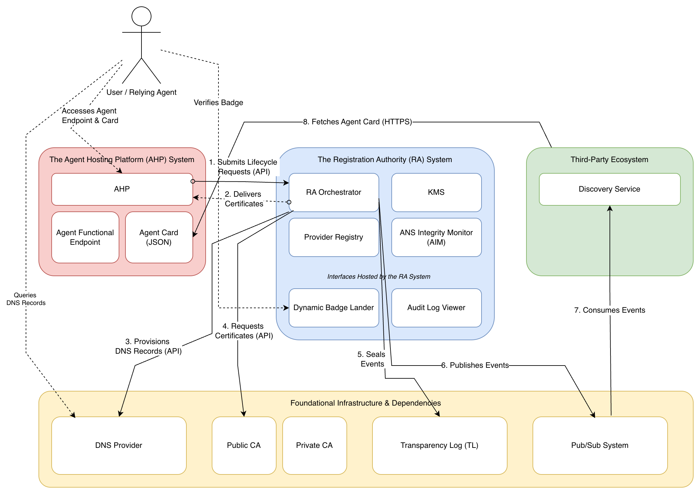
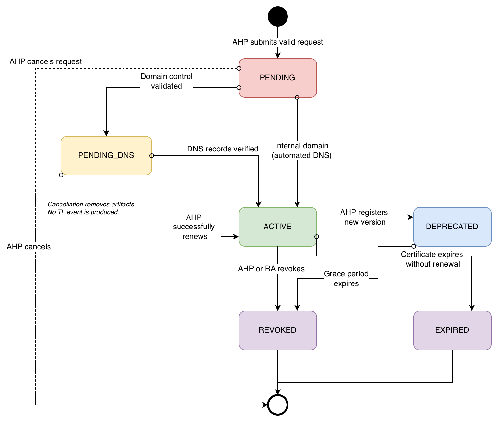
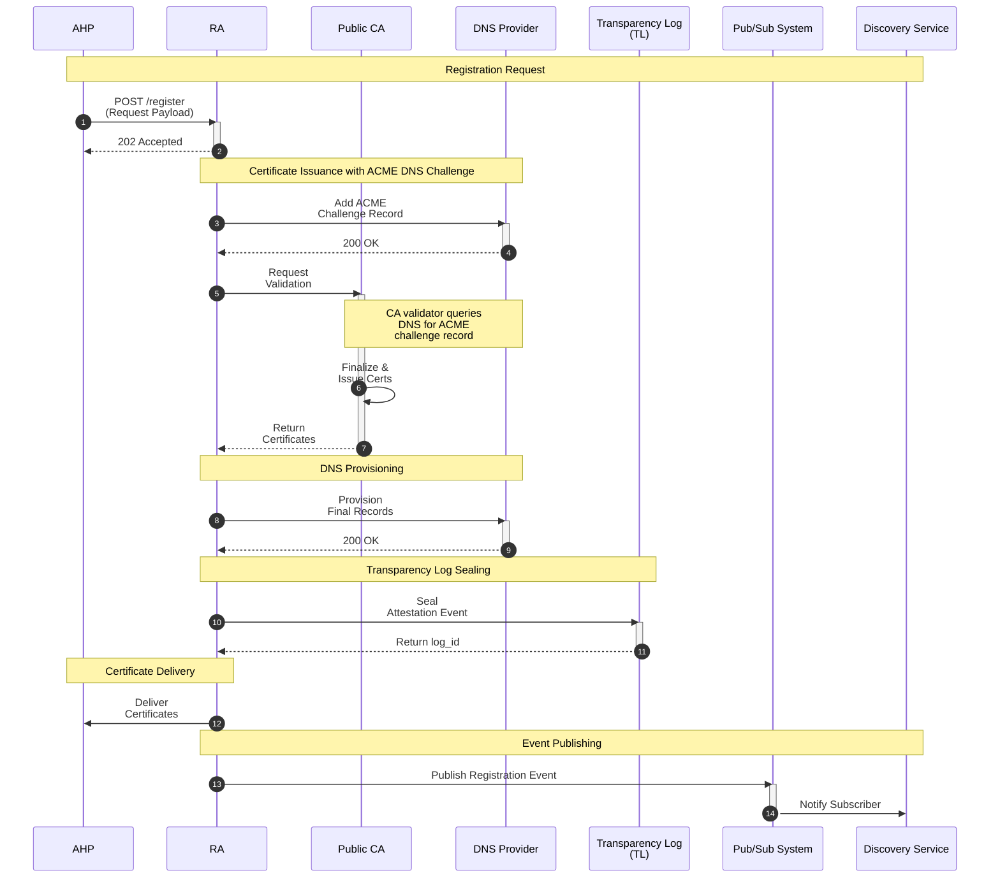
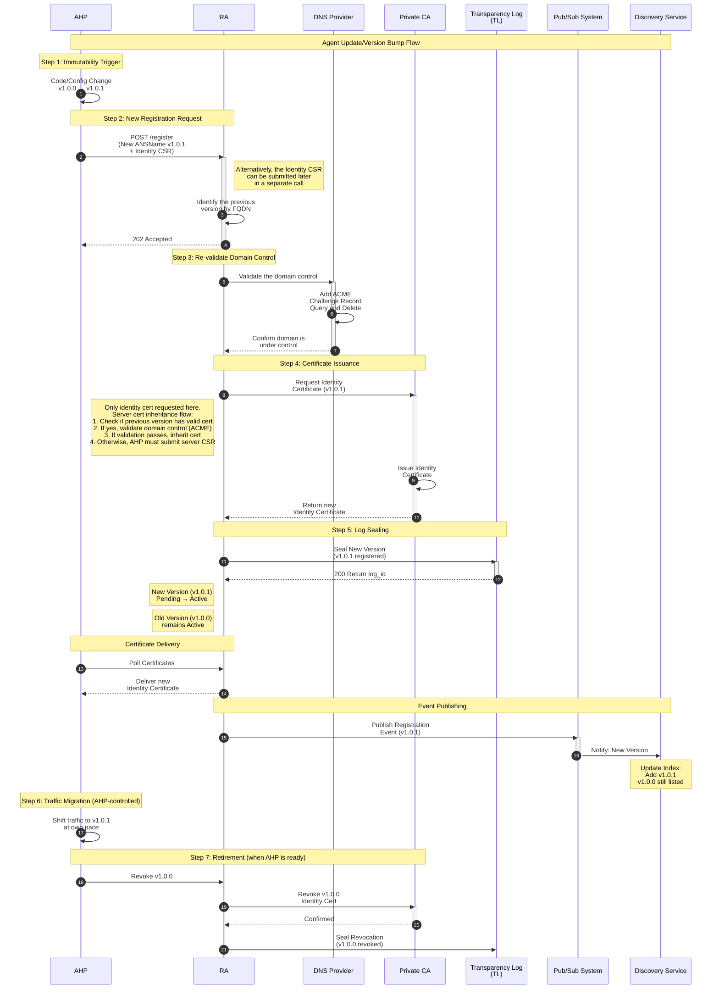

# Agent Name Service: Architecture and Design

*A trust layer for the agentic web*

## 1.0 Introduction and goals

### 1.1 The problem

A customer support agent at one company needs to hand a transaction to a payment processor at another. Before delegating, it must answer three questions: Is the payment agent who it claims to be? Can I verify that claim independently? And when that agent updates its software next week, how do I know I am still talking to the same entity?

Today, every AI platform answers these questions differently, or not at all. Google's A2A protocol, Anthropic's MCP, and Microsoft's agent frameworks each define their own discovery and trust mechanisms. These mechanisms do not interoperate. An agent registered in one ecosystem is invisible to another. The result is a set of walled gardens, each growing rapidly but unable to connect. Agents today answer questions, generate text, and summarize documents. They do not autonomously execute transactions across organizational boundaries, because there is no way to verify counterparty identity. The shift from agents that talk to agents that transact requires a trust layer that no single platform provides.

The Agent Name Service (ANS) solves this by anchoring every agent identity to a domain name, the one namespace that already spans every network on earth. The Registration Authority (RA) verifies domain ownership, issues cryptographic certificates, provisions DNS records, and seals an immutable record into a Transparency Log. Existing agent protocols continue to work. ANS adds the identity layer underneath.

### 1.2 Origin and departures from prior art

This architecture builds on "Agent Name Service for Secure AI Agent Discovery" by Narajala, Huang, Habler, and Sheriff (OWASP). The design departs from that paper in several ways, motivated by production deployment at internet scale.

The core design choices have independent corroboration from unrelated efforts. The Hedera ecosystem's HCS-14 standard independently arrived at DNS TXT records for agent discovery, using `_agent.<nativeId>` as the record name. What began as independent convergence is now active collaboration: GoDaddy is working with the HCS-14 working group to define an ANS Profile within HCS-14, so that resolvers can verify ANS DNS records, certificates, and log proofs through a standard interface without ANS-specific branching. A companion effort will define a Merkle Tree Registry specification under HCS-2, anchoring periodic ANS Transparency Log roots to a public distributed ledger for independently verifiable timestamps. The IETF's SCITT working group (Supply Chain Integrity, Transparency and Trust), whose core architecture draft is in the RFC Editor Queue, defines an append-only transparency log with signed statements and receipts that maps closely to the ANS Transparency Log. Google's A2A and Anthropic's MCP, now consolidating under the Linux Foundation, define agent communication but explicitly defer identity and discovery to external infrastructure. The convergence of these independent efforts on the same structural gap corroborates the design direction.

### 1.3 Foundational principles

**Identity is anchored to a domain name.** Every agent maps to a unique, globally resolvable Fully Qualified Domain Name (FQDN). The `ANSName` format `ans://v{version}.{agentHost}` embeds the FQDN directly. This domain becomes the agent's permanent address, the root of its trust chain, and the one identifier that remains stable across software versions. Trust artifacts bind cryptographically to verified domain control, not to a logical name in a private directory.

Five design decisions follow from this foundation:

1. **Domain control validation.** The RA verifies ownership using the ACME protocol (DNS-01 or HTTP-01 challenges) before attesting to any identity. No domain proof, no registration.

2. **Decentralized discovery.** The RA publishes signed lifecycle events to a message bus. Third-party discovery services subscribe, verify signatures, and build their own indexes. Discovery is a competitive market, not a centralized lookup.

3. **Version-bound lifecycle.** Every change to an agent's software or capabilities requires a new version number and a new registration. This event-driven lifecycle produces a granular audit trail.

4. **Dual-certificate model.** Two certificates resolve the conflict between public web trust and software versioning. A Server Certificate from a public CA secures the stable FQDN. An Identity Certificate from a private CA attests to the version-bound `ANSName`. Each has its own lifecycle.

5. **Discoverable schemas.** The Agent Card links each protocol to a canonical JSON Schema URL, making schemas first-class artifacts rather than implementation details hidden inside server-side adapters.

### 1.4 Terminology

| Term | Definition |
| :--- | :--- |
| **A2A** | Agent-to-Agent protocol, Google's standard for agent collaboration. |
| **AHP** | Agent Hosting Platform, the system that runs agent code and initiates lifecycle requests with the RA. |
| **ANS** | Agent Name Service, the directory and trust layer described in this document. |
| **CA** | Certificate Authority, an entity that issues digital certificates. Publishes OCSP responders and CRL distribution points for real-time revocation checks. |
| **CSR** | Certificate Signing Request, a message from an applicant to a CA requesting a certificate. |
| **FQDN** | Fully Qualified Domain Name, a complete domain name specifying exact position in the DNS hierarchy (e.g., `support-agent.acme.com`). |
| **KMS** | Key Management System, the centralized service protecting the cryptographic root of trust. |
| **MCP** | Model Context Protocol, Anthropic's standard for agent-tool communication. |
| **RA** | Registration Authority, the central orchestrator that validates agent identity, issues certificates, provisions DNS, and seals records. |
| **TL** | Transparency Log, an append-only, cryptographically verifiable ledger of all agent lifecycle events. |

### 1.5 Goals

The ANS Registry exists to let autonomous AI agents find and trust each other across organizational boundaries. Without a shared trust layer, every agent provider needs bilateral agreements with every potential partner. That creates an O(n²) scaling problem.

The registry automates certificate lifecycle management, DNS record provisioning, and cryptographic identity binding. A small business can connect its customer support chatbot to a third-party payment processor without manual configuration or custom trust negotiation. The verifiable identity model also enables new business patterns: agents can charge per API call or require subscriptions with cryptographic proof of service delivery.

The system records all identity events in a single Transparency Log. Server Certificates and Identity Certificates are separate because their lifecycles differ. Server Certificates follow the public CA renewal cycle. Identity Certificates change whenever the agent's software changes. Every code release requires a new identity registration, producing an audit trail that tracks exactly which version of an agent was running at any point in time.

External regulatory pressure is creating concrete demand for this infrastructure. The EU AI Act (Article 50) requires transparency and identity disclosure for AI systems interacting with people, with compliance required by August 2, 2026. In the US, NIST's Center for AI Standards and Innovation issued a Request for Information on Securing AI Agent Systems in January 2026. Both signals point in the same direction: verifiable agent identity is moving from a design preference to a compliance requirement.

### 1.6 Deployment topologies

The architecture described in this document is topology-independent. The same RA, TL, and certificate infrastructure can run at different scopes depending on the trust boundary an organization needs.

**Public ANS.** The primary deployment. The RA, TL, and event feeds are internet-facing. Transparency is public: anyone can verify any agent's identity and audit its history. Multiple environments (production, OTE, development) serve different stages of the integration lifecycle. OTE mirrors production functionality and is the appropriate destination for agents that are not yet ready for production use.

**Internal ANS.** An organization runs its own RA and TL behind its corporate network, the same way a company runs internal DNS and uses RFC 1918 address space. Agents registered in an internal ANS are visible only to participants on that network. The TL is not publicly accessible, but it remains transparent within the organization: the append-only, cryptographically verifiable properties are unchanged. Internal ANS is appropriate when agents interact only within a single enterprise and the organization prefers to keep its agent inventory private.

**Enterprise ANS as a service.** A hosted internal ANS instance, operated on behalf of an enterprise in their own cloud account (e.g., AWS with their own object storage for the TL). The enterprise controls access, data residency, and retention policy. The operator provides the software and operational support. This model serves organizations that want private agent identity infrastructure without building it from scratch.

**Extranet ANS.** A semi-private deployment shared among a defined set of partner organizations. Participants trust the shared RA and TL, but the infrastructure is not open to the public internet. Extranet deployments are valuable during the early adoption period before broad public ANS adoption, similar to how corporate extranets bridged organizations before widespread SSL adoption and mature network segmentation made direct internet connectivity practical.

Each topology runs the same protocol. An agent registered in a public ANS presents the same certificate structure as one in an internal ANS. The difference is who can see the TL and who can query the event feeds. Federation between topologies (e.g., an internal agent that also needs a public identity) is a future capability that builds on the multi-RA federation work described in §9.3.

### 1.7 Entity scope

The term "agent" appears throughout this document because autonomous AI agents are the primary registrant. The architecture is not limited to agents. Any software entity that needs a verifiable, domain-anchored identity can register: an agentic browser acting on behalf of a user, a web crawler with declared behavioral policies, a consuming service that presents credentials when calling an agent. The registration payload, certificate model, and TL semantics are identical regardless of entity type. What differs is the Agent Card content and the endpoints array. A consuming entity may register an Identity Certificate for mTLS without serving an Agent Card. The Trust Index scores whatever signals are available; a missing card reduces the integrity dimension but does not block registration.

## 2.0 Architectural views

### 2.1 Logical view

Three security domains meet at the Registration Authority.

The **Agent Platform Domain** contains the Agent Hosting Platform and the public-facing DNS Provider. The **Trust Authority Domain** contains the Key Management System, the Transparency Log, and the Provider Registry. The **Certificate Domain** contains both the Public and Private Certificate Authorities.



*Figure 1. Component diagram. Three security domains meet at the RA: the Agent Platform (red), the Trust Authority (blue), and shared infrastructure (yellow). The Third-Party Ecosystem (green) consumes events and fetches Agent Cards.*

### 2.2 Process view

Two flows define system behavior.

**Registration.** The RA receives a request, delegates validation to specialized services, aggregates the results, seals an immutable entry into the Transparency Log, and delivers certificates to the AHP.

**Integrity monitoring.** The ANS Integrity Monitor (AIM) continuously queries DNS records for active agents, compares them to the expected state from registration, and triggers remediation when it detects unauthorized changes.

## 3.0 Component model

The architecture connects a central Registration Authority with Agent Hosting Platforms and shared internet infrastructure.

### 3.1 The Registration Authority system

The RA is the trusted third party at the center of the ANS ecosystem. It validates agent identities, orchestrates certificate issuance, and seals records into the Transparency Log.

**3.1.1 Registration Authority.** The stateful orchestration engine that processes registration requests, coordinates with external services, and manages agent lifecycle from registration through revocation.

**3.1.2 Key Management System (KMS).** AWS KMS (or equivalent) holds the private key that signs the Transparency Log's Merkle Tree Root. This key is the cryptographic root of trust for the entire system.

**3.1.3 Provider Registry.** Maps immutable ProviderIDs (`PID-1234`) to current legal entity names. When "AcmeCorp" becomes "MegaCorp," one record updates instead of re-registering thousands of agents.

**3.1.4 ANS Integrity Monitor.** The AIM is an external, third-party ecosystem role (see §3.4.2). The RA runs its own AIM instance as a reference implementation. The architecture treats monitoring as a decentralized function.

The RA's internal AIM validates DNS records, Agent Card integrity, and linked schemas against registration hashes. It triggers remediation when it detects discrepancies.

To avoid false positives from transient network errors, the reference implementation requires a multi-node consensus check and a 15-minute persistent failure window before changing agent state. The system distinguishes between "Unreachable" (identity preserved, retry later) and "Mismatch" (remediation needed).

**3.1.5 Interfaces hosted by the RA:**
* **Dynamic Badge Lander.** Displays an agent's real-time trust status. Deployed in two formats: a standalone HTML page for forensic verification, and an embeddable JavaScript snippet for AHP landing pages. The JS snippet is a visual trust symbol for human users, not a cryptographic security mechanism.
* **Audit Log Viewer.** Forensic history of state changes with cryptographic proofs.
* **Lifecycle Management APIs.** Private endpoints where AHPs submit registrations, renewals, and revocations. These APIs accept both CSR-based registration and BYOC (Bring Your Own Certificate) for Server Certificates.

### 3.2 The Agent Hosting Platform system

The AHP hosts the agent's code and business logic. It initiates lifecycle requests to the RA on behalf of the agent's owner and maintains the public-facing resources at the agent's FQDN: the functional endpoints, the Agent Card metadata file, and JSON Schema files for each supported protocol.

**3.2.1 Agent Hosting Platform.** The client platform that integrates with the RA's APIs.

**3.2.2 Interfaces hosted by the AHP:**
* **Agent Functional Endpoint.** The live service exposing the agent's capabilities.
* **Agent Card.** A machine-readable JSON file at a canonical URL describing the agent's capabilities, with links to each protocol's JSON Schema. The schema includes a `verifiableClaims` array for third-party attestation references (see §A.2). Each claim entry is a typed reference (type, hash, URL, issuer) to a credential hosted by its issuer. The RA hashes the full Agent Card, including any claims present at registration, and seals the hash into the Transparency Log. The RA validates the structure of each claim entry but does not evaluate the claims themselves; that is the Trust Index's responsibility.

### 3.3 Infrastructure and dependencies

The RA depends on several external systems.

**3.3.1 Transparency Log (TL).**

The Transparency Log is an append-only ledger that records every agent lifecycle event. Think of it as a notary's journal: once an entry is written, it cannot be altered or removed. Anyone can verify that fact mathematically.

The TL stores events in a Merkle tree. Each leaf in the tree holds one event. Each parent node holds the hash of its children. If someone changes a historical event, its hash changes. That change propagates up through every parent node to the root. The root hash, signed by the KMS, is the single value that proves the integrity of the entire log.

Events process in batches (every 5 seconds or after 1,000 events). Each event receives a globally unique, monotonically increasing sequence number. Events become visible via the public API only after checkpointing. Clients never observe uncommitted state.

The implementation uses the Tessera library (successor to Trillian) with tile-based proof generation and SHA-256 hashing. Leaf nodes contain deterministic hashes of canonicalized event data. The KMS signs each new Merkle root after batch completion, creating a verifiable checkpoint.

This architecture follows the IETF SCITT model (Supply Chain Integrity, Transparency and Trust). SCITT defines an append-only transparency service that accepts signed statements, registers them in a log, and returns receipts as proof of inclusion. Its core architecture draft is in the RFC Editor Queue. A future goal is formal SCITT compliance, so the TL implements an emerging internet standard rather than a bespoke design.

Merkle inclusion proofs (which demonstrate that a specific event exists in the tree) are available on-demand via the `includes=merkleProof` query parameter. Clients can omit the parameter for lower latency. Consistency proofs between any two tree states follow RFC 6962. Append operations run in O(log n) time by caching intermediate node hashes.

**Event schema versioning:**

The TL supports multiple event schema versions to enable backward-compatible evolution. Schema V0 used `snake_case` field names and lowercase event types. Schema V1 (current) uses `camelCase` field names and UPPERCASE event types (e.g., `AGENT_REGISTERED`, `AGENT_REVOKED`). The response header `X-Schema-Version` identifies the schema version of each event. Historical events retain their original schema version; clients must handle both formats. The `/v1/log/schema/{schemaVersion}` endpoint serves the JSON Schema definition for each version.

**3.3.1.1 Public verification interface:**

The Transparency Log exposes a REST API for external verifiers. The current API surface:

| Endpoint | Purpose |
| :--- | :--- |
| `GET /v1/agents/{agentId}` | Current agent transparency log entry (HTML or JSON) |
| `GET /v1/agents/{agentId}/audit` | Paginated audit trail (most recent first) |
| `GET /v1/log/checkpoint` | Latest signed checkpoint |
| `GET /v1/log/checkpoint-history` | Checkpoint history with pagination |
| `GET /v1/log/schema/{schemaVersion}` | Versioned JSON Schema definitions |
| `GET /.tlog/checkpoint` | Tessera-compliant checkpoint |
| `GET /.tlog/root_keys` | Root verification keys |
| `GET /.tlog/tile/{level}/{index}` | Merkle tree tiles |

The API provides:
- Current and historical Signed Tree Heads (STH)
- Merkle inclusion proofs for specific events (opt-in via `includes=merkleProof`)
- Consistency proofs between tree states
- Public signing keys for verification
- Event queries by agent ID

**3.3.1.2 Key distribution:**

The Transparency Log implements multi-channel key distribution:
- Primary: HTTPS endpoints at `/v1/keys/*` for current and historical public keys
- Secondary: DNS TXT records for key fingerprint verification

Each key associates with a `tree_version` that increments on rotation. Public keys support caching with ETags and cache-control headers.

**3.3.1.3 Producer signature validation:**

Producer signatures are validated internally by the TL upon event receipt and sealed into log entries as part of the immutable record. Producer public keys remain private. External verifiers trust the TL's validation as part of the trust model. See §5.9 for the full key management lifecycle.

**3.3.2 Event distribution architecture:**

Events flow through three systems: an SNS message bus, a queryable Event Stream, and the Transparency Log.

**3.3.2.1 SNS message bus:**

AWS SNS distributes lifecycle events from the RA via the `ans-transparency-log-event-notifications` topic. Each event payload includes a digital signature from the RA. Publishing runs in the background so that multiple subscribers do not slow down registration.

**3.3.2.2 Event Stream:**

The Event Stream is a separate microservice (Go + AWS CDK). It provides queryable, cursor-paginated access to agent lifecycle events. It consumes from the SNS topic via an SQS→Lambda pipeline and stores events in DynamoDB Global Tables for multi-region reads.

Key characteristics:
- **Cursor-based pagination** using UUIDv7 `logId` values (strictly time-ordered globally)
- **Time-bucketed partitioning** (`YYYYMMDD` derived from logId) avoids hot partitions
- **Provider-filtered queries** via a Global Secondary Index (`providerId#dateBucket`)
- **Configurable retention** (default 30 days) via DynamoDB TTL
- **SDKs provided:** Go SDK (poller with persistence and retry) and Python SDK (async iterator with webhook delivery)

API surface:
- `GET /v1/events` - Query events with optional `providerId`, `lastLogId` cursor, and `limit` (1-200)
- `GET /health` - Service health check

The Event Stream and the Transparency Log serve different purposes. The TL proves that events occurred and were not tampered with. The Event Stream provides efficient queries and real-time subscriptions. Discovery Services use the Event Stream for indexing.

**3.3.3 Producer authentication and event submission**

The Transparency Log uses two-phase trust establishment for event producers (RA instances).

**Phase 1: Key registration.** Before submitting events, each RA instance registers its public key with the TL's internal API. The registration includes the instance identifier (`ra_id`), signing algorithm, and validity period. Authentication uses JWT tokens from the IAM system. The `ra_id` in the token must match the key being registered. Keys can pre-register with future `valid_from` dates for zero-downtime rotation.

**Phase 2: Event submission.** The RA instance signs each event with its registered private key and submits it to `/internal/v1/events`. The event includes a detached JWS signature and `producer_key_id`. The TL validates the signature against the registered public key before accepting the event. Validated events receive a globally unique sequence number, enter the batch queue, and seal into the Merkle tree during the next batch cycle. The `log_id` provides idempotency: submitting the same event twice has no effect.

**3.3.4 DNS provider:**

Manages public DNS zone files for agent FQDNs. The RA interacts via API (e.g., Domain Connect) to provision records.

### 3.3.5 Certificate Authorities (CAs)

The architecture uses two distinct Certificate Authority types:

* **Public Certificate Authority (Public CA):** Standard, universally trusted CA (e.g., Let's Encrypt, DigiCert) issues the Public Server Certificate (`PubSC`) securing the agent's stable FQDN. Public revocation services (OCSP/CRL) serve any internet client.

* **Private Certificate Authority (Private CA):** Dedicated CA operated by the Registration Authority issues event-driven Private Identity Certificates (`PriCC`) attesting to version-bound `ANSName`. Revocation services remain private to the ANS ecosystem.

This separation allows the `PubSC` to follow slow, time-based public WebPKI rules for universal compatibility while the `PriCC` maintains the fast, event-driven lifecycle needed for agent identities.

### 3.4 The trust framework: three layers

The RA answers one question: "Who are you?" It verifies and seals the agent's identity. It does not evaluate whether the agent is well-governed or well-behaved. Those are separate questions, answered by separate services, built on the identity foundation the RA provides.

**Layer 1: Foundational identity (the RA).** The RA verifies domain control, issues certificates, and seals the Agent Card hash into the Transparency Log. This layer is the scope of this document.

**Layer 2: Operational maturity (third-party attestors).** Services like SOC 2 auditors or HIPAA validators attest to how an agent is governed. These attestations update on a batch or certification cycle. The Agent Card's `verifiableClaims` array (§3.2.2) carries references to these attestations.

**Layer 3: Behavioral reputation (real-time scoring).** External services continuously score agent behavior: transaction success rates, protocol compliance, community flags. These scores update in seconds, not months.

These three layers describe *who provides trust data*. The companion Trust Index Architecture describes *what trust data is evaluated*, organizing signals into five dimensions (integrity, identity, solvency, behavior, safety) and computing a numeric trust score. The Trust Index consumes data from all three layers. Layer 1 feeds the integrity and identity dimensions. Layers 2 and 3 feed solvency, behavior, and safety.

The data flows mechanically through two paths. **Registration-time claims** enter the system via the Agent Card's `verifiableClaims` array (§3.2.2). The AHP includes whatever attestation references it has at registration. The RA hashes the full Agent Card, claims included, and seals that hash into the Transparency Log. The event payload's `meta` block includes the claim types. Discovery Services and Trust Index crawlers can filter by attestation type without fetching the full Agent Card. **Post-registration signals** (behavioral scores, dispute rates, real-time solvency proofs) never touch the Agent Card or the RA. The Trust Index collects these independently and includes them in its own scoring output. The RA's sealed hash is a snapshot of what the agent claimed at registration. The Trust Index's evaluation is a live assessment of what the agent is doing now.

*The trust framework diagram lives in TRUST_INDEX_ARCHITECTURE.md (Figure 1: Five Pillars of Trust).*

**3.4.1 Discovery service:**

Third-party applications at layer 3 consume the RA's Pub/Sub feed to build searchable agent indexes accessible through their own UI and API.

**3.4.2 ANS Monitoring Service:**

Third-party ANS monitoring services provide layer 2 and layer 3 functions. For instance, the ANS Integrity Monitor operates at layer 2 and provides continuous integrity verification for registered agents; its findings contribute to behavioral scoring at layer 3.

A competitive marketplace of monitoring services can emerge. Different services can offer different verification frequencies, geographic coverage, and alerting features. The RA is the source of truth for registration. ANS Monitors audit the live state of the internet against that truth.

Third-party AIMs are encouraged to implement a "soft-fail" protocol. When a monitor detects a discrepancy between a live Agent Card hash and the TL attestation, it should first signal a "Compliance Warning" via the event stream. Hard cryptographic revocation should be reserved for confirmed malicious drift. This gives AHP providers time to fix configuration errors before service is interrupted.

### 3.5 Stability and safety valves

Automated governance can cause outages if it overreacts. Two safety valves prevent this:

* **Decoupled trust enforcement.** When a metadata integrity check fails, the first response is discovery suppression (hiding the agent from search), not certificate revocation (breaking mTLS). This creates a review window for human intervention before connections break.

* **Registry independence.** The data plane (mTLS handshakes between agents) continues to function during RA or AIM outages. Previously established trust proofs remain valid until the registry restores connectivity or certificates naturally expire.

### 3.6 The ANS SDK

The SDKs (Java, Go, Python) and the CLI are the interface between the AHP developer and the RA. They handle three concerns that the RA's API does not address: protocol-specific metadata extraction, trust store management, and certificate installation.

**3.6.1 Protocol adapter layer.**

The RA accepts a single registration payload format (§6.1.1). Agent protocols define their own metadata structures: A2A has an Agent Card, MCP has a tool manifest, HTTP_API may have an OpenAPI document. The SDK's protocol adapter translates these native formats into the ANS registration payload.

Each adapter extracts the fields the RA needs (endpoints, capabilities, schema URLs) from the protocol's native metadata. The developer points the SDK at an existing configuration file or URL. The adapter reads it, constructs the ANS registration payload, and optionally assembles the `agentCardContent` block from the native source. The developer does not write ANS-specific metadata by hand.

The adapter also works in reverse. When the SDK receives a registration response, it can generate protocol-native files (for instance, an A2A Agent Card augmented with ANS trust fields) for the AHP to serve.

**3.6.2 Registration flow.**

From the developer's perspective, registration is a single CLI command or SDK method call. The steps underneath:

1. The developer provides the agent's FQDN, version, and a pointer to the protocol metadata (a file path, URL, or inline configuration).
2. The protocol adapter (§3.6.1) reads the metadata and constructs the registration payload.
3. The SDK generates a private key and CSR for the Identity Certificate. It stores the private key in the AHP's keystore; the key never leaves the developer's infrastructure.
4. The SDK submits the registration payload to the RA and receives a 202 Accepted.
5. The SDK polls the RA until validation completes (domain control, organization identity, schema checks).
6. On success, the SDK downloads the issued certificates and installs them in the configured keystore.

The CLI exposes each step as a separate subcommand for debugging and scripting. The SDK's high-level method runs them as a single operation.

**3.6.3 Trust Provisioner distribution.**

ADR 009 defines the Trust Provisioner, a client-side component that manages the agent's trust store. The SDK bundles it.

On first use, the Trust Provisioner installs the bootstrapping RA's Private CA root certificate into the agent's trust store. This root is the one anchor the SDK ships with; everything else derives from it. In the single-RA phase, this root is sufficient: the agent can verify Identity Certificates issued by that RA.

In the federated phase (§9.3), the Trust Provisioner retrieves a trust bundle from the Federation Registry. The bundle contains the root certificates of all compliant RAs. The provisioner verifies the bundle's signature against the Federation Registry's master trust anchor, installs the roots, and refreshes them on a configurable schedule. The agent can then verify Identity Certificates from any compliant RA without manual trust store configuration.

## 4.0 Data model and integrity

### 4.1 The ANSName

An ANSName is the canonical identifier for a registered agent. It has three components, bound by the protocol prefix `ans://`. The format decouples identity from protocol: an agent can support A2A, MCP, and HTTP_API simultaneously without changing its name.

**Canonical Format:** `ans://v{version}.{agentHost}`

**Canonical Example:** `ans://v1.0.0.sentiment-analyzer.example.com`

| Component | Description | Example |
| :--- | :--- | :--- |
| **protocol** | Fixed protocol prefix for all ANS names. Always "ans". | `ans` |
| **version** | Semantic version (`major.minor.patch`) strictly bound to the agent's code. Prefixed with 'v'. | `v1.0.0` |
| **agentHost** | Fully-qualified domain name (FQDN) serving as both the agent's network address and trust anchor. This FQDN is the agent's persistent identifier. | `sentiment-analyzer.example.com` |

**Registration Metadata Fields:**

These fields are required during registration but are not part of the ANSName string format:

| Field | Description | Max Length | Required | Unique |
| :--- | :--- | :--- | :--- | :--- |
| **agentDisplayName** | Human-readable name for the agent. Used in discovery services and UIs. | 64 chars | Yes | No |
| **agentDescription** | Brief description of the agent's purpose and capabilities. | 150 chars | No | No |

**History.** The ANSName was simplified from six components to three in January 2026 (PR #415). The `protocol`, `agentName`, `capability`, `ProviderID`, and `extension` components were removed. Protocols moved to the endpoints array. The FQDN absorbed the agent name. Two metadata fields were added: `agentDisplayName` (required, human-readable) and `agentDescription` (optional). The result: fewer components, stable FQDN-based identity, and protocol flexibility without version changes.

**Domain Model:**

```kotlin
data class AnsName private constructor(
    val version: SimplifiedSemVer,  // e.g., SimplifiedSemVer(1, 0, 0)
    val agentHost: String            // e.g., "sentiment-analyzer.example.com"
) {
    fun toUri(): String = "ans://v${version}.${agentHost}"
}
```

### 4.2 Identifiers

An agent has three identifiers, each answering a different question.

#### 4.2.1 Core identity identifiers

**ANSName** answers "which version of this agent?" The format `ans://v{version}.{agentHost}` binds a specific software version to a specific domain. Any change to either component requires a new registration.

**FQDN** answers "which agent, across all versions?" The domain name `sentiment-analyzer.example.com` remains constant whether the agent runs v1.0.0 or v2.0.0. The FQDN is the trust anchor, the root of the cryptographic chain, and the stable reference for an agent's complete history.

**Agent ID (UUID)** answers "which registration record?" Each registration instance receives a system-assigned UUID. API paths use this UUID (e.g., `/agents/{agentId}/certificates/server`). The UUID is the operational handle for a specific version's record, independent of ANSName formatting.

The FQDN is the identity. The ANSName is the versioned identity. The UUID is the database key.

**Future: Decentralized Identifier (DID).** DIDs are planned as an optional identifier that bridges web2 and web3 identity. A DID like `did:web:support-agent.example.com` resolves to a DID Document containing the agent's public key material. The cryptographic anchor is bidirectional: the DID Document references the FQDN, and the Transparency Log entry records the DID. The RA would verify both directions at registration. For `did:web`, the trust root is still DNS (since the DID resolves to the domain). For blockchain-based methods (`did:ethr`, `did:ion`), the trust root is the ledger itself, and the binding to the FQDN provides the bridge between the two trust substrates.

**Display name and description.** A human-readable display name (required, max 64 characters) and an optional description (max 150 characters) accompany each registration. Display names support spaces, capitalization, and special characters. They are not unique, since the FQDN is the unique identifier.

#### 4.2.2 Registration and lifecycle identifiers

**Registration Identifier**: Primary identifier for each agent registration in the system. Each new version receives a new registration identifier while maintaining linkage to previous versions.

**Application Identifier**: Tracks the application process before registration approval, enabling audit trails of both successful and rejected applications.

**Supersedes Identifier**: Links new registration versions to their predecessors, creating an immutable chain of version history.

#### 4.2.3 Certificate and signing identifiers

**CSR Identifier**: Unique identifier for each Certificate Signing Request, enabling asynchronous certificate processing workflows.

**Certificate Order Identifier**: Bridges the registry with external certificate issuance services for complex validation scenarios.

**Certificate Serial Number**: Enables precise certificate revocation following standard PKI practices.

#### 4.2.4 Transparency Log identifiers

**Log Entry Identifier.** A unique reference to each event in the Transparency Log.

**Sequence Number.** A globally unique, monotonically increasing position that enforces the append-only property.

**Leaf Index.** Position in the Merkle tree, used to generate inclusion proofs.

**Tree Version.** Increments when the KMS signing key rotates, so verifiers know which key to use for historical proofs.

#### 4.2.5 Operational and forensic identifiers

**RA Instance Identifier (ra_id).** Identifies the specific runtime instance that processed a request. If that instance is later found to be compromised, auditors can isolate every event it touched.

**Root Signing Key Identifier.** Identifies the key used to sign the Merkle Tree Root.

**Producer Key Identifier.** Identifies the key an RA instance used to sign an event before submitting it to the Transparency Log.

**Registrar Identifier.** A stable, public identifier for each RA in a federated ecosystem.

#### 4.2.6 Event and request identifiers

**Request Identifier.** Tracks a request across service boundaries.

**Message Identifier.** Deduplicates events in the asynchronous messaging system.

**Trace Identifier.** Correlates operations across microservices for debugging.

#### 4.2.7 Data organization identifiers

**Date Partition Key.** Partitions events by date for efficient time-range queries.

**Provider-Date Composite Key.** Combines provider and date for scoped queries while preserving global order.

**Pagination Cursor.** An opaque token for traversing large result sets.

#### 4.2.8 Identifier flow patterns

The architecture defines specific identifier flow patterns to maintain consistency:

**Registration Flow**: Agent Identifier → Registration Identifier → CSR Identifier → Certificate Order Identifier → Log Entry Identifier → Sequence Number

**Event Flow**: Request Identifier → Agent Identifier → Log Entry Identifier → Date Partition → Leaf Index

**Version Update Flow**: Agent Identifier + Supersedes Identifier → New Registration Identifier → New ANSName with incremented version

**Forensic Trace Flow**: RA Instance Identifier → All processed events → Sequence Numbers → Merkle proofs → Tree Version → Root Signing Key

Each flow produces a chain of identifiers that can be traced end to end with cryptographic proof at each step.

### 4.3 Certificate integrity

**Server Certificate.** Issued by a Public CA. Contains the FQDN in the SAN for standard TLS.

**Identity Certificate.** Issued by a Private CA. Contains the full `ANSName` as a `uniformResourceIdentifier` in the SAN, binding the certificate to a specific software version.

### 4.4 Agent state lifecycle

An agent's `agent_state` progresses through a defined set of states. Each transition is recorded in the Transparency Log.

**States:**

| State | Description |
| :--- | :--- |
| `PENDING` | Initial state after registration submission; awaiting validation |
| `PENDING_DNS` | Domain validated; awaiting DNS record verification |
| `ACTIVE` | Registration complete; agent is operational |
| `DEPRECATED` | Marked for retirement by the AHP; signals consumers to migrate |
| `REVOKED` | Explicitly revoked; identity certificates invalidated |
| `EXPIRED` | Registration validity expired; requires renewal |

**Transitions:**

- `PENDING` → `PENDING_DNS` (domain control validated, DNS records provisioned)
- `PENDING_DNS` → `ACTIVE` (all DNS records verified)
- `PENDING` → `ACTIVE` (internal domain with automated DNS; validation and provisioning complete)
- `ACTIVE` → `DEPRECATED` (AHP explicitly marks a version for retirement)
- `ACTIVE` → `REVOKED` (explicit revocation by AHP or RA)
- `DEPRECATED` → `REVOKED` (AHP completes migration and revokes, or certificate expires)
- `ACTIVE` → `EXPIRED` (certificate validity period expired without renewal)

A registration in `PENDING` or `PENDING_DNS` can be cancelled before activation. Cancellation removes partial artifacts (ACME challenges, provisioned DNS records) from the RA's internal state. No TL event is produced because the log-sealing step (§6.1.2, step d) has not occurred. Cancelled registrations never reach the TL.

Revocation is idempotent: revoking an already-revoked registration is a no-op.



*Figure 2. Agent state lifecycle. PENDING_DNS is the normal intermediate state for external domains; internal domains with automated DNS skip directly to ACTIVE. Cancellation (dashed lines) removes artifacts without producing a TL event. REVOKED and EXPIRED are terminal.*

### 4.5 Cryptographic data integrity standards

#### 4.5.1 JSON Canonicalization Scheme (JCS)

All JSON data must be canonicalized with JCS (RFC 8785) before signing or hashing. JCS produces a deterministic byte sequence from any logical JSON object, so different implementations computing a hash over the same data always get the same result. Without this guarantee, Merkle tree leaf hashes would depend on serialization order, whitespace, and numeric formatting.

#### 4.5.2 JSON Web Signature (JWS) format

All digital signatures MUST use JWS Detached Signature format. The payload is NOT embedded in the JWS structure. Signatures are stored in separate fields from the data they sign.

Why detached? If a signature field were included in the data being signed, the signature would need to contain itself. That is impossible. Detached signatures avoid this circular dependency. They also let data be processed, indexed, and queried without JWS extraction. Multiple parties can add signatures without modifying the original payload.

When a signature resides in the same JSON object as its data, the signature fields must be excluded from the signed payload. The scope must be explicit (e.g., "all fields except `signature` and `signature_kms_key_id`"). During verification, implementations extract only the signed fields before canonicalization.

**Technical requirements:**

The default algorithm is ES256 (ECDSA with P-256 and SHA-256), with provisions for algorithm agility.

Protected headers must include:
- `alg`: signing algorithm
- `kid`: key identifier for the signing key
- `typ`: type indicator (e.g., "JWT" for attestations)
- `tsp`: Unix timestamp of signature creation
- `raid`: RA instance identifier that created the signature

The payload consists of the JCS-canonicalized JSON object being signed (stored separately). The signature format follows `<protected_header>..signature` (note the two dots with empty payload section).

Use cases include Transparency Log batch signatures (Signed Tree Heads), RA attestation badges, Pub/Sub event payloads, and critical lifecycle requests such as revocations.

**JSON Structure and Signature Scope:**
To prevent circular dependencies when signatures are stored within JSON objects:

1. **Explicit Field Exclusion Pattern:**
   ```json
   {
     "data_field_1": "value1",
     "data_field_2": "value2",
     "signature": "..."         // This field is NOT included in the signed payload
   }
   ```
   Signature covers: `{"data_field_1": "value1", "data_field_2": "value2"}`

2. **Nested Structure Pattern (Recommended):**
   ```json
   {
     "data": {
       "field_1": "value1",
       "field_2": "value2"
     },
     "signature": "..."         // Signs only the "data" object
   }
   ```
   Signature covers: The entire `data` object

3. **Multi-Level Signature Pattern:**
   ```json
   {
     "event": {
       "type": "registered",
       "ans_name": "...",
       "producer_signature": "..."  // Signs the event minus this field
     },
     "batch_signature": "..."       // Signs the entire event object
   }
   ```
   - `producer_signature` covers: event object excluding itself
   - `batch_signature` covers: entire event object (including producer_signature)

## 5.0 Trust, security, and attestation

### 5.1 Layered trust

Trust rests on three layers. The **Identity Layer** uses the version-bound ANSName. The **Cryptographic Layer** signs the Merkle Tree Root with a key controlled by the KMS. The **Operational Layer** records the `ra_id` of the specific RA instance that performed each validation, enabling forensic accountability at the instance level.

#### 5.1.1 Verification steps and trust tiers

A client connecting to an agent can perform several independent verification steps. Each step adds evidence. The more steps a client performs, the stronger its assurance that the agent is authentic.

**Step 1: PKI certificate validation.** The client checks the agent's TLS certificate against trusted Certificate Authorities. This is standard TLS. It provides encryption and server authentication but cannot detect a compromised CA.

**Step 2: DANE record validation.** The client resolves the TLSA record at `_443._tcp.agent.example.com` and confirms the certificate fingerprint matches. This check uses a second trust channel (DNS, secured by DNSSEC) independent of the CA system. A compromised CA alone cannot forge a matching TLSA record. The RA provisions this record at registration: `_443._tcp.agent.example.com IN TLSA 3 0 1 [sha256_hash]`. The parameters mean DANE-EE (usage 3), full certificate (selector 0), SHA-256 (matching type 1). Selector 0 produces the same hash as the badge fingerprint in the TL, so a single SHA-256 computation serves both DANE and badge verification.

**Step 3: Transparency Log verification.** The client verifies that the presented certificate fingerprint matches the one recorded in the Transparency Log at registration. The TL already stores this fingerprint as part of the sealed attestation. This check uses a third trust channel (the TL's immutable Merkle tree, signed by the KMS). The current implementation uses Trust On First Use (TOFU), where the client caches the fingerprint locally on first contact. This is being superseded by TL-Backed Verification, where the client queries the TL directly. TL-Backed Verification removes the dependency on persistent local storage, making it suitable for ephemeral cloud environments (containers, serverless) where local state does not survive restarts.

For convenience in human communication and in the Trust Index scoring model, these steps map to named tiers: **Bronze** (step 1 only), **Silver** (steps 1-2), and **Gold** (steps 1-3). Agents making trust decisions operate on the specific verification artifacts, not the tier labels. The tier is a summary for human readers, like a diploma's honors designation. The artifacts listed on the diploma are what matter.

**Implementation.** The Java SDK implements all three tiers via `GoldTierTrustManager.java`. The current Gold implementation uses TOFU; TL-Backed Verification is in development. The Go SDK provides CLI tooling for Bronze and Silver verification.

### 5.2 Attestation and verification

Attestation proves that an agent's identity was validated. The verification path starts with a DNS lookup and ends with a Merkle proof.

#### 5.2.1 DNS trust anchor
The RA provisions one `_ans-badge` TXT record per ACTIVE version, pointing to that version's badge in the Transparency Log. This is the entry point for verification.

**Record format:**

```
_ans-badge.{agentHost} IN TXT "v=ans-badge1; version=v1.0.0; url=https://transparency.ra.ansregistry.com/v1/agents/{agentId}"
```

| Field | Required | Description |
| :--- | :--- | :--- |
| `v` | Yes | Format version. Always `ans-badge1`. |
| `version` | Yes | The agent version this badge represents, matching the version component of the ANSName (e.g., `v1.0.0`). Enables verifiers to select the correct badge when multiple ACTIVE versions coexist. |
| `url` | Yes | URL to fetch the badge from the Transparency Log. |
| `registrar` | No | Registrar ID of the issuing RA (ADR 011). Reserved for federated multi-RA deployments (§9.3). |

When two versions are ACTIVE (§6.2), DNS contains two `_ans-badge` records with different `version` values. A verifier that knows the version (e.g., from the Identity Certificate's URI SAN during mTLS) selects the matching record directly. A verifier that does not know the version (e.g., a client connecting over standard TLS) fetches the badge for the highest version or compares the presented certificate's fingerprint against each badge.

#### 5.2.2 Immediate status check (Dynamic Badge Lander)
The RA-hosted Badge Lander answers one question: "Is this agent trustworthy right now?" It displays the current agent state, the Merkle inclusion proof for the registration event, and the signed attestation badge.

#### 5.2.3 Cryptographic verification path
High-assurance verification walks this chain:
1. **DNS record integrity.** Verify the `_ans-badge` TXT record via DNSSEC.
2. **Badge signature.** Validate the JWS signature on the attestation badge using the RA's public key.
3. **Merkle inclusion.** Verify that the event exists in the Transparency Log.
4. **Root signature.** Validate the Signed Tree Head using the KMS key identifier.
5. **State consistency.** Confirm that the agent's current state matches the latest log entry.

#### 5.2.4 Deep forensic history (Audit Log Viewer)
The Badge Lander links to the Audit Log Viewer, which presents a chronological history of all state transitions with Merkle inclusion proofs for each event and cross-references to related events (registrations, renewals, revocations).

### 5.3 Operational and forensic integrity
Any version change to the `ANSName` triggers revocation of the old Identity Certificate and issuance of a new one. The `ra_id` in each Transparency Log entry lets auditors isolate every event processed by a single compromised instance. The separation of Server and Identity Certificates means a compromise of one does not affect the other.

### 5.4 Key management and storage
The RA never generates, handles, or accesses an agent's private keys. The AHP owns the full lifecycle of its private key material. The RA uses separate credentials for each external service integration, rotated on a regular schedule and stored in a secret management system.

### 5.5 Agent discovery model
Discovery is decoupled from the RA. The RA broadcasts lifecycle events. Third parties build indexes.

The process has two stages. First, a Discovery Service subscribes to the event feed, verifies the signature on each payload, and indexes the metadata using the FQDN as primary key. New agents become discoverable within seconds.

Second, the Discovery Service's crawler fetches the full Agent Card from the `agent_card_url` in the event payload. It parses this file to augment its index with detailed capability descriptions and parameter schemas.

#### 5.5.1 The `_ans` DNS record

A client that has an FQDN but no prior knowledge of the agent needs to know: what protocol does this agent speak, and where is its metadata? Without a deterministic answer, the client must probe common paths (`/.well-known/agent.json`, `/v1/chat`, `/mcp`) and wait for 404 errors. This is slow, noisy, and triggers firewalls.

The `_ans` TXT record is a connection hint published in DNS. It tells the client which protocol the agent supports and where to find the handshake instructions.

**Record syntax.** A standard TXT record containing semicolon-separated key-value pairs.

| Field | Required | Description |
| :--- | :--- | :--- |
| `v` | Yes | Schema version. Always `ans1` for this specification. |
| `p` | No | Protocol dialect for this entry: `a2a`, `mcp`, `http`. When omitted, the record applies to any protocol. |
| `url` | No | URL to the metadata file or endpoint. When omitted and `mode` is not `direct`, clients fall back to `/.well-known/agent-card.json` at the FQDN. |
| `mode` | No | `card` (default): client fetches the file at `url`. `direct`: client connects to the FQDN without fetching a static file. |

**Multiple records.** An FQDN may have multiple `_ans` TXT records, one per protocol. Clients filter by the `p` field and select the entry matching their capabilities.

**Four configurations:**

*Static card.* The agent hosts a metadata file at a URL it controls.
```
_ans   IN   TXT   "v=ans1; url=https://agent.example.com/.well-known/agent-card.json"
```
The RA fetches the file, hashes it, and seals the hash into the TL.

*Dynamic / direct.* The agent is code behind an API gateway. There is no static file to fetch.
```
_ans   IN   TXT   "v=ans1; p=mcp; mode=direct"
```
The client connects via the protocol handshake to the FQDN's A/AAAA address. The RA records a null hash (the agent is active but has no static card to verify).

*SaaS delegate.* The agent runs on a platform like Salesforce. The metadata lives on the provider's domain.
```
_ans   IN   TXT   "v=ans1; url=https://agentforce.salesforce.com/agents/v1/metadata/0014x"
```
The RA fetches and hashes the remote file.

*Multi-protocol.* The agent speaks multiple protocols. Each gets its own record.
```
_ans   IN   TXT   "v=ans1; p=a2a; mode=direct"
_ans   IN   TXT   "v=ans1; p=mcp; url=https://api.example.com/mcp-tools.json"
```
An A2A client ignores the MCP record and connects directly. An MCP client ignores the A2A record and fetches the manifest. A generic crawler that matches no specific protocol falls back to the record without a `p` field, if one exists.

**Resolution logic.** Given a target protocol, a client:

1. Queries all `_ans` TXT records for the FQDN.
2. Filters by `p={target_protocol}`. If no match, selects records with no `p` field.
3. If `mode=direct`: connect to the FQDN. No file to fetch.
4. If `url` is present: fetch the file at that URL.
5. If neither `url` nor `mode=direct`: attempt `/.well-known/agent-card.json` as a fallback.

### 5.6 Coexistence with other trust models
ANS is a foundational identity layer, not a replacement for existing authentication schemes. An agent at a stable FQDN can support multiple authentication protocols simultaneously.

A client using token-based authentication connects to the FQDN, secured by the standard Server Certificate. An ANS-aware agent connects to the same FQDN but initiates mTLS, presenting its Identity Certificate to prove its specific, version-bound ANSName. Both connections arrive at the same address.

This addresses two scenarios. Legacy or simple clients fall back to token-based authentication over standard TLS. High-assurance ANS-to-ANS communication between agents at different RAs requires bridging private trust domains. ADR 009 details how a client-side Trust Provisioner solves this bootstrap problem.

### 5.7 Channel vs. message-level security
Point-to-point API calls (AHP-to-RA, RA-to-CA) are secured with TLS. TLS protects authentication, confidentiality, and integrity for the duration of the session. For transient, synchronous commands between trusted parties, channel security is sufficient.

Payloads receive digital signatures when they are durable artifacts intended for third-party or asynchronous verification. Unlike TLS, a digital signature proves origin and integrity long after the session ends. Three payload types carry signatures: the RA Attestation Badge, Pub/Sub event payloads (so subscribers can verify authenticity), and critical AHP requests like revocations (for non-repudiation).

The signature verification hierarchy has three levels. Level 1: TL root signatures are publicly verifiable using keys from `/v1/keys/*`. Level 2: RA attestation badges are publicly verifiable using the RA's published public key. Level 3: producer signatures are included in log entries but verified only internally. Their presence preserves the chain of custody without requiring external verification infrastructure.

The multi-level signature pattern looks like this:
```json
{
  "event": {
    "type": "registered",
    "ans_name": "...",
    "producer_signature": "...",  // Included but not publicly verifiable
    "producer_key_id": "..."      // For forensic reference
  },
  "tree_head": {
    "root_hash": "...",
    "tree_signature": "..."       // Publicly verifiable via /v1/keys/*
  }
}
```

For internal verification, the TL validates producer signatures using keys from an internal registry. For public verification, anyone can verify tree signatures using the TL's published keys. Producer signatures are included in responses for record completeness but do not need to be verified externally. This separation keeps the public verification path simple while preserving forensic detail.

### 5.8 Private vs. public audit trails
The system maintains two logs. The private operational log lives in the RA's internal database, recording fine-grained milestones (`domain_validation_complete`, `certificate_issued`) for debugging and forensic analysis. The public Transparency Log records only finalized state changes (`ra_badge_created`, `agent_revoked`, `agent_renewed`) in an immutable, cryptographically verifiable ledger.

### 5.9 Producer key management

The TL maintains a private registry of producer (RA instance) public keys for internal signature validation. Each RA instance must register at least one active public key before submitting events. Keys specify the signing algorithm (ES256, RS256, etc.) and should include an expiration date. The `ra_id` in the key registration must match the `ra_id` in the IAM JWT token claims.

Rotation uses an overlap window. New keys can be registered with future `valid_from` dates. During the overlap period (default 24 hours), both old and new keys are active, so in-flight events are not rejected. Old keys are marked expired automatically when the window closes.

Producer private keys never leave the RA instance. Public keys are accessible only via the internal API with authentication. Compromised keys can be revoked immediately via `DELETE /internal/v1/producer-keys/{key_id}`. Historical signatures remain valid after key expiration but not after revocation.

All producer keys are retained indefinitely for forensic analysis. Usage statistics track total signatures and last-used timestamps, so during security incidents, specific keys can be queried to identify affected events.

### 5.10 Ecosystem security considerations
Query privacy is out of scope for the RA because it does not handle discovery queries. Discovery Services built on ANS should implement privacy-preserving techniques from the OWASP paper: Private Information Retrieval and Anonymized Query Relays.

**Connection privacy.** When a client connects to an agent, the TLS handshake reveals the specific hostname. Network observers (ISPs, corporate firewalls, surveillance systems) can see that someone connected to `payments.acme.com` rather than just `acme.com`. Encrypted Client Hello (ECH) solves this by encrypting the hostname inside the TLS handshake. When an AHP provides ECH configuration during registration, the RA publishes it in the HTTPS record. Clients that support ECH (Chrome 117+, Firefox 118+) encrypt the hostname automatically. Discovery Services and privacy-sensitive clients SHOULD prefer agents with ECH enabled.

### 5.11 Ecosystem integrity and remediation

The AIM role is designed to be external to the RA. This creates an attack vector: a malicious monitoring service could disable valid agents by flooding the RA with false failure reports. The remediation process guards against this with four principles.

1. **Monitors report, the RA adjudicates.** External monitors cannot command state changes. They publish findings. The RA alone decides whether to act.

2. **Reports are public and signed.** Monitors publish findings (successes and failures) to their own cryptographically signed feeds, building a verifiable reputation. Monitors that frequently report false positives lose credibility.

3. **Quorum before action.** The RA's Remediation Service must not suspend an agent based on a single report from one monitor. It requires corroborating reports from multiple independent monitors before triggering automated state changes.

4. **Evidence must be verifiable.** Every failure report must include cryptographic proof of the discrepancy. The RA re-verifies this evidence independently before accepting the report.

## 6.0 Operational flow

Most directory systems assign a registration a TTL. When the timer expires, the entry vanishes. ANS works differently. Each software version gets its own immutable ANSName and its own Identity Certificate. The identity remains valid as long as the certificate does. The certificate is revoked whenever the software changes. This produces an audit trail that records which code was running behind a given name at any point in time.

### 6.1 Initial registration flow
Registration happens in two stages. First, the RA accepts the request and reserves the ANSName in a `pending` state. Then, once all validations pass, the RA activates the agent atomically.


*Figure 4: Sequence Diagram of the Initial Agent Registration Flow*

#### 6.1.1 Stage 1: Pending registration
The AHP submits a registration request via `POST` to the RA's Lifecycle Management API. The JSON payload contains:
  * **Identity Components:**
    - `agentDisplayName` (required, max 64 chars): Human-readable name for discovery. Not required to be unique.
    - `agentDescription` (optional, max 150 chars): Brief capability description
    - `version` (required): Semantic version string (e.g., "1.0.0")
    - `agentHost` (required): Complete FQDN serving as the agent's persistent identifier (e.g., "sentiment-analyzer.example.com")
  * **Endpoint Configuration** (required): Array of protocol-specific endpoints (minimum 1), where each endpoint specifies:
    - `protocol` (required): One of `A2A`, `MCP`, or `HTTP_API`
    - `agentUrl` (required): The actual endpoint URL
    - `metadataUrl` (optional): Link to protocol metadata (e.g., `/.well-known/mcp.json`)
    - `documentationUrl` (optional): Link to developer documentation
    - `functions` (optional): Array of function declarations for this protocol
    - `transports` (optional): Ordered set of supported transport mechanisms. Values: `STREAMABLE_HTTP`, `SSE`, `JSON_RPC`, `GRPC`, `REST`, `HTTP`. When omitted, clients infer transport from the protocol.
  * **Cryptographic Materials:**
    - `identityCsrPEM` (required): CSR for version-bound Identity Certificate
    - `serverCertificatePEM` (optional): BYOC server certificate, OR
    - `serverCsrPEM` (optional): CSR for RA-issued Server Certificate
    - `serverCertificateChainPEM` (optional): Certificate chain for BYOC
  * **Agent Card (optional):**
    - `agentCardContent` (optional): The full Agent Card JSON object. When provided, at least one endpoint must include a `metadataUrl`. The RA validates the card's structure, hashes it, and seals the hash into the Transparency Log at activation. The `metadataUrl` tells the AIM where to fetch the live card for ongoing integrity verification (§6.8). Without a URL, the sealed hash would be unverifiable — a lock with no door. This pairing avoids the chicken-and-egg problem where agents using RA-issued certificates cannot serve the Agent Card over HTTPS until after registration completes: the AHP knows the card content and the future URL, even though the URL is not yet serving traffic. When `agentCardContent` is omitted, the RA records the Agent Card URL without a hash, and the AIM verifies the card's integrity post-registration. Agent Cards behind authentication are permitted (the A2A spec allows this). An inaccessible card means no `capabilities_hash` in the TL entry. This is a trust signal, not a registration failure: the Trust Index scores integrity lower when no hash is available, but registration proceeds.
  * **Privacy Configuration (optional):**
    - `echConfigList` (optional): Base64-encoded ECHConfigList for Encrypted Client Hello. When provided, the RA includes it in the HTTPS record, enabling clients to hide the agent's hostname during TLS handshake. The AHP generates and manages ECH keys; the RA only publishes the configuration.
**Validation.** The RA validates the payload: `agentDisplayName` presence and length (max 64 chars), `agentDescription` length (max 150 chars), `version` format (semantic version), `agentHost` format (valid FQDN per RFC 1123, max 253 chars), and at least one endpoint with a valid protocol and URL.

If valid, the RA constructs the `ANSName` as `ans://v{version}.{agentHost}`, creates an internal record, and sets its status to `pending`. No public actions are taken in this state.

#### 6.1.2 Stage 2: Activation
Once the registration is pending and valid, the RA runs external validations asynchronously. All must pass before activation.

* **Organization identity verification.** Verifying the legal entity of the provider for OV-level attestations.
* **Domain control validation.** Two ACME challenge types are supported. DNS-01 (default for RA-managed domains): the RA generates a challenge string, the AHP provisions a TXT record, and the RA verifies the record. HTTP-01 (for externally-managed domains): the RA generates a challenge token, the AHP provisions it at `http://{agentHost}/.well-known/acme-challenge/{token}` on port 80. Both methods avoid delegating OAuth tokens.
* **Schema integrity validation.** For each protocol in the Agent Card, the RA fetches the schema from the metadata URL, hashes it, and verifies the hash matches the expected value.

When all validations pass, the RA performs the activation sequence. These steps are irreversible once the log is sealed.

a. **Certificate issuance.** The RA obtains the version-bound Identity Certificate. For the Server Certificate, the path depends on what the AHP submitted at registration. If the AHP submitted a CSR, the RA obtains the Server Certificate from a Public CA. If the AHP submitted a BYOC Server Certificate (§7.6), the RA validates and stores it but does not issue a new one. A BYOC registration is complete without an RA-issued Server Certificate; implementations must not treat the absence of an RA-issued certificate as incomplete.

b. **DNS provisioning.** The RA publishes the agent's DNS records (`HTTPS`, `TLSA`, `_ans`, `_ans-badge`). The RA constructs each `_ans` record from the registration payload: `mode=card` with the `metadataUrl` when one was provided, `mode=direct` otherwise. If the registration includes multiple endpoints with different protocols, the RA publishes one `_ans` record per protocol with the appropriate `p=` field (see §5.5.1). The RA publishes one `_ans-badge` record for this version, including the `version=` field (see §5.2.1). If other versions are already ACTIVE, their `_ans-badge` records remain; the new record is added alongside them. If the AHP provided an `echConfigList`, the HTTPS record includes the `ech=` parameter.

c. **Event payload generation.** If the AHP submitted `agentCardContent`, the RA hashes that content (including any `verifiableClaims`) and stores the hash as the authoritative fingerprint for AIM integrity checks. If no card content was submitted, the RA records the Agent Card URL without a hash. The AIM will fetch and hash the live card after activation (§6.8). In both cases, the RA extracts a lightweight summary (description, capabilities, claim types) for the event's `meta` object.

d. **Log sealing (point of no return).** The RA submits the signed event payload to the Transparency Log, where it is batched, sealed into the Merkle tree, and made immutable.

e. **Artifact delivery.** The RA delivers the new certificates to the AHP.

f. **Public notification.** The RA publishes the event payload to the Pub/Sub system, announcing the new agent to the discovery ecosystem.

#### 6.1.3 Information flows
* **AHP to RA.** Registration request JSON payload.
* **RA to external services.** Validation requests to CAs and DNS providers.
* **RA to AHP.** Validation challenges, status updates, issued certificates, and `log_id`.
* **RA to Pub/Sub.** The `agent_registered` event payload.

### 6.2 Agent update/version bump
Any code change triggers a complete re-registration. Even fixing a typo in the Agent Card requires a new version number and a new Identity Certificate. The old version remains ACTIVE while the new one is validated.

When the AHP detects a change:

1. The AHP increments the semantic version in the ANSName (e.g., `v1.0.0` becomes `v1.0.1`)
2. The AHP submits a new registration request with the incremented version number and a fresh CSR for the Identity Certificate
3. CRITICAL: The old version remains ACTIVE during this entire process

The RA re-validates organization identity and domain control because a version change requires the same trust verification as an initial registration. The RA issues a new Identity Certificate bound to the new version. The Server Certificate stays active because it is tied to the FQDN, not the version. If the new version's endpoint configuration introduces protocols not present in any existing ACTIVE version, the RA provisions additional `_ans` DNS records for those protocols (§5.5.1). Existing `_ans` records are left unchanged.

When the RA successfully validates and seals the new version into the Transparency Log:
- The new version is marked as `ACTIVE`
- The old version also remains `ACTIVE`
- Both versions now coexist — each has its own Identity Certificate, its own TL entry, and its own ANSName

Multiple ACTIVE versions of the same FQDN are normal. A patch bump (v1.0.0 → v1.0.1) may coexist for hours while the AHP shifts traffic. A major version change (v1.x → v2.x) may coexist for months while consumers migrate. The RA does not impose a timeline. The AHP controls the transition.

Each version's Identity Certificate has a finite validity period (matching the Private CA's issuance policy). The AHP retires a version by either explicitly revoking it or letting its certificate expire without renewal. In both cases, the TL records the terminal event.

During a transaction, the connecting client sees the Identity Certificate presented by the specific agent instance it reaches. The ANSName in that certificate's SAN identifies the exact version. The client can verify it against the TL and make its own trust decision: accept any ACTIVE version, require the latest, or pin to a specific version its own policy demands.

If the new registration fails validation:
- The old version remains ACTIVE and unaffected
- No service interruption occurs
- The AHP can retry with corrected information

The entire successful process exchanges just two messages: the AHP sends the new ANSName and CSR, the RA returns the new Identity Certificate and log ID.


*Figure 5: Sequence Diagram of the Agent Update/Version Bump Flow*

### 6.3 Agent renewal
Renewal applies when an Identity Certificate approaches expiration but the agent code has not changed. The AHP submits a new CSR for the same ANSName with no version increment. The RA re-validates, issues a fresh Identity Certificate, and seals an `agent_renewed` event into the log.

### 6.4 Agent deregistration/revocation
When an agent shuts down permanently, the AHP sends a revocation request to the RA with an RFC 5280 reason code (`KEY_COMPROMISE`, `CESSATION_OF_OPERATION`, `AFFILIATION_CHANGED`, `SUPERSEDED`, `CERTIFICATE_HOLD`, `PRIVILEGE_WITHDRAWN`, or `AA_COMPROMISE`) and optional comments. The RA immediately revokes the Identity Certificate at the Private CA and seals an `agent_revoked` event into the Transparency Log. The revocation takes effect within minutes through OCSP/CRL distribution.

DNS cleanup differs based on domain management. Because `_ans-badge` records are version-specific (§5.2.1), the RA always removes the revoked version's `_ans-badge` record. The shared records (`HTTPS`, `TLSA`, `_ans`) are removed only when no ACTIVE registrations remain for the FQDN.
- **RA-managed domains (internal):** The RA removes the revoked version's `_ans-badge` record immediately. It removes the shared DNS records (`HTTPS`, `TLSA`, `_ans` TXT) via background jobs once the last ACTIVE registration for the FQDN is revoked or expired. If the revoked version was the only one supporting a given protocol, the RA also removes that protocol's `_ans` record.
- **Externally-managed domains:** The revocation response always includes the revoked version's `_ans-badge` record in the `dnsRecordsToRemove` array. When the last ACTIVE registration is revoked, the array also includes all shared records (`HTTPS`, `TLSA`, `_ans`). Each record includes the name, type, value, and purpose (`DISCOVERY`, `TRUST`, `CERTIFICATE_BINDING`, `BADGE`). The AHP is responsible for executing the DNS cleanup.

### 6.5 DNS management roles

| Actor | Initial Registration Tasks | Ongoing Lifecycle Tasks | Deregistration Tasks |
| :--- | :--- | :--- | :--- |
| **Agent Hosting Platform** | Owns domain, obtains DNS write credential, manages A/AAAA records. | Autonomous DNS updates, monitors renewals, submits config changes. | Submits deregistration request, revokes RA access. |
| **Registration Authority** | Generates ACME challenge, verifies record, generates permanent record content. | Re-runs ACME challenge, updates records. | Deletes agent-specific records when last ACTIVE version is deregistered (§6.4). |
| **DNS provider** | Hosts authorization endpoint, processes AHP's API requests to provision ANS records. | Processes AHP's modification requests (upon RA instruction). | Processes deletion requests from the AHP. |

#### 6.5.1 Enterprise DNS topologies

Enterprises manage DNS in ways that affect which records the RA can provision and which ACME challenge method applies. Three patterns cover the common cases.

**Static IP (the enterprise controls the gateway).** The agent's FQDN resolves to an A or AAAA record the enterprise manages. No CNAME is involved. The RA can provision the full record suite: HTTPS, TLSA, `_ans`, `_ans-badge`. ACME DNS-01 works directly. This is the simplest topology and produces the highest Trust Index score because all verification paths are available.

```
; Enterprise manages these:
support.api   IN  A      192.0.2.50

; RA provisions these:
support.api            IN  HTTPS 1 . alpn="h2"
_443._tcp.support.api  IN  TLSA  3 0 1 abc123...
_ans.support.api       IN  TXT   "v=ans1; mode=card; url=..."
_ans-badge.support.api IN  TXT   "v=ans-badge1; version=v1.0.0; url=..."
```

**Cloud provider with CNAME.** The agent runs on a cloud platform (Salesforce, AWS, Heroku) that provides a dynamic hostname. The enterprise points a CNAME to that hostname. A DNS CNAME record cannot coexist with other record types at the same name (RFC 1034 §3.6.2). The RA detects the CNAME and skips the HTTPS record. The agent works, but ECH privacy is unavailable because the HTTPS record cannot carry the `ech=` parameter.

```
; Enterprise manages this:
support.api   IN  CNAME  production-123.force.com.

; RA provisions these (no HTTPS record due to CNAME conflict):
_ans.support.api       IN  TXT   "v=ans1; url=..."
_ans-badge.support.api IN  TXT   "v=ans-badge1; version=v1.0.0; url=..."
_443._tcp.support.api  IN  TLSA  3 0 1 abc123...
```

ACME DNS-01 still works because the challenge record (`_acme-challenge.support.api`) is a TXT record at a different name, not at the CNAME apex.

**CNAME flattening (Cloudflare and similar).** Some DNS providers resolve a CNAME privately and publish only the resulting IP as an A record. The CNAME never appears in the public zone. Because the public zone shows an A record, the CNAME-vs-HTTPS conflict does not arise. The RA sees a stable address and provisions the full record suite, including HTTPS. The enterprise gets the operational convenience of pointing to a cloud provider with the full trust score of a static IP topology.

```
; What the enterprise configures (in the DNS provider's dashboard):
support.api   IN  CNAME  lb.herokuapp.com.

; What the public zone shows (CNAME flattened by the provider):
support.api            IN  A      104.21.55.1
support.api            IN  HTTPS  1 . alpn="h2"
_443._tcp.support.api  IN  TLSA   3 0 1 abc123...
_ans.support.api       IN  TXT    "v=ans1; mode=card; url=..."
_ans-badge.support.api IN  TXT    "v=ans-badge1; version=v1.0.0; url=..."
```

The distinction between corporate DNS (the enterprise's internal zone infrastructure) and managed DNS (a provider hosting customer zones with API access) also affects the registration flow. When the enterprise's corporate DNS team must provision records manually, ACME DNS-01 requires coordination between the RA and a human operator. When the DNS provider offers API access (Domain Connect or direct API), the RA can automate provisioning. The design supports both: §6.1.2 defines DNS-01 as the default and HTTP-01 as the fallback for domains where the RA cannot automate DNS writes.

### 6.6 Parallel release tracks
A `releaseChannel` field in the Agent Card (e.g., "stable", "beta") supports parallel tracks. Each version has a unique `ANSName`, and each channel's lifecycle is independent.

### 6.7 Rollbacks
Rollbacks follow a roll-forward procedure. To revert a buggy `v1.0.1`, the AHP deploys the old stable code as a new version (`v1.0.2`), registers it, and cuts over. The AHP then revokes the buggy `v1.0.1` identity. If `v1.0.0` is still ACTIVE (its certificate has not expired and the AHP never revoked it), traffic can also be shifted back to it while the new registration completes.

## 6.8 Ongoing integrity verification
Third-party ANS Monitoring Services verify agents continuously. A scheduler enqueues verification jobs for all active agents discovered through the RA's public event feed. Geographically distributed workers consume these jobs in parallel.

A single FQDN may have multiple ACTIVE registrations (§6.2). The AIM verifies each registration independently. The `_ans`, `TLSA`, and `HTTPS` DNS records are shared across versions because they bind to the FQDN, not to a specific version. The set of `_ans` records reflects the union of protocols across all ACTIVE versions; when the last version supporting a given protocol is revoked, the RA removes that protocol's `_ans` record (§6.4). The `_ans-badge` records are version-specific: the RA publishes one per ACTIVE version, each with a `version` field matching the registration's version (§5.2.1). The Agent Card and its hashes are also version-specific: each registration sealed its own `capabilities_hash` into the TL.

Each worker checks three things per active registration:

1. **DNS pointer validation.** Authoritative DNS queries for `_ans` and `_ans-badge` records with full DNSSEC validation. These records are checked once per FQDN, not once per version.
2. **Agent Card integrity.** The AIM fetches the Agent Card from the `agent_card_url` recorded in each registration's event payload (§A.3), hashes the live content, and compares against the `capabilities_hash` the RA sealed at registration. The `_ans` DNS records are connection hints for client agents, not integrity targets; the Agent Card is the document whose hash the TL attests to. When multiple ACTIVE versions share the same `agent_card_url`, the live content matches at most one version's hash (whichever version the AHP currently serves at that path). The AIM compares the live hash against all ACTIVE versions' sealed hashes for that URL. A match against any ACTIVE version is a pass. A mismatch against all of them is an integrity finding. AHPs that need independent per-version verification should register version-specific Agent Card URLs. If the registration included `agentCardContent`, the hash was sealed into the TL at activation. If not, the AIM computes and records the hash on first successful fetch. A card that was unreachable at registration but becomes reachable later is not penalized; the AIM records the baseline hash at first contact. Cards behind authentication remain unhashable by the AIM; the agent's integrity score reflects this (see §3.4).
3. **Schema integrity.** Parse the Agent Card, fetch each `schema.url`, hash the content, and compare against the `schema.hash` in the Agent Card.

Failures are reported to the monitoring service's central system, which can alert agent owners and publish signed findings as described in §5.11.

### 6.9 Private CA migration (root rotation)
The RA will eventually need to change its Private CA provider, whether for a security incident, a contract change, or a technical upgrade. A simple cutover would break trust for all existing agents. The migration uses a transitional period where both CAs are trusted simultaneously.

1. **Update the trust bundle.** The RA instructs all AHPs to update `trusted_private_ca_chain.pem` to include root certificates for both the old and new CAs. After this step, all agents in the ecosystem can trust Identity Certificates from either CA.
2. **Begin issuance from the new CA.** The RA switches its internal systems to issue all new and renewed Identity Certificates from the new CA.
3. **Decommission the old CA.** After 1-2 years, once all active Identity Certificates have been naturally replaced, the old CA can be decommissioned. The RA notifies AHPs to remove the old root from their trust bundles.

### 6.10 ECH configuration updates

ECH keys have shorter lifespans than certificates. AHPs rotate them independently of the agent registration lifecycle.

The RA exposes an update endpoint:

```http
PATCH /v1/agents/{agentId}/ech
Content-Type: application/json

{
  "echConfigList": "<base64-encoded ECHConfigList>"
}
```

The RA validates the ECHConfigList format (per RFC 9180), updates the HTTPS record, and returns success. This operation does not create a Transparency Log entry. ECH is a transport-layer optimization, not an identity change. The AHP can rotate ECH keys hourly without affecting the agent's identity or trust status.

To disable ECH, the AHP sends an empty configuration:

```http
PATCH /v1/agents/{agentId}/ech
Content-Type: application/json

{
  "echConfigList": null
}
```

The RA removes the `ech=` parameter from the HTTPS record, reverting to protocol hints only.

## 7.0 Architectural decisions (ADRs)

### 7.1 ADR 001: Separation of certificates for identity vs. TLS

| Item | Description |
| :--- | :--- |
| **Context** | An agent needs a stable, publicly trusted endpoint for HTTPS and a separate, version-bound identity for agent-to-agent interactions. Tying the volatile `ANSName` to a Server Certificate with a fixed validity period would create an unsustainable re-issuance burden. |
| **Decision** | The system uses two separate certificates: a **Server Certificate** from a Public CA with a time-based lifecycle, and an **Identity Certificate** from a Private CA with an event-driven lifecycle. |
| **Certificate Comparison** | To clarify their distinct roles, their attributes are compared below:<br><br><table><thead><tr><th>Attribute</th><th>Public Server Certificate</th><th>Private Identity Certificate</th></tr></thead><tbody><tr><td><strong>Purpose</strong></td><td>Secure the endpoint (like a website)</td><td>Prove the agent's specific identity</td></tr><tr><td><strong>Subject</strong></td><td>Stable FQDN (e.g., <code>agent.example.com</code>)</td><td>Volatile ANSName (e.g., <code>...v1.0.1...</code>)</td></tr><tr><td><strong>Lifecycle</strong></td><td>Time-based (e.g., 90 days)</td><td>Event-driven (revoked on any update)</td></tr><tr><td><strong>Issuer</strong></td><td>Public CA</td><td>Private CA</td></tr><tr><td><strong>Primary Use Case</strong></td><td>Standard TLS for clients and simple agents</td><td>High-assurance mTLS for ANS-to-ANS collaboration</td></tr></tbody></table> |
| **Rationale** | Separation isolates the high-frequency churn of the Identity Certificate from the stable renewal cycle of the Server Certificate. A single endpoint can support both ANS-to-ANS mTLS and traditional clients with token-based protocols. The Server Certificate's lifecycle is "time-based" (governed by CA/B Forum standards). The Identity Certificate's lifecycle is "event-driven" (dictated by the agent's software version). |

### 7.2 ADR 002: Necessity of the ra_id with a centralized KMS

| Item | Description |
| :--- | :--- |
| **Context** | A centralized KMS signs the TL's Merkle Tree Root, so all valid log entries share the same `kms_key_id`. The question is whether this single cryptographic link suffices for all failure scenarios, particularly a non-cryptographic compromise (e.g., a buggy or breached server instance). |
| **Decision** | Every Transparency Log entry must include both the Cryptographic Root ID (`kms_key_id`) and the Operational Instance ID (`ra_id`). |
| **Rationale** | The `kms_key_id` proves the signature is cryptographically valid. The `ra_id` identifies the specific server that performed the validation. This distinction lets auditors selectively revoke attestations processed by a single faulty instance without distrusting the entire log. |

### 7.3 ADR 003: RA as orchestrator, not primary identity validator

| Item | Description |
| :--- | :--- |
| **Context** | The RA's role requires validation checks such as legal entity verification and domain control. The question is whether the RA should implement all of this specialized logic internally. |
| **Decision** | The RA is an orchestrator and state aggregator. It proxies validation requests to specialized services and aggregates their pass/fail responses. |
| **Rationale** | Using existing, hardened services for identity verification and DNS management reduces the RA's complexity and attack surface. The RA focuses on its core function: controlling access to the log-sealing process. |

### 7.4 ADR 004: Enforcing strict ANSName immutability

| Item | Description |
| :--- | :--- |
| **Context** | When an agent's code is updated, its `ANSName` version increments. The old Identity Certificate must be handled without breaking consumers who have not yet migrated. Enterprise agents may serve millions of partners; migration timelines range from hours (patch bumps) to months (major version changes). A forced deprecation window would require the AHP to choose between freezing its software or breaking its consumers. |
| **Decision** | Any change to the semantic version of the `ANSName` MUST be treated as a new identity with its own registration, Identity Certificate, and TL entry. Multiple versions of the same FQDN MAY be simultaneously ACTIVE. The AHP controls the transition: it decides when to deprecate and when to revoke an older version. The RA does not impose a retirement deadline. Each version's Identity Certificate has a finite validity period; an unrenewed certificate expires naturally. |
| **Rationale** | The Identity Certificate presented during a connection identifies the exact version. The ANSName in its SAN is unambiguous. There is no confusion about "which version answered" because the certificate answers that question cryptographically. Letting the AHP control retirement mirrors how web certificates work: the operator renews or lets them expire. The TL records every state change, so the audit trail is complete regardless of how long two versions coexist. |

### 7.5 ADR 005: Decoupling provider identity for operational flexibility

| Item | Description |
| :--- | :--- |
| **Context** | Using a mutable, human-readable provider name (e.g., AcmeCorp) in the immutable `ANSName` created an operational risk. A corporate acquisition or rebranding would force mass re-registration of every agent owned by that provider. |
| **Decision** | The provider name component in the `ANSName` is replaced with a non-semantic, unique, and immutable `ProviderID` (e.g., `PID-1234`). A separate, high-trust `Provider Registry` is introduced to manage the mapping between this immutable `ProviderID` and its current, mutable legal entity name. |
| **Rationale** | Decoupling technical identity from business identity keeps the `ANSName` immutable while allowing flexibility for business events like acquisitions. A single update in the `Provider Registry` handles rebranding without mass re-registration. |
| **Note** | The January 2026 ANSName simplification (§4.1) went further than this ADR envisioned: the provider component was removed from the ANSName entirely, not replaced with a ProviderID within it. The principle (decouple mutable business identity from immutable technical identity) remains correct; the implementation resolved the problem at a higher level. |

### 7.6 ADR 006: Bring-your-own-certificate (BYOC) policy

| Item | Description |
| :--- | :--- |
| **Context** | An AHP may already have a valid X.509 certificate for its service and may want to use it during registration instead of having the RA issue a new one. |
| **Decision** | The BYOC policy is different for the two certificate types:<br><br>1. Public Server Certificates: BYOC is PERMITTED, with a critical caveat. This includes standard and wildcard certificates.<br>2. Private Identity Certificates: BYOC is strictly PROHIBITED. |
| **Rationale** | For Server Certificates: AHPs can use existing public certificates, but the RA must still perform independent Domain Control Validation (e.g., ACME DNS-01). The certificate does not replace live validation. For wildcard certificates, the RA MUST perform DCV on the specific FQDN, even if the wildcard covers the parent domain.<br><br>For Identity Certificates: The Private Identity Certificate represents the RA's attestation of a validated `ANSName`. Accepting third-party certificates would compromise the RA's trust role, like a notary signing an unwitnessed document. The RA must control issuance. |
| **Implementation** | Certificate chain validation checks against both the system truststore and custom trust anchors. The system extracts the issuer DN using four strategies to handle various certificate formats. Full certificate chain PEM is stored for forensic analysis. The database schema includes a `byoc_certificates` table with validation metadata. |

### 7.7 ADR 007: Multi-protocol agent support

| Item | Description |
| :--- | :--- |
| **Context** | Agents often support multiple communication protocols (e.g., both conversational `a2a` and transactional `mcp`) from a single FQDN. The architecture must define how one agent identity represents multiple protocols. |
| **Decision** | To balance a singular identity with functional flexibility, the following model is adopted:<br><br>1. One Version, One ANSName: Each unique software version of an agent is represented by one and only one canonical `ANSName`. The AHP must designate a single "primary" protocol to be used in this identifier.<br><br>2. Agent Card is Authoritative for Functionality:** The Agent Card is the sole authoritative source for the *complete list* of all supported protocols, endpoints, and capabilities.<br><br>3. Schemas are External and Linked: Each protocol listed in the `protocolExtensions` block of the Agent Card MUST link to its own canonical JSON Schema via a `schema` URL. |
| **Rationale** | The model trades a complete functional description in the `ANSName` for a single cryptographic identity with one Identity Certificate. Functional detail moves to the Agent Card, a richer and more flexible document. External linked schemas promote modularity and prevent bloat. The design favors unified identity over separate FQDNs per protocol, though AHPs can still register multiple single-protocol agents if preferred. <br><br>While this architecture is protocol-agnostic, the viability of the ecosystem depends on dominant standards like A2A or a unified AI Card. The RA's schema validation MUST provide first-class support for these protocols' schemas. The reference SDK should integrate with these protocols' SDKs to reduce AHP onboarding effort. |

### 7.8 ADR 008: Detached signature storage requirement

| Item | Description |
| :--- | :--- |
| **Context** | Digital signatures need to be stored and transmitted alongside data payloads. The question is whether to embed signatures within the data (standard JWS Compact Serialization with Base64URL-encoded payloads) or store them separately as detached signatures. |
| **Decision** | All digital signatures in the ANS Registry MUST be stored detached from their payloads at every level of the system. This applies to:<br><br>1. Transparency Log signatures; worker signatures on events and KMS signatures on Merkle roots.<br>2. RA attestation badges; signatures are stored in separate fields from the attestation data.<br>3. Pub/Sub event payloads; event data and signatures are distinct JSON fields.<br>4. API request signatures; request bodies and their signatures are transmitted separately. |
| **Rationale** | Detached signatures separate data from cryptographic proof architecturally. Benefits include:<br><br>1. Performance: No Base64 encoding/decoding overhead for large payloads.<br>2. Storage Efficiency: Native format storage without ~33% Base64 expansion.<br>3. Processing Flexibility: Data can be processed, indexed, or queried without JWS extraction.<br>4. Signature Composability: Multiple parties can add signatures without modifying original data.<br>5. Streaming Support: Large payloads can be streamed while signatures are handled separately.<br>6. Clear Data Model: Structure clearly distinguishes signed data from signatures. |

### 7.9 ADR 009: Solving the trust bootstrap problem via a client-side trust provisioner

| Item | Description |
| :--- | :--- |
| **Context** | The Private CA for Identity Certificates (ADR 001) enables the event-driven, version-bound lifecycle. Non-ANS-aware agents cannot trust certificates from this private authority, causing hard mTLS failures. This barrier could prevent a marketplace of multiple interoperable RAs. A mechanism must distribute and manage trust in these private roots. |
| **Decision** | The architecture uses a client-side ANS Trust Provisioner (or "Bootstrapper") to solve the trust bootstrap problem. This component manages the agent's trust store through two phases:<br><br>1. Initial (Single-RA) Phase: The provisioner contains the root certificate of the bootstrapping RA and ensures secure installation.<br><br>2. Federated (Multi-RA) Phase: The provisioner becomes a "Federated Trust Manager" configured with a master trust anchor for a Federation Registry. It fetches, verifies, and caches a trust bundle containing root certificates of all compliant RAs. |
| **Rationale** | Public CAs cannot support the required lifecycle (ADR 001). Private CA inclusion in universal trust stores violates CA/B Forum requirements. Trust requires explicit consent, and a client-side component is the only scalable distribution mechanism. The provisioner abstracts trust bundle complexity so agents can verify peers from any compliant RA without manual configuration. It replaces manual trust distribution with automated tooling, enabling the federated model in §9.3. The provisioner behavior and Federation Registry format are candidates for RFC standardization. |

### 7.10 ADR 010: Separation of duties for high-assurance verification

| Item | Description |
| :--- | :--- |
| **Context** | Full verification (§5.1.1, steps 1-3) requires independent checks: PKI validation, DANE validation against an owner-controlled `TLSA` record, and TL fingerprint verification. The RA can manage DNS records via Domain Connect. A compromised RA could issue a fraudulent certificate and publish a matching `TLSA` record, defeating defense-in-depth. |
| **Decision** | High-assurance verification requires strict separation between certificate issuance and DNS attestation. The RA's automated DNS permissions must exclude write access to the `_ans-identity._tls` `TLSA` record. The Agent Owner or AHP manages this record. The RA issues the certificate; the owner publishes its hash in DNS. |
| **Rationale** | This separation maintains independence between verification paths. The owner-controlled DNS zone protects against RA compromise. The owner continuously affirms trust through a separate channel rather than delegating to the RA. |

### 7.11 ADR 011: Establishing a canonical registrar identifier (`registrar_id`) for federation

| Item | Description |
| :--- | :--- |
| **Context** | A federated ANS/RA marketplace requires unambiguous identification of each compliant RA. The `ANSName` must remain registrar-agnostic for portability, and the operational `ra_id` is too granular for this purpose. |
| **Decision** | The Registrar ID (`registrar_id`) is a unique, stable, public string assigned to each approved RA (e.g., `ra-prime`). The `registrar_id` is excluded from the `ANSName`. It appears in the `_ans-badge` DNS record (as `registrar`) and in all Transparency Log event payloads to identify the originating RA. |
| **Rationale** | This decouples agent identity from the current registrar. Agents move between RAs by updating DNS records (`url` and `registrar`) without changing the `ANSName`. Identity portability is preserved while enabling federated routing and trust verification. The `registrar_id` is the Federation Registry's primary key. |

### 7.12 ADR 012: Defining cryptographic consent for transactions

| Item | Description |
| :--- | :--- |
| **Context** | In an autonomous agent economy, high-stakes interactions (payments, data sharing) require a non-repudiable authorization mechanism that replaces traditional human consent (e.g., clicking "I Agree"). |
| **Decision** | Agent consent to execute a transaction is defined as an explicit, verifiable, cryptographic action. This consent MUST be captured as a JWS Detached Signature over the transaction's payload, such as the A2A/MCP message or x402 payment order. |
| **Rationale** | This ADR formalizes that the PriCC is both an authentication certificate and the authorization instrument. The private key associated with the PriCC is the tool the agent uses to provide cryptographic consent. This mechanism ensures that any agent action can be forensically tied back to the specific, version-bound identity that authorized it, which is a mandatory requirement for legal and financial auditing. |

### 7.13 ADR 013: ECH key management responsibility

| Item | Description |
| :--- | :--- |
| **Context** | Encrypted Client Hello (ECH) hides the SNI during TLS handshakes, preventing network observers from seeing which specific agent a client visits. ECH requires a key pair: the public key lives in DNS, the private key decrypts incoming handshakes at the TLS termination point. The RA controls DNS; the AHP controls TLS termination. |
| **Decision** | ECH is optional. When enabled, the AHP generates and manages ECH key pairs. The AHP provides the ECHConfigList to the RA during registration or via the `/v1/agents/{agentId}/ech` endpoint. The RA publishes it in the HTTPS record. The RA does not generate, store, or rotate ECH keys. |
| **Rationale** | The RA cannot hold ECH private keys without becoming a TLS termination point, which would violate architectural separation. The AHP already manages server certificates and TLS configuration. ECH follows the same pattern: AHP-managed keys, RA-published configuration. This preserves the RA's role as orchestrator while enabling privacy-conscious AHPs to protect their users' connection metadata. |

### 7.14 ADR 014: Event schema versioning strategy

| Item | Description |
| :--- | :--- |
| **Context** | The Transparency Log's event schema evolved during development. The initial V0 schema used snake_case field names and lowercase event types (e.g., `"registered"`). As the ecosystem matured, the need for a more explicit, self-documenting schema became clear, particularly for SDK consumers and cross-service compatibility. |
| **Decision** | The TL supports explicit schema versioning. V1 uses camelCase field names and UPPERCASE event types (e.g., `"AGENT_REGISTERED"`, `"AGENT_REVOKED"`). Clients request a specific schema version via the `/v1/log/schema/{schemaVersion}` endpoint or the `X-Schema-Version` request header. The TL translates between schemas at the API boundary; internal storage remains canonical. |
| **Rationale** | Explicit versioning avoids silent breaking changes for consumers. UPPERCASE event types are unambiguous and match enum conventions in Kotlin, Go, and Java SDKs. The API-boundary translation pattern keeps storage independent of presentation, allowing future schema versions without data migration. V0 remains supported indefinitely for backward compatibility. |

## 8.0 Non-functional requirements (NFRs)

### 8.1 Operational requirements (performance and availability)

| Category | ID | Requirement Description |
| :--- | :--- | :--- |
| Availability | NFR-A-01 | The RA service must maintain a minimum uptime of 99.9%. |
| Availability | NFR-A-02 | The ANS Integrity Monitor subsystem must maintain a minimum uptime of 99.9%. |
| Performance| NFR-P-01 | The end-to-end Agent Registration flow must complete in a median time of < 120 seconds. |
| Performance| NFR-P-02 | The critical step of sealing a validated entry into the TL must take a median time of < 500 milliseconds. |
| Performance| NFR-P-03 | Identity Certificate revocation requests must be reflected in OCSP/CRL data within a maximum of 5 minutes. |
| Performance| NFR-P-04 | Any unauthorized change to a provisioned DNS record must be detected by the AIM within a maximum of 24 hours. |
| Performance| NFR-P-05 | The Transparency Log must process event batches within 5 seconds under normal load conditions. |
| Performance| NFR-P-06 | Merkle tree append operations must complete in O(log n) time by utilizing cached intermediate nodes. |
| Performance| NFR-P-07 | Inclusion proof generation must complete in < 100ms for any event in the log. |
| Scalability | NFR-S-01 | The system must support scaling to process a minimum of 1,000 full agent registrations per hour. |
| Scalability | NFR-S-06 | The AIM system must be architected to complete a full verification cycle of all N active agents within the time window defined by NFR-P-04. |
| Scalability | NFR-S-07 | The Transparency Log must scale to support billions of events while maintaining sub-second append performance. |
| Event Submission | FR-14 | The TL must validate producer signatures before accepting events. |
| Event Submission | FR-15 | The TL must support idempotent event submission using log_id. |
| Event Submission | FR-16 | The TL must assign globally unique sequence numbers atomically. |
| Key Management | FR-17 | The TL must support producer key registration with validity periods. |
| Key Management | FR-18 | The TL must support zero-downtime key rotation with overlap periods. |

### 8.2 Security and auditability requirements

| Category | ID | Requirement Description                                                                                                   |
| :--- | :--- |:--------------------------------------------------------------------------------------------------------------------------|
| Integrity | NFR-S-02 | The TL must be cryptographically protected by a Merkle Tree structure to ensure it is tamper-evident.                     |
| Integrity | NFR-S-03 | All RA instances must use the same centralized KMS (`kms_key_id`) as the Root of Trust for signing the TL.                |
| Auditability| NFR-S-04 | Every entry sealed into the TL must contain the unique Operational Instance ID (`ra_id`) for forensic accountability.     |
| Binding | NFR-S-05 | The Private Identity Certificate must enforce the cryptographic binding of the full `ANSName` via a URI SAN.              |
| Integrity | NFR-S-06 | All event data must be canonicalized using JCS before hashing to ensure deterministic Merkle tree construction.           |
| Integrity | NFR-S-07 | The Transparency Log must enforce strict append-only semantics through hash chaining and sequence validation.             |
| Auditability| NFR-S-08 | Every batch in the Transparency Log must include both start and end sequence numbers for complete batch reconstruction.   |
| Auditability| NFR-S-09 | Historical Merkle tree states must be preserved to enable consistency proofs between any two points in time.              |
| Compliance | NFR-C-01 | The RA's validation process must adhere to all relevant policies for Organization Identity and Domain Control validation. |
| Compliance | NFR-C-02 | The Transparency Log implementation must support RFC 6962-compatible monitoring and auditing interfaces.                  |
| Authentication | NFR-S-10 | All internal API endpoints must require IAM JWT token authentication.                                                     |
| Authentication | NFR-S-11 | The ra_id must match the ra_id in requests and registered keys.                                                           |
| Integrity | NFR-S-12 | Producer signatures must be validated before event acceptance.                                                            |
| Integrity | NFR-S-13 | Events must be immutable once assigned a sequence number.                                                                 |
| Availability | NFR-S-14 | Key rotation must not cause event submission failures.                                                                    |
| Auditability| NFR-S-15 | All producer keys must be retained for forensic analysis.                                                                 |
| Auditability| NFR-S-16 | Failed signature validations must be logged with details.                                                                 |

*NFR-S-02: Altering a single character in a past entry changes the root hash, producing mathematical proof of tampering.*

*NFR-S-04: If an RA instance is compromised, auditors use the `ra_id` to find every registration that instance processed.*

### 8.3 Failure modes and resilience

#### Scenario: Extended AHP unavailability
* **Consequence.** The agent's certificates expire. ANS-to-ANS mTLS connections fail and the public endpoint becomes inaccessible.
* **RA role.** The RA detects the expired status and reports the failure on the Dynamic Badge Lander. The RA cannot auto-renew because the AHP controls its private keys.

#### Scenario: Extended CA unavailability
* **Consequence.** All operations requiring new certificate issuance (registrations, renewals, version bumps) are blocked.
* **RA role.** The RA queues or fails pending requests and reports the dependency failure. Existing agents remain operational.

#### Scenario: Domain name expiration
* **Consequence.** The agent's endpoint becomes unreachable and Domain Control Validation checks fail.
* **RA role.** The RA treats a persistent DCV failure as a security event and updates all associated `ANSName`s to `INVALID` or `REVOKED`.

#### Scenario: DNS provider unavailability
* **API unavailability.** The RA cannot provision or modify DNS records. New registrations stall. Existing agents are unaffected.
* **Global DNS failure.** All DNS-based discovery and resolution fails. The ANS Registry depends on a functioning global DNS.

#### Scenario: Service credential failure (write path)
* **Consequence.** The RA cannot authenticate to a critical external dependency.
* **RA role.** The RA enters a degraded state: read-only requests (e.g., Badge Lander) continue, write operations are queued or rejected with clear error messages, and high-priority alerts are sent to administrators. The system MUST support zero-downtime credential rotation.

#### Scenario: Service credential failure (activation path)
* **Consequence.** The RA temporarily cannot complete activation of a pending registration.
* **RA role.** The RA continues to accept new requests and place them in `pending` (AHP receives `202 Accepted`). Internal workers periodically retry the failed operation. If the failure persists beyond the defined SLA, the monitoring system alerts administrators. Read-only operations for active agents are unaffected.

## 9.0 Open issues / future work

### 9.1 Open issues (current limitations)
* **Full DNSSEC integration.** The RA must perform a full cryptographic check of the DNSSEC chain when validating a domain, not just check for record existence.
* **KMS key rotation playbook.** A formal procedure for zero-downtime rotation of the central KMS signing key. The `tree_version` field increments with each rotation, letting verifiers select the correct key for historical proofs. The playbook must cover: tree-version-to-key-ID mapping, the transition period where both keys are active, how rotations are communicated to verifiers, and long-term storage of historical public keys.
* **Producer key backup and recovery.** A disaster recovery procedure for producer keys: secure backup location, recovery if the internal registry is corrupted, and coordination with RA instances for re-registration.

### 9.2 Recently implemented (moved from future work)
* ~~Transparency Log consistency proofs~~: **Implemented.** The TL now supports RFC 6962-compliant consistency proofs via the Tessera tile-based architecture. Proofs are available through the `/.tlog/` endpoints (see §3.3.1.1).
* ~~Client SDK/CLI for high-assurance verification~~: **Implemented.** The Java SDK provides `GoldTierTrustManager.java` with TOFU-based Gold Tier verification (being superseded by TL-Backed Verification, see §5.1.1), certificate chain validation, and DANE/TLSA checking. The Go SDK includes CLI tooling for Bronze and Silver tier verification. Both SDKs are actively maintained.
* ~~Component registries for ANSName standardization~~: **Superseded.** The ANSName simplification to `ans://v{version}.{agentHost}` (3 components) eliminated the need for formal component registries. The earlier 7-component format had components like `capability` that required governance; the current format uses only version and host FQDN.

### 9.3 Future work

* **Granular ANSName revocation.** Revoke specific components (e.g., a single compromised capability) rather than the entire identity.
* **Automated policy engine.** Externalize the RA's validation rules into a separate policy engine.
* ~~Wildcard certificate policy~~: **Resolved in ADR 006.** Wildcards are permitted for BYOC Server Certificates. The RA still performs DCV on the specific FQDN regardless of certificate scope. Identity Certificates cannot be wildcards because the ANSName in the SAN must bind to a specific version and host. The Trust Index applies a scoring penalty for wildcard scope (broader blast radius if compromised).
* **Automated ANSName suggestion.** Inspect an agent's code or documentation and propose a compliant ANSName and capabilities list.
* **Automated credential rotation.** Zero-downtime rotation for all external service integration credentials.
* **Federated, multi-RA ecosystem.** The single-RA model is the bootstrap phase. The long-term goal is a marketplace of interoperable RAs, governed by a standards body analogous to the CA/B Forum (an "ANS Forum"). This requires the Federated Trust Manager mode of the ANS Trust Provisioner (ADR 009) and a central Federation Registry defining RA compliance policies.
* **RA-to-RA federation protocol.** Client-side trust enables federation, but a resilient ecosystem needs formal server-side communication between registrars. This includes:
    * Prioritized channels: anchor thread (revocations), signal thread (policies, reputation), and probe thread (health monitoring).
    * Zero-trust identity via cryptographic workload identity standards (e.g., SPIFFE) instead of network-based controls.
* **Runtime integrity (ZKPs/TEEs).** Zero-Knowledge Proofs and Trusted Execution Environment attestations would close the "application integrity gap," letting an agent prove its runtime code has not been tampered with. Layer 1 identity via the Identity Certificate alone cannot provide this guarantee.
* **Verifiable claim types and issuer accreditation.** The Agent Card schema defines a `verifiableClaims` extension point (§3.2.2, §A.2). The remaining work is defining specific claim type standards (e.g., "AIBOMv1", "SOC2ComplianceProof", "GuardrailCert"), accrediting third-party issuers, and building RA validation logic for each type. The extension point itself is in place; the governance and tooling for specific claim types is not.
* **SCITT compliance and public root anchoring.** Align the Transparency Log with the IETF SCITT architecture (currently in the RFC Editor Queue) by adopting COSE-based signed statements and standardized receipt formats. This would make the TL interoperable with other SCITT-compliant transparency services. Separately, the HCS-2 Merkle Tree Registry specification (§1.2) will define how the TL periodically publishes its signed Merkle root to a public distributed ledger. This anchoring provides externally verifiable timestamps independent of the RA's infrastructure, strengthening the guarantee that historical log entries have not been backdated or rewritten.
* **Adoption forcing functions.** SSL adoption was driven by browser enforcement (the padlock icon). No equivalent platform-level enforcement exists for agent identity today. The most likely forcing functions are regulatory (see §1.5) and liability-driven: the first fraudulent cross-platform agent transaction will create urgent demand. The Trust Provisioner (ADR 009) addresses the technical bootstrap, but the market bootstrap depends on these external drivers.

### 9.4 Public verification requirements

The Transparency Log MUST provide these public verification capabilities:

* **Key distribution.** Public endpoints for current and historical TL signing keys.
* **Inclusion proofs.** Mathematical proof that an event exists at a specific tree position.
* **Consistency proofs.** Proof that the tree has grown correctly between two sizes.
* **Batch verification.** Ability to verify all events within a signed batch.
* **Complete records.** All log entries include producer signatures as part of the immutable record.

External verifiers can mathematically verify tree integrity and inclusion proofs. Producer signature validation is internal to the TL. Trust in producer validation is inherited from trust in the TL operator.

Verification MUST NOT require access to producer public keys, authentication for read-only operations, or knowledge of RA implementation details.

### 9.5 Internal API security model

The TL's internal API uses defense-in-depth:

* **Authentication.** Layer 1: network isolation (private VPC/subnet). Layer 2: IAM JWT token authentication. Layer 3: `ra_id` validation between the signed event and registered keys.
* **Audit trail.** All API calls are logged with full request context. Failed authentication attempts trigger alerts. Producer key operations are logged for compliance.
* **Operational safety.** Key revocation requires reason codes. Idempotency prevents duplicate event submission.

## 10.0 Implementation view and technology stack

### 10.1 Technology stack

| Component | Technology | Notes |
| :--- | :--- | :--- |
| **Registration Authority** | Kotlin 2.1, Spring Boot 3.2, Arrow 1.2, Coroutines 1.7 | Hexagonal architecture, functional error handling via Arrow Either |
| **Transparency Log** | Go, Tessera (tile-based Merkle tree), Aurora MySQL | AWS KMS ES256 signing, RFC 6962-compliant proofs |
| **Event Stream** | Go, AWS CDK, DynamoDB Global Tables | SNS→SQS→Lambda pipeline, UUIDv7 cursors for pagination |
| **Java SDK** | Java, Spring Boot integration | Gold Tier `GoldTierTrustManager`, DANE/TLSA verification |
| **Go SDK** | Go, CLI tooling | Bronze/Silver tier verification, DNS resolution utilities |
| **Python SDK** | Python | Event Stream consumer, async event processing |
| **Infrastructure** | AWS (EKS, Aurora, KMS, Route 53, SNS/SQS, DynamoDB) | Multi-region with DynamoDB Global Tables |

### 10.2 Software architecture
The RA uses Hexagonal Architecture (Ports and Adapters), separating core domain logic from infrastructure concerns (databases, external APIs).

### 10.3 External service integration
The RA integrates with multiple external services. All credentials MUST be stored in a secret management system and rotated on a regular schedule.

| Service | Purpose | Authentication Method |
| :--- | :--- | :--- |
| **DNS Provider API** | Provision DNS records | OAuth 2.0 or JWT tokens |
| **Public CA (ACME)** | Issue Server Certificates | ACME protocol |
| **Private CA API** | Issue Identity Certificates | JWT Bearer Token |
| **Transparency Log KMS** | Sign Merkle Tree roots | AWS IAM Instance Role |

## Appendix A: Data structure examples

All examples use a single agent, "MySupportCo Omni-Channel Agent," to show consistent data structures across the registration lifecycle. CSRs are truncated for brevity.

### A.1 Registration request
The JSON payload submitted by an AHP to the RA's `/register` endpoint. This is the primary input to the system.

```json
{
  "agentDisplayName": "MySupportCo Omni-Channel Agent",
  "agentDescription": "Provides customer support via conversational and transactional interfaces.",
  "version": "1.5.0",
  "agentHost": "support-agent.my-support-co.com",
  "endpoints": [
    {
      "protocol": "A2A",
      "agentUrl": "wss://support-agent.my-support-co.com/a2a",
      "metadataUrl": "https://support-agent.my-support-co.com/.well-known/a2a-metadata.json",
      "documentationUrl": "https://developer.my-support-co.com/docs/a2a",
      "transports": ["STREAMABLE_HTTP", "SSE"],
      "functions": [
        {
          "name": "lookupOrder",
          "description": "Looks up order details in a conversational flow"
        }
      ]
    },
    {
      "protocol": "MCP",
      "agentUrl": "https://support-agent.my-support-co.com/mcp",
      "metadataUrl": "https://support-agent.my-support-co.com/.well-known/mcp-metadata.json",
      "documentationUrl": "https://developer.my-support-co.com/docs/mcp",
      "transports": ["STREAMABLE_HTTP"],
      "functions": [
        {
          "name": "getTicketStatus",
          "description": "Gets the status of a support ticket transactionally"
        }
      ]
    }
  ],
  "identityCsrPEM": "-----BEGIN CERTIFICATE REQUEST-----\nMIICvjCCAaYCAQAweTELMAkGA1UEBhMCVVMxEzARBgNVBAgMCkNhbGlmb3JuaWEx\n...(truncated for brevity)...\n-----END CERTIFICATE REQUEST-----",
  "serverCsrPEM": "-----BEGIN CERTIFICATE REQUEST-----\nMIICvDCCAaQCAQAweDELMAkGA1UEBhMCVVMxEzARBgNVBAgMCkNhbGlmb3JuaWEx\n...(truncated for brevity)...\n-----END CERTIFICATE REQUEST-----",
  "agentCardContent": {
    "agentDisplayName": "MySupportCo Omni-Channel Agent",
    "agentDescription": "Provides customer support via conversational and transactional interfaces.",
    "version": "1.5.0",
    "agentHost": "support-agent.my-support-co.com",
    "releaseChannel": "stable",
    "endpoints": ["...same as A.2..."],
    "securitySchemes": {"...same as A.2..."},
    "verifiableClaims": ["...same as A.2, if any..."]
  },
  "echConfigList": "AEn+DQBFKwAgACBh3V7JEKAS...(truncated for brevity)...AAAA"
}
```

**Notes:**
- The RA constructs the ANSName as: `ans://v1.5.0.support-agent.my-support-co.com`
- `agentCardContent` is optional. When provided, at least one endpoint must include a `metadataUrl` so the AIM has a URL to verify the sealed hash against. The RA hashes the content and seals the hash into the TL at activation. This solves the chicken-and-egg problem for AHPs using RA-issued certificates, since the AHP knows its Agent Card content and future hosting URL before the certificate exists. When omitted, the AIM hashes the live Agent Card post-activation (§6.8).

### A.2 Agent Card
The metadata file hosted by the AHP at the URL specified in an `_ans` DNS record (§5.5.1). This is the agent's public identity document.

```json
{
  "ansName": "ans://v1.5.0.support-agent.my-support-co.com",
  "agentDisplayName": "MySupportCo Omni-Channel Agent",
  "agentDescription": "Provides customer support via conversational and transactional interfaces.",
  "version": "1.5.0",
  "agentHost": "support-agent.my-support-co.com",
  "releaseChannel": "stable",
  "endpoints": [
    {
      "protocol": "A2A",
      "agentUrl": "wss://support-agent.my-support-co.com/a2a",
      "metadataUrl": "https://support-agent.my-support-co.com/.well-known/a2a-metadata.json",
      "documentationUrl": "https://developer.my-support-co.com/docs/a2a",
      "functions": [
        {
          "name": "lookupOrder",
          "description": "Looks up order details in a conversational flow.",
          "parameters": {
            "type": "object",
            "properties": {
              "orderId": {"type": "string"},
              "customerEmail": {"type": "string"}
            },
            "required": ["orderId"]
          }
        }
      ]
    },
    {
      "protocol": "MCP",
      "agentUrl": "https://support-agent.my-support-co.com/mcp",
      "metadataUrl": "https://support-agent.my-support-co.com/.well-known/mcp-metadata.json",
      "documentationUrl": "https://developer.my-support-co.com/docs/mcp",
      "functions": [
        {
          "name": "getTicketStatus",
          "description": "Gets the status of a support ticket transactionally.",
          "parameters": {
            "type": "object",
            "properties": {
              "ticketId": {"type": "string"}
            },
            "required": ["ticketId"]
          }
        }
      ]
    }
  ],
  "securitySchemes": {
    "agentAuth": {
      "type": "mutual_tls",
      "description": "mTLS using the agent's Private Identity Certificate for high-assurance ANS-to-ANS communication."
    }
  },
  "verifiableClaims": [
    {
      "type": "SOC2_TYPE2",
      "issuer": "did:web:auditor.example.com",
      "hash": "SHA256:9f3a2b...",
      "url": "https://auditor.example.com/reports/my-support-co-2026.json",
      "issuedAt": "2026-01-15T00:00:00Z",
      "expiresAt": "2027-01-15T00:00:00Z"
    },
    {
      "type": "SBOM_CYCLONEDX",
      "issuer": "self",
      "hash": "SHA256:4e7d1c...",
      "url": "https://support-agent.my-support-co.com/.well-known/sbom.json",
      "issuedAt": "2026-02-01T00:00:00Z"
    }
  ]
}
```

**Changes:**
- `ansName` format: `ans://v1.5.0.support-agent.my-support-co.com`
- Added `agentDisplayName` and `agentDescription` as top-level fields
- Added `version` and `agentHost` as explicit top-level fields
- Changed `endpoints` from object to array format
- Each endpoint has `protocol`, `agentUrl`, `metadataUrl`, `documentationUrl`
- Functions moved into each endpoint's scope with parameters
- Removed `protocolExtensions` (replaced by endpoint-specific metadata URLs)
- Added `verifiableClaims` array for third-party attestation references (§3.2.2). Each entry has `type`, `issuer`, `hash`, `url`, and timestamps. The array is optional; agents without claims omit it

### A.3 Pub/Sub event payload (registration)
The event payload published by the RA on successful registration. This same object is sealed into the Transparency Log and accessible via the Audit Log Viewer.

**Note on schema versioning:** This example uses V1 event types (UPPERCASE, e.g., `"AGENT_REGISTERED"`) but retains V0 field naming (`snake_case`) in the top-level event fields. The `meta` block uses V1 `camelCase`. The TL supports both schemas via the `/v1/log/schema/{schemaVersion}` endpoint and `X-Schema-Version` request header. A fully V1-native example would use camelCase throughout.

**Note on Producer Signatures:**
- The `producer_signature` field contains the RA instance's signature on the event
- This signature was validated internally by the TL before accepting the event
- The signature is included to maintain the complete chain of custody
- Producer keys are not publicly distributed; trust in validation is part of the TL trust model

```json
{
  "log_id": "550e8400-e29b-41d4-a716-446655440000",
  "sequence_number": 1234567,
  "ans_name": "ans://v1.5.0.support-agent.my-support-co.com",
  "agent_host": "support-agent.my-support-co.com",
  "version": "1.5.0",
  "agent_card_url": "https://support-agent.my-support-co.com/.well-known/agent-card.json",
  "agent_state": "AGENT_REGISTERED",
  "producer_signature": "eyJhbGciOiJFUzI1NiIsImtpZCI6InJhMS1wcm9kLWtleS0yMDI0LTAxIn0...",
  "producer_key_id": "ra1-prod-key-2024-01",
  "meta": {
    "agentDisplayName": "MySupportCo Omni-Channel Agent",
    "agentDescription": "Provides customer support via conversational and transactional interfaces.",
    "capabilities": ["lookupOrder", "getTicketStatus"],
    "protocols": ["A2A", "MCP"],
    "claimTypes": ["SOC2_TYPE2", "SBOM_CYCLONEDX"],
    "endpoints": [
      {
        "protocol": "A2A",
        "url": "wss://support-agent.my-support-co.com/a2a"
      },
      {
        "protocol": "MCP",
        "url": "https://support-agent.my-support-co.com/mcp"
      }
    ],
    "registered_date": "2025-10-05T18:00:00Z",
    "validation_type": "acme-dns-01-ov",
    "cert_types": {
      "server": "x509-ov-server",
      "identity": "x509-ov-client-ans"
    },
    "ra_badge_url": "https://transparency.ra.ansregistry.com/registration/reg-8v2k7x9p"
  },
  "signature_kms_key_id": "arn:aws:kms:us-east-1:123456789012:key/RootKey-A",
  "signature": "eyJhbGciOiJFUzI1NiIsInR5cCI6IkpXVCJ9..."
}
```

**Changes:**
- `ans_name`: Updated to `ans://v1.5.0.support-agent.my-support-co.com`
- Added `agent_host`: Explicit FQDN field (persistent identifier)
- Added `version`: Explicit version field
- Removed `fqdn`: Replaced by `agent_host`
- `meta.agentDisplayName`: Human-readable name (required, not unique)
- `meta.agentDescription`: Description field
- Removed `meta.provider`: Simplified ownership model
- Removed `meta.endpoint` (singular): Replaced by `meta.endpoints` array
- Added `meta.protocols`: Array listing all supported protocols
- Added `meta.claimTypes`: Array listing the `type` values from the Agent Card's `verifiableClaims`, so Discovery Services and Trust Index crawlers can filter by attestation type without fetching the full Agent Card

### A.4 RA attestation badge
The response from the Dynamic Badge Lander. It contains two parts: the signed attestation (immutable) and the current Merkle proof (which updates as the tree grows).

This example shows the complete log entry including the producer signature:
- The `attestation` object contains the complete event record
- The `producer_signature` is included as part of the immutable record
- The `attestation_signature` signs the ENTIRE `attestation` object
- The `current_proof` contains its own signature that covers only the `root_hash`

```json
{
  "attestation": {
    "ra_id": "RA-USEAST1-PROD-03",
    "event_timestamp": "2025-10-05T18:00:00Z",
    "log_id": "reg-multi-protocol",
    "sequence_number": 1234567,
    "ans_name": "ans://v1.5.0.support-agent.my-support-co.com",
    "agent_host": "support-agent.my-support-co.com",
    "version": "1.5.0",
    "agent_display_name": "MySupportCo Omni-Channel Agent",
    "status": "VERIFIED",
    "attestations": {
      "organization_validation": "success",
      "domain_validation": "acme-dns-01",
      "cert_types": {
        "server": "x509-ov-server",
        "identity": "x509-ov-client-ans"
      },
      "server_cert_fingerprint": "sha256:a1b2c3d4...",
      "identity_cert_fingerprint": "sha256:e5f6g7h8...",
      "capabilities_hash": "sha256:fedcba98...",
      "dnssec_status": "validated",
      "protocols_supported": ["A2A", "MCP"]
    },
    "producer_signature": "eyJhbGciOiJFUzI1NiIsImtpZCI6IlBST0QtS0VZLTEyMyIsInR5cCI6IkpXVCIsInRzcCI6MTczMzI1MjQwMCwicmFpZCI6IlJBLVVTRUFTVDEtUFJPRC0wMyJ9...",
    "producer_key_id": "ra1-prod-key-2024-01",
    "leaf_hash": "sha256:abc123def456..."
  },
  "attestation_signature": "eyJhbGciOiJFUzI1NiIsImtpZCI6IlJBLUtFWS00NTYiLCJ0eXAiOiJKV1QiLCJ0c3AiOjE3MzMyNTI0MDAsInJhaWQiOiJSQS1VU0VBU1QxLVBST0QtMDMifQ...",
  "current_proof": {
    "leaf_index": 1234567,
    "tree_size": 9876543,
    "tree_version": 1,
    "path": ["sha256:def456789abc...", "sha256:ghi789012def...", "...up to ~40-47 hashes for very large trees..."],
    "root_hash": "sha256:current1234...",
    "root_signature": "eyJhbGciOiJFUzI1NiIsImtpZCI6ImFybjphd3M6a21zLXVzLWVhc3QtMToxMjM0NTY3ODkwMTI6a2V5L1Jvb3RLZXktQSIsInR5cCI6IkpXVCJ9..."
  }
}
```

**Signature coverage:**

1. **producer_signature** covers all fields in the attestation EXCEPT:
   - `producer_signature` itself
   - `producer_key_id`
   - `leaf_hash` (which is computed after signing)

2. **attestation_signature** covers:
   - The ENTIRE `attestation` object as shown (including producer_signature and leaf_hash)

3. **root_signature** covers:
   - Only the string value of `root_hash` (not the entire proof object)

**Verification process:**
1. Verify `attestation_signature` covers the `attestation` object using the RA's public key
2. The `producer_signature` is included for completeness but requires internal keys to verify
3. Use the `current_proof` to mathematically verify that `leaf_hash` is included in the tree
4. Verify `root_signature` covers the `root_hash` using the TL's public key

**Note:** The producer signature is part of the sealed record but cannot be independently verified without access to internal producer keys. This is by design; external verifiers rely on the TL's operational integrity for producer validation.

**Note on `capabilities_hash`:** This field contains the SHA-256 hash of the Agent Card content. When the AHP submitted `agentCardContent` in the registration payload (§6.1.1), the hash was computed at registration and sealed into the TL. When the AHP omitted the card content, this field is null at registration. The AIM computes and records the hash on first successful fetch of the live Agent Card (§6.8).

**Note on Path Length:** The path contains log₂(tree_size) hashes:
- 1 billion events ≈ 30 hashes (< 1KB)
- 1 trillion events ≈ 40 hashes (~1.3KB)
- 10 trillion events ≈ 44 hashes (~1.4KB)

Even at extreme scale, the path remains a reasonable size to include in responses.

**Tree Version:** The `tree_version` field increments when a new KMS signing key is activated. Verifiers use this to select the correct historical key for old proofs. The system supports key rotation without invalidating existing proofs, maintaining a clear audit trail of key changes.

### A.5 AIM failure report
The payload an AIM worker publishes when it detects an integrity failure. Consumed by the Remediation Service.

```json
{
  "event_type": "integrity_failure_detected",
  "event_timestamp": "2025-10-06T11:00:00Z",
  "worker_id": "aim-worker-ap-southeast-2-def456",
  "agent_host": "support-agent.my-support-co.com",
  "ans_name": "ans://v1.5.0.support-agent.my-support-co.com",
  "check": {
    "record_type": "_ans",
    "failure_type": "MISMATCH",
    "expected_value": "v=ans1; mode=card; url=https://support-agent.my-support-co.com/.well-known/agent-card.json",
    "actual_value": "v=ans1; mode=card; url=https://malicious-site.com/evil-card.json"
  }
}
```

**Changes:**
- Added `agent_host`: FQDN (persistent identifier)
- `ans_name`: Updated to new format
- Removed `fqdn`: Replaced by `agent_host`

### A.6 Revocation request
The JSON payload submitted by an AHP to the RA's `/revoke` endpoint.

```json
{
  "request_type": "agent_revocation",
  "ans_name": "ans://v1.5.0.support-agent.my-support-co.com",
  "reason_code": "CESSATION_OF_OPERATION",
  "reason_description": "Service is being retired."
}
```

**Changes:**
- `ans_name`: Updated to new format

**Note:** The RA may accept either ANSName or agent_host (FQDN) for revocation requests to support operational flexibility.

### A.7 Pub/Sub event payload (revocation)
The event published after the RA processes the revocation and seals it into the log.

**Signature scope:** Same as A.3. The `signature` signs all fields except `signature` and `signature_kms_key_id`.

```json
{
  "agent_host": "support-agent.my-support-co.com",
  "agent_card_url": "https://support-agent.my-support-co.com/.well-known/agent-card.json",
  "ans_name": "ans://v1.5.0.support-agent.my-support-co.com",
  "version": "1.5.0",
  "agent_state": "AGENT_REVOKED",
  "meta": {
    "agentDisplayName": "MySupportCo Omni-Channel Agent",
    "agentDescription": "Provides customer support via conversational and transactional interfaces.",
    "capabilities": ["lookupOrder", "getTicketStatus"],
    "protocols": ["A2A", "MCP"],
    "registered_date": "2025-10-05T18:00:00Z",
    "event_timestamp": "2025-11-20T14:00:00Z",
    "endpoints": [
      {
        "protocol": "A2A",
        "url": "wss://support-agent.my-support-co.com/a2a"
      },
      {
        "protocol": "MCP",
        "url": "https://support-agent.my-support-co.com/mcp"
      }
    ],
    "validation_type": "acme-dns-01-ov",
    "cert_types": {
      "server": "x509-ov-server",
      "identity": "x509-ov-client-ans"
    },
    "revocation_reason": "CESSATION_OF_OPERATION",
    "ra_badge_url": "https://transparency.ra.ansregistry.com/registration/reg-8v2k7x9p"
  },
  "signature_kms_key_id": "arn:aws:kms:us-east-1:123456789012:key/RootKey-A",
  "signature": "eyJhbGciOiJFUzI1NiIsInR5cCI6IkpXVCJ9..."
}
```

**Changes:**
- Added `agent_host`: FQDN (persistent identifier)
- Added `version`: Explicit version
- `ans_name`: Updated to new format
- Removed `fqdn`: Replaced by `agent_host`
- `meta.agentDisplayName`: Added (required, not unique)
- `meta.agentDescription`: Added
- `meta.protocols`: Added array
- Removed `meta.provider`: Simplified ownership
- Removed `meta.endpoint` (singular): Replaced by `meta.endpoints` array

### A.8 DNS records
The DNS records provisioned by the RA for the registered agent.

```DNS Zone file
$ORIGIN support-agent.my-support-co.com.
$TTL 3600

; --- Core Location Records (Managed by AHP) ---
@           IN  A      203.0.113.50
@           IN  AAAA   2001:db8::50

; --- (Records below provisioned by RA) ---
; Service binding: HTTP/2 support and Encrypted Client Hello (when AHP provides ECH config)
; The ech= parameter contains a base64-encoded ECHConfigList. Clients supporting ECH
; will encrypt the hostname in the TLS handshake, hiding it from network observers.
@           IN  HTTPS  1 . alpn=h2 ech=AEn+DQBFKwAgACBh3V7JEKAS...

; Binds the TLS certificate to the DNS name via DNSSEC
_443._tcp   IN  TLSA   3 0 1 <sha256_fingerprint_of_server_certificate>

; Connection hints for client agents (see §5.5.1)
; This agent supports A2A (with a hosted card) and MCP (direct connection)
_ans        IN  TXT    "v=ans1; p=a2a; mode=card; url=https://support-agent.my-support-co.com/.well-known/agent-card.json"
_ans        IN  TXT    "v=ans1; p=mcp; mode=direct"

; Points to the RA-hosted Dynamic Badge Lander (one record per ACTIVE version)
_ans-badge   IN  TXT    "v=ans-badge1; version=v1.5.0; url=https://transparency.ra.ansregistry.com/registration/reg-8v2k7x9p"

; --- High-assurance addition (Requires DNSSEC) ---
; For full verification (§5.1.1, step 2+), agents add one more record.
; CRITICAL: Per ADR 010, this record MUST be managed exclusively by the agent
; owner (or their AHP), not the RA. It is the owner's final, independent
; attestation, ensuring that even a compromised RA cannot forge an agent's
; identity because it cannot create a matching DNS record.
_ans-identity._tls IN TLSA 3 0 1 <sha256_fingerprint_of_private_identity_certificate>
```

### A.9 Producer key registration

An RA instance registering its public key:

**Request:**
```http
POST /internal/v1/producer-keys
Content-Type: application/json

{
  "key_id": "ra1-prod-key-2024-01",
  "public_key_pem": "-----BEGIN PUBLIC KEY-----\nMFkwEwYHKoZIzj0CAQYIKoZIzj0DAQcDQgAE...",
  "algorithm": "ES256",
  "ra_id": "ra-instance-prod-us-east-1",
  "valid_from": "2024-01-15T00:00:00Z",
  "expires_at": "2025-01-15T00:00:00Z",
  "metadata": {
    "environment": "production",
    "region": "us-east-1",
    "rotation_of": "ra1-prod-key-2023-01"
  }
}
```

**Response:**
```json
{
  "key_id": "ra1-prod-key-2024-01",
  "status": "active",
  "fingerprint": "sha256:a1b2c3d4...",
  "created_at": "2024-01-15T00:00:00Z"
}
```

### A.10 Revocation response (external domains)
When revoking an agent on an externally-managed domain, the RA returns a `dnsRecordsToRemove` array listing the DNS records the AHP must delete.

```json
{
  "agentId": "550e8400-e29b-41d4-a716-446655440000",
  "ansName": "ans://v1.5.0.support-agent.my-support-co.com",
  "status": "REVOKED",
  "reasonCode": "CESSATION_OF_OPERATION",
  "revokedAt": "2025-11-20T14:00:00Z",
  "dnsRecordsToRemove": [
    {
      "name": "support-agent.my-support-co.com",
      "type": "HTTPS",
      "value": "1 . alpn=h2 ech=AEn+DQBFKwAgACBh3V7JEKAS...",
      "purpose": "DISCOVERY"
    },
    {
      "name": "_443._tcp.support-agent.my-support-co.com",
      "type": "TLSA",
      "value": "3 0 1 <sha256_fingerprint_of_server_certificate>",
      "purpose": "CERTIFICATE_BINDING"
    },
    {
      "name": "_ans.support-agent.my-support-co.com",
      "type": "TXT",
      "value": "v=ans1; mode=card; url=https://support-agent.my-support-co.com/.well-known/agent-card.json",
      "purpose": "TRUST"
    },
    {
      "name": "_ans-badge.support-agent.my-support-co.com",
      "type": "TXT",
      "value": "v=ans-badge1; version=v1.5.0; url=https://transparency.ra.ansregistry.com/registration/reg-8v2k7x9p",
      "purpose": "BADGE"
    }
  ]
}
```

**Note:** For RA-managed domains, the RA deletes these records automatically and does not return `dnsRecordsToRemove`. The response includes only the status confirmation fields.
